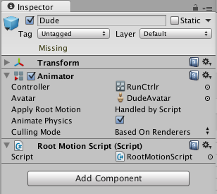

# Root Motion

## Body Transform

Body Transform 是 character 的质心 mass center（通常是 hip bone）。它被用在 Mecanim 的 retargeting engine，并提供最稳定的 displacement 模型。Body Orientation 是 lower 和 upper body 相对于 Avatar T-Pose 的 orientation 的平均值。

Body Transform 和 Orientation 被存储在 Animation Clip（使用 Avatar 中的 Muscle definitions 设置）。它们是存储在 Animation Clip 中的唯一 world-space curves。其他东西：muscle curves 和 IK goals（Hands 和 Feet）相对于 body transform 被存储。

在实际播放动画时，角色可以朝向任何方向，不可能只用于在动画片段中记录的 world-space 方向。因此 world-space curve 会基于角色当前的方向进行调整，即根据角色当前方向 offset world-space curve。

## Root Transform

Root Transform 是 Body Transform 在 Y 平面上的投影，并且在运行时计算。每一帧，计算一个 Root Transform 的变化。然后这个 transform 的变化被应用到 Game Object(具有 Animator 的 root gameobject，模型是它的 child) 来使它移动。


## Animation Clip Inspector

Animation Clip Editor settings —— Root Transform Rotation, Root Transform Position (Y) and Root Transform Position (XZ) —— 让你控制来自 Body Transform 的 Root Transform 投影。根据这些 settings，Body Transform 的一些部分可能被传递 transferred 到 Root Transform。例如你可以决定你是否想动作 motion 的 Y position 成为 Root Motion（trajectory）的一部分，或者 pose（body transform）的一部分，这称为 Baked into Pose。

有时，我们不想应用 Root Transform，因为我们想通过其他系统移动 Animator GameObject，比如导航系统，或者自己的脚本。但是如果不应用 Body Transform，动画可能不自然，因为动画是一个连续的过程，需要 Body 左右旋转才自然。Unity 提供了 Bake into Pose 的功能，将 Body Transform 的位移和旋转烘焙到动画片段中的骨骼 transform 中，这样数据就被转移到动画片段中应用了，因此就不必应用 Body Transform 了。

Bake into Pose 提供了 3 个选项：

- Root Transform Rotation

  把 Body Transform 旋转烘焙到动画片段，之后动画中 Animator GameObject 就不会绕着 Y 轴旋转了。

- Root Transform Position (Y)

  把 Body Transform 在 Y 轴上的位移烘焙到动画片段，之后动画中 Animator GameObject 就不会在 Y 轴上有移动了。

- Root Transform Position (XZ)

  把 Body Transform 在 XZ 平面上的位移烘焙到动画片段，之后动画中 Animator GameObject 就不会在 XZ 平面上有移动了。

烘焙时，还提供了 offset 选项，可以强制一个偏移。比如一个动画在另一个模型上播放，会导致 foot 从地面漂移起来，甚至即使应用了 Foot IK 也不能完全落在地面上。此时就可以在 Root Transform Position (Y) 中设置一个 offset，将动画数据向下移动移动一点（正数向下移动）。Bake 到动画片段之后，所有使用这个动画的模型都会被偏移。如果只想为指定的模型偏移，可以复制动画片段专用于这个模型骨骼（通常游戏中一个骨骼对应很多 Skinned Mesh），或者在脚本中设置 offset，每次播放这个动画时手动将模型向下偏移。

此时应用了 Foot IK 之后 Foot 仍然不能落到地面上，不是 Foot IK 没有作用，可能只是因为两个模型的 Foot size 不同而已。


上面两个模型的 foot 大小不同，即使 Foot IK 正常工作，Bake 的动画中 foot 仍然漂浮在地面上。此时只能使用 Offset 来向下移动模型来解决。


## Root Transform Rotation

- Bake into Pose

  Orientation 将会保留在 body transform（或 Pose）上。Root Orientation 将是常量，而且 delta Orientation 将是 identity。这意味着 Game Object 根本不会被 AnimationClip 旋转。

  只有具有相似 start 和 stop Root Orientation 的 AnimationClips 应该使用 Bake Root Transform Rotation 这个选项。在 UI 上的 Green Light 告诉你 AnimationClip 是一个很好的候选者。一个合适的候选者将是直接的 walk 或 run。即 clip 开始和结束的旋转时接近甚至样的。

- Based Upon：这个选项让你设置 clip 的 orientation。

  - Body Orientation
  
    clip 的数据将会被旋转以跟随质心（Body Transform）的 forward 向量。默认值对于绝大多数 Motion Capture（Mocap）数据例如 walks，runs，和 jumps 都很合适，但是它对于俯身这样垂直 body forward 向量的动作 motion 将会失败，因为 Body Transform 的旋转只包含绕着 Y 轴的旋转。这种情况下，你可以使用 Offset settting 手动调整 orientation
  
  - Original
  
    它将会自动添加 imported clip 中找到的 authored offset。它通常和 Keyframed data 一起使用，以考虑被艺术家设置的 orientation。

- Offset：当选择 Based Upon 时用来输入 offset

## Root Transform Position (Y)

使用 Root Transform Rotation 中描述的相同的概念。

- Bake Into Pose

  Motion 的 Y 分量将 bake 到在动画片段的 Pose 上。Root Transform（Animator GameObject）的 Y 分量将是常量，并且 Delta Root Position Y 将是 0. 这意味着这个 clip 不改变 Game Object 的高度。同样，Green Light 告诉你 clip 是一个烘焙 Y motion 到 pose 的很好的候选者，即 start 和 stop 位置的 Y 值相似。 

  **绝大多数 AnimationClips 将会开启这个设置**。只有那些会改变 GameObject 高度的 clips 应该关闭这个选项，例如 jump up or down。

  注意：Animator.gravityWeight 被 Bake into Pose position Y 驱动。当开启时，gravityWeight = 1，当关闭时，gravityWeight = 0. GravityWeight 在 states 之间 transitioning 时 blend。

- Based Upon：和 Root Transform Rotation 类似

  - Original

  - Mess Center（Body）

  - Feet

    这对改变高度的 AnimationClips 非常方便（Bake Into Pose disabled）。当使用 Feet 选项，Root Transform Position Y 将会对所有 frames 匹配最低 foot Y。这样 blending point 总是维持在 feet 周围，这可以防止 blending 或 transitioning 时漂浮的问题

- Offset：和 Root Transform Rotation 类似，你可以使用 Offset setting 手动调整 Animation Clip 的高度

## Root Transform Position (XZ)

- Bake Into Pose

  通常被用于 Idles，这里你想要强制 delta Position（XZ）为 0. 这可以停止很多 evaluations 之后小的 deltas drifting 的累积。它还可以和 Based Upon Original 一起用于一个 Keyframed clip 以强制被艺术家设置的 authored（权威） position。

## Loop Pose

Loop Pose（Loop Pose 这个行为就像例 Blend Trees 或 Transitions 中的 Pose Blending 一样）与 Root Transform 相关。一旦 Root Transform 被计算，Pose 变成相对于它。Start 和 Stop frame 的相对 Pose 差（区别 difference）在 clip 0-100% 范围内计算和分配，使得 start 和 stop 位置的 pose 完全一样。

Loop Pose 在这里是一个动词，即让 Pose Loop。

## Generic Root Motion and Loop Pose

这基本上和 Humanoid Root Motion 相同，但是相比于使用 Body Transform 来计算/投影一个 Root Transform，这里使用的是设置在 Root Node 的 transform。Pose（Root Motion bone 下面的所有 bones）被设置为相对 Root Transform。

## Tutorial: Scripting Root Motion for “in-place” humanoid animations

有时你的 animation 是以 in-place 状态来的，意味着如果你将它放到 scene 中，它不会移动它所在的 character。换句话说，animation 不包含 root motion。为此，你可以在脚本中修改 root motion。按照下面的步骤将所有东西放在一起（注意有很多不同方式可以达到相同效果，这只是其中一种）

- 打开包含 in-place 动画的 FBX 文件的 inspector，进入 Animation tab
- 确保 Muscle Definition 被设置为你想要控制的 Avatar（比如说这个 avater 被称为 Dude，而它已经被添加到 Hierarchy View）
- 从可用的 clips 选择 animation clip
- 确保 Loop Pose 被正确 aligned（它旁边的 light 是绿色的），并且 Loop Pose 的 checkbox 被选择

  

- 在 animation view 中预览动画，以确保 animation 的开始和结束平滑 smoothly align，并且 character in-place 移动
- 在 animation clip 上创建 curve，它将控制 character 的速度（你可以从 Animation Import inspector Curves -> + 添加一个曲线）
- 将 curve 命名为有意义的东西，例如 ”Runspeed“

  

- 创建一个新的 Animator Controller（我们称它为 RootMotionController）
- 将想要的 animation clip 拖放到它上面，这应该创建一个和动画同名的 state
- 添加一个和 curve 同名的参数到 Controller（这里是 Runspeed）

  

- 在 Hierarchy 选择 character Dude，它的 inspector 应该已经有一个 Animator 组件
- 将 RootMotionController 拖放到 Animator 的 Controller 属性上
- 如果你现在点击 Play，你应该看见 Dude in-place running

最终，为了控制 motion，我们将需要创建一个脚本（RootMotionScript.cs），它实现了 OnAnimatorMove 回调：

```C#
using UnityEngine;
using System.Collections;

[RequireComponent(typeof(Animator))]
public class RootMotionScript : MonoBehaviour {
    /*
    Callback for processing animation movements for modifying root motion.
    This callback will be invoked at each frame after the state machines and the animations have been evaluated, but before OnAnimatorIK.
    */
    void OnAnimatorMove()
    {
            Animator animator = GetComponent<Animator>(); 
                              
            if (animator)
            {
                Vector3 newPosition = transform.position;
                newPosition.z += animator.GetFloat("Runspeed") * Time.deltaTime; 
                transform.position = newPosition;
            }
    }
}
```

你应该挂载 RootMotionScript 到 Dude object。当你完成时，Animator 组件将会检测到这个 script 有一个 OnAnimatorMove 函数并显示 Apply Root Motion 属性被脚本 Handle 了


