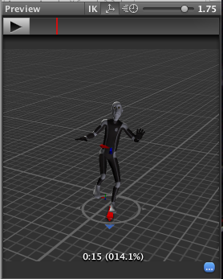
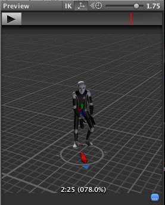

# Target Matching

通常在游戏中，会出现一种场景：character 必须以 hand 和 foot 在特定时间放在特定位置的方式移动。例如，一个角色可能需要跳过 stepping stones 或跳起抓住一个头上的 beam。

你可以使用 Animator.MatchTarget function 来处理这种问题。想象一下，你想要安排一个场景：character 跳到一个平台上，而你已经有了 animation clip 称为 Jump Up。首先你需要找到 animation clip 中角色开始离开地面的位置，例如在下图中是 normalized time = 14.1% 或 0.141：



你还要找到 animation clip 中 character 将要落地的位置，在这个 clip 中是 normalized time = 78% 或 0.78：



配合这些信息，你可以创建一个称为 MatchTarget 的脚本，你可以将它挂载到模型上：

```C#
using UnityEngine;
using System;

[RequireComponent(typeof(Animator))] 
public class TargetCtrl : MonoBehaviour {

    protected Animator animator;    
    
    //the platform object in the scene
    public Transform jumpTarget = null; 
    void Start () {
        animator = GetComponent<Animator>();
    }
    
    void Update () {
        if(animator) {
            if(Input.GetButton("Fire1"))         
                animator.MatchTarget(jumpTarget.position, jumpTarget.rotation, AvatarTarget.LeftFoot, 
                                                       new MatchTargetWeightMask(Vector3.one, 1f), 0.141f, 0.78f);
        }       
    }
}
```

这个脚本将会移动 character 使得它从当前 position 跳起然后左脚落在 target 上。要记住，使用 MatchTarget 的结果通常只会在 gameplay 中正确的点被调用才有意义。

```C#
public void MatchTarget(Vector3 matchPosition, Quaternion matchRotation, AvatarTarget targetBodyPart, MatchTargetWeightMask weightMask, float startNormalizedTime, float targetNormalizedTime = 1);
```

- matchPosition：想要 body part 到达的 position
- matchRotation：想要 body part 到达的 rotation
- targetBodyPart：用于匹配的 body part
- weightMask：包含用于 matching position 和 rotation 的 weight 的结构
- startNormalizedTime：animation clip 的 start time（0：clip beginning，1：clip end）
- targetNormalizedTime：animation clip 的 end time，可以设置超过 1 的值在特定数量的 loops 之后触发一个 match，例如 2.3 意味着 第二个 loop 之后的 30%
- completeMatch：允许你指定如果 MatchTarget 函数被中断将发生什么。一个 true 的 value 导致在发生中断时 GameObject 被立即移到 MatchPosition，否则 GameObject 停留在当前位置。

自动调整 GameObject 的 position 和 rotation。

当当前 state 处于特定过程时，调整 GameObject position 和 rotation 使得 AvatarTarget 到达 matchPosition。Target matching 只工作于 base layer（index 0）。你同一时间只能 queue 一个 match target，你必须等到前一个完成，否则你的 target matching 将会被丢弃。如果你以低于 clip 当前 normalized time 更低的 start time 调用 MatchTarget，而 clip 可以循环，则 MatchTarget 将会调整时间来匹配下一个 clip loop。例如，start time = 0.2， clip 当前 normalized time = 0.3，则 start time 将被调整为 1.2。Animator.applyRootMotion 必须被开启来使 MatchTarget 生效。
