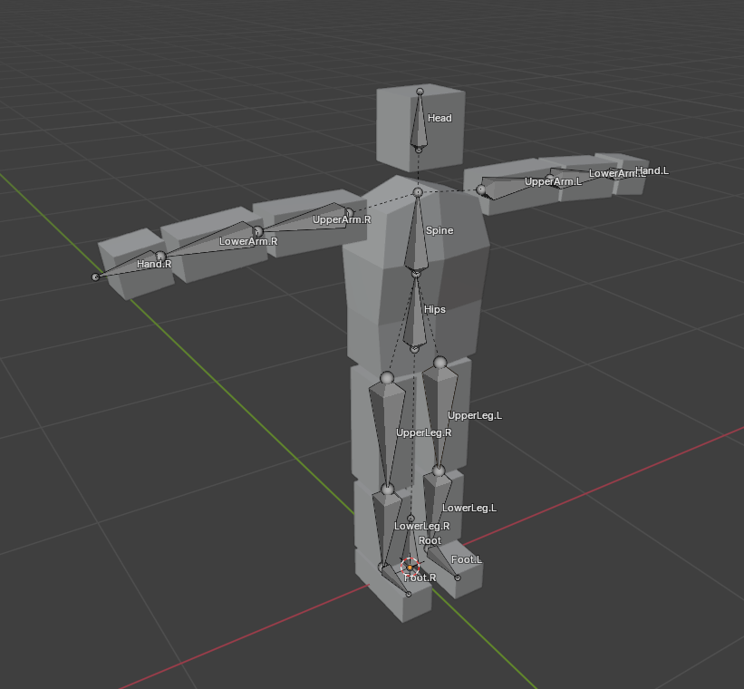
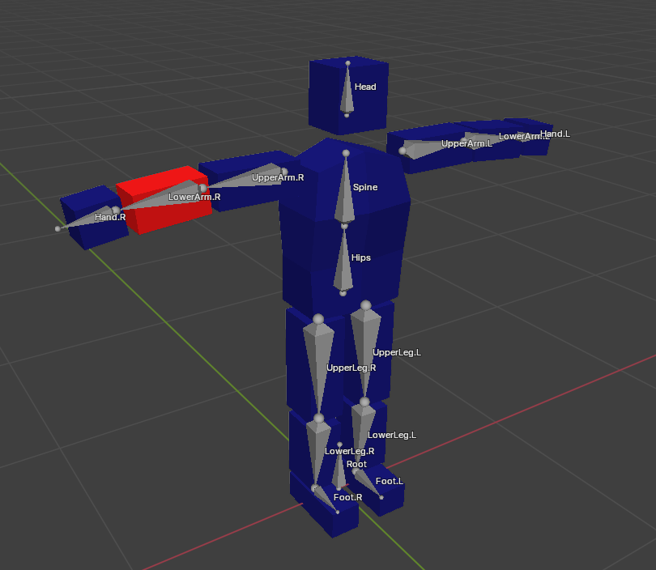
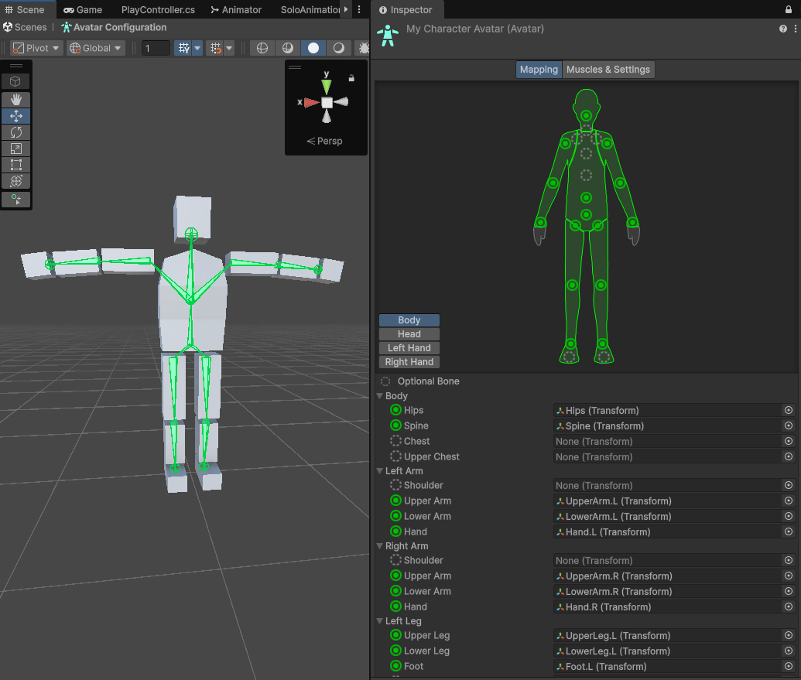
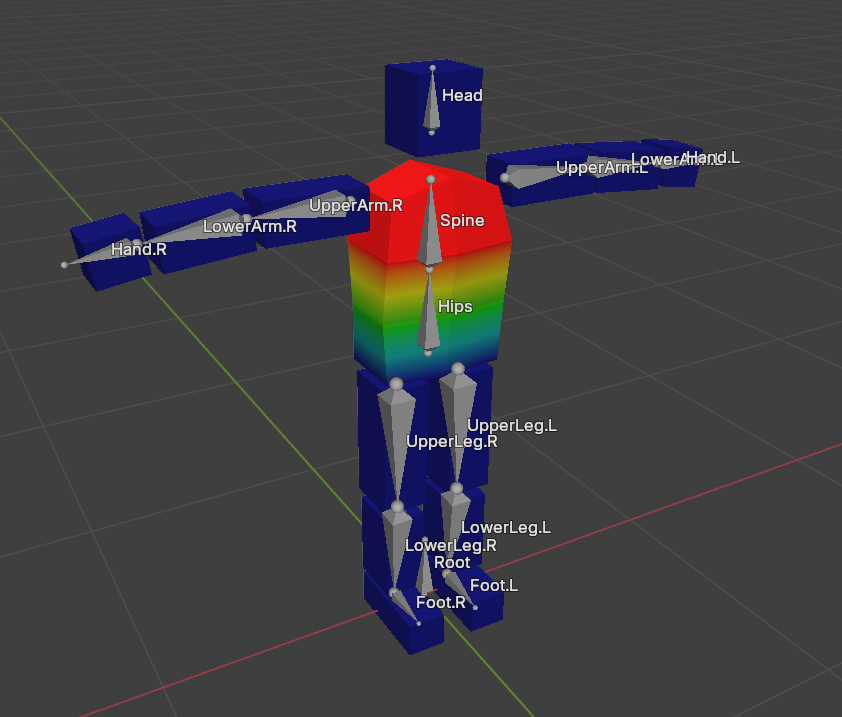
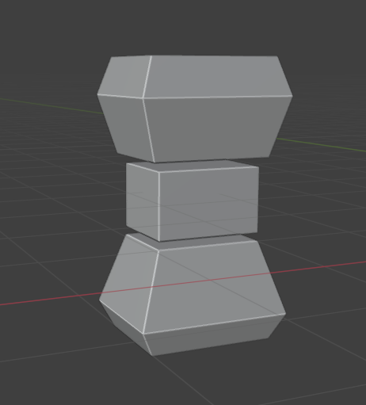
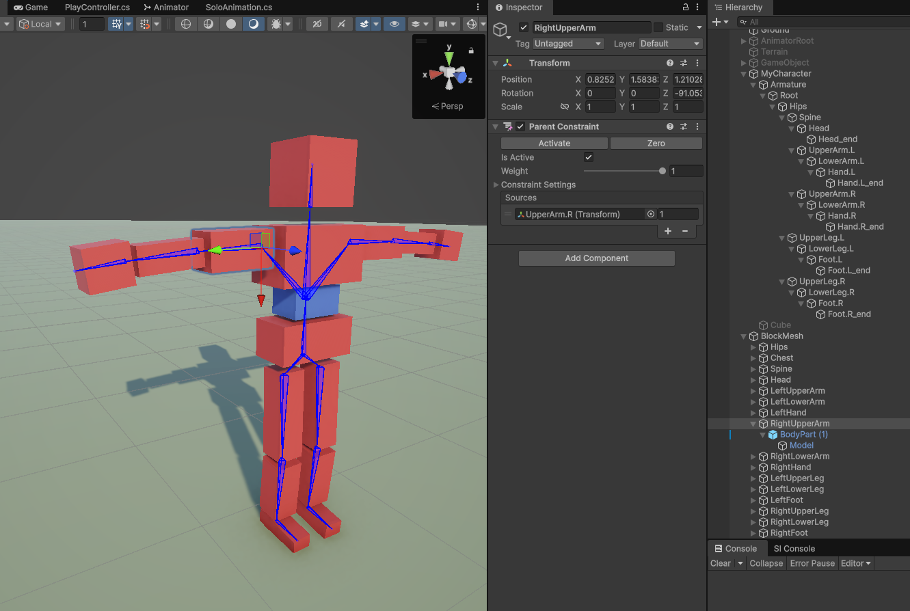
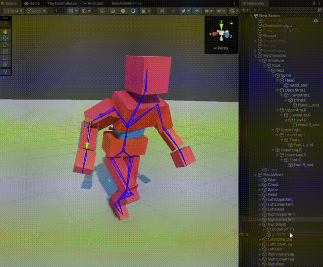
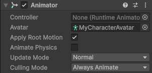
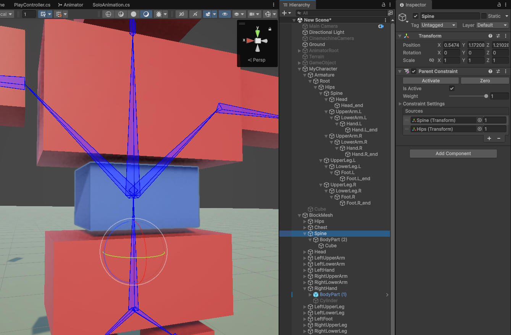

下面使使用 Blender 创建一个简单的 Character，并导入到 Unity 播放动画的效果。

# 骨骼结构

 

- 位于原点有一个 Root Bone，用于 Root Motion。
- Hips 与 Root Bone Disconnect。
- Hips 下面是 Spine，Spine 下面没有 Chest 和 Neck，直接就是 UpperArm 和 Head。

  Chest 和 Neck 在 Unity 中是可选的。
  
  UpperArm 和 Head 与 Spine Disconnect。
  
  Disconnect 只是 Blender 中的概念和功能，Unity 中没有 Disconnect 概念。
  
  在 Unity 中所有 Bone 与 Parent 都是 Disconnected 的，都可以自由移动。

- 没有手指、脚趾骨骼，它们也是可选的

# 蒙皮

- 模型使用简单的 Cube 表示身体的各个部分
- 建立骨骼时，只建立了一侧骨骼，并自动添加 .L 后缀，然后用 Symmetrize 功能自动创建另一侧的镜像骨骼（注意必须沿着 X 轴）
- 创建 Mesh 时使用 Mirror Modifier 自动创建另一边的镜像
- 为 Mesh 添加 Armature Deform Modifier，并自动为每个 Bone 创建空的 Vertex Group
- 手动离散权重赋值，每个 Bone 完全控制它对应的 Cube，每个 Cube 也只被它对应的 Bone 控制
- 因为 Mesh 是镜像的，只需要为编辑一侧的 Vertex 指定 Vertex Group 和权重，此时另一边骨骼的 Vertex Group 都是空的。最后 Apply Mesh 的 Mirror Modifier，会自动将另一侧的 Mesh Vertices 分配到相应的骨骼的 Vertex Group 中，并与镜像一侧的 Vertex 具有相同权重

 

# 导入到 Unity 中

导入到 Unity 中注意 scale = 0.01，并取消勾选 Unity 的 "Convert Units(1cm to 1m)"。

这样模型的大小就与 Blender 中一样，不会被缩放。

 

在 Rig 页面

- 为 Animation Type 选择 Humanoid
- 为 Avatar Definition 选择 Create From This Model，让 Unity 为这个模型自动创建一个 Avatar
- 创建 Avatar 时，模型必须尽量接近 Unity 的 Avatar T-Pose，否则可能导致创建 Avatar 无效

  Avatar T-Pose：角色竖直站立，双脚向前，双臂水平展开，手心向下

  使用 Unity Avatar 的骨骼名字，并尽量接近 Avatar T-Pose 可以最大便利 Unity 为模型生成 Avatar。这个模型导入后创建 Avatar 一次即成功。

# 播放动画

将模型拖拽到 Scene 中，会自动创建 Animator GameObject，并将 SkinnedMesh 和 骨骼结构放在其下。

这里使用 Animancer 的 SoloAnimation 播放动画。选择 Unity AssetStore 上的 Kevin Iglesias 的 Human Animations 合集中的一个动画 Run，将它的动画片段指定给 SoloAnimaiton 的 Clip，进入 Play Mode，就可以看见角色正常地播放 Run 动画了。


实际上，SkinnedMesh 与动画的播放过程无关，它与 Animation 是两个独立的系统。

- Animation，包括 Rigging，IK 等，只负责操作 Animator 下面的骨骼 Hierarchy，完全无视 SkinnedMesh 的存在
- SkinnedMesh 也不管 Animator 下的骨骼 Hierarchy 是怎样运动的（动画片段、过程化动画、脚本），它只负责读取骨骼相对 Rest Pose 的位移和旋转，然后对 Mesh 进行变形

网上无论时免费的动画库，还是 Unity AssetStore 上的动画库，已经包含了大量的常用的，基础甚至中高级的动画片段了。如果不是做非常重视动画（真实度）的游戏，这些动画资源已经足够了。另外 Animation Rigging 和 FinalIK 还能基于现有动画创建过程化动画，无需创建动画片段。

对应模型，如果只专注 Minicraft（Lowpoly/Voxel + Pixel Texture），Blender 和 Blockbench 也已经足够了。只需要创建模型和简单骨骼（手动离散蒙皮）即可，动画就直接使用已有资源足够。甚至都不需要创建蒙皮 Mesh，只创建一个简单骨骼。然后在 Unity 中，为每个骨骼绑定一个简单的 Mesh（例如 Cube，甚至稍复杂一点的几何体，例如梯形台，圆柱体）。模型的 Rest Pose 就是 T-Pose，按照 T-Pose 为骨骼组装一套简单集合体 Mesh 构成的 Mesh，只要 T-Pose 时外观看起来正确，动画时就一定正确。

例如这个模型的 Body 其实有一段的连续权重，身体上部被 Spine 控制，下部被 Hips 控制，中间的 Vertices 在 Spine 和 Hips 之间有一个过渡：



但其实可以完全使用多个简易几何体 Mesh 来组装一个 Body，然后每段都想上面一样整体被一个骨骼控制，这样就完全不需要 SkinnedMesh 了：



这样用简易不可变性的几何体创建角色的方法不仅简单，还具有独特的风格，另外替换身体的部分（替换为更华丽的）或添加额外的配件都很容易。

将几何体绑定到骨骼上的方法既可以直接将几何体放在相应骨骼的下方。还可以用 Unity Constraints 将几何体通过约束绑定到骨骼上。后一种方法更好，因为它不会侵入原来的骨骼结构，骨骼结构专门用于动画。而且替换身体部分时非常容易，可以替换 GameObject，还可以直接替换 MeshFilter 中的 Mesh。另外，Constraints 还可以引用多个 Source Target，为每个 Target 指定一个权重，这样可以实现类似 SkinnedMesh 的多个骨骼控制一个 Vertex 的功能，这里是多个骨骼控制一个几何体，每个骨骼的影响权重在 Constraint 中指定即可，这样可以实现类似 SkinnedMesh 的更加平滑的变形。

但是更好的办法是 Duplicate Armature。只创建一个骨骼的，对每个模型 Duplicate Armature，然后创建和 Armature Size 匹配的模型。在游戏中，根据期望的大小，缩放整个模型（Animator GameObject），这样更干净，更简单。

骨骼结构通过 Duplicate 复制一份就可以重用，而且可以缩放，以显示不同大小的模型，即让不同大小、不同角色的模型都可以复用骨骼和动画。

# 非 Skinned 模型





上面是按照上面的思想通过简易几何体（这里只使用了一个 Cube Mesh）创建的角色模型。

这里关闭了 SkinnedMesh（disable SkinnedMesh GameObject 或者 SkinnedMeshRenderer 组件）。注意如果关闭了 SkinnedMesh，需要将 Animator 的 Culling Mode 设置为 Always Animate。默认是 Culling Update Transforms，这个选项如果发现 SkinnedMesh 不更新，Animator 就不会继续输出骨骼动画。为了让骨骼继续动画，需要将 Culling Mode 设置为 Always Animate。



这里的方法是为每个骨骼（Hips，Spine，LeftUpperArm），创建一个 Pivot GameObject，然后在 Pivot 下面放真正的模型（使用 Pivot 的好处下面讲述）。

为了让模型的 Pivot 跟随骨骼运动，每个 Pivot 都创建一个 Parent Constraint，让 Pivot 绑定它对应的骨骼 Transform。例如这里的 RightUpperArm 通过 Parent Constraint 绑定到骨骼 UpperArm.R。

Parent Constraint 让被约束的 GameObject 和 Source GameObjects 像 Child-Parent GameObject，它随 Parent 移动而移动，随 Parent 旋转而旋转。如果被约束的 GameObject 到 Source GameObjects 有偏移，就会绕着它旋转。因此这里还要点击一下 Parent Constraint 的 Zero 按钮，消除偏移，让 GameObject 严格对齐到骨骼的位置上。缩放是被忽略的，“Parent”（Source GameObjects）的缩放不影响被约束的 GameObject。

在 Pivot 下面用 Cube（以及各种简单几何体）拼装这个身体部分，这里就是一个简单的 Cube。

所有 Pivot 放在一个单独的 BlockMesh GameObject 下面，不需要每个 Pivot 放在对应的骨骼下面，“侵入” Armature 骨骼。也不需要像 Armature 下面的骨骼一样组织，可以直接线性平铺排列。因为每个 Pivot 通过 Parent Constraint 约束到对应的骨骼上了，它已经跟随骨骼移动和旋转了。加了 Constraint 组件的 GameObject 只被它约束，不再被 GameObject 的 Parent-Child 关系控制了，就像 Rigidbody。

对每个 bone 创建一个 Pivot 而不是直接创建模型，Pivot 的好处有：

- 对应真正的骨骼。骨骼本身就是一个空 Transform，Pivot 本身也是一个空的 Transform，并且二者的 Transform 的 Position、Rotation 保持同步
- 模型在 Pivot 下面可以自由组装。无论组装成什么形状，Pivot 下面的 Hierarchy 的整体形状只会绕着 Pivot 旋转（以及缩放）。这样就可以不依赖几何体的 Pivot，Pivot GameObject 下面的几何体的 Pivot 可以任意放置，只要整体形状绕着 Pivot 就可以了
- 如果几何体的 Pivot 本身就是这个身体组件的 Pivot，只需要简单的点击 Transform 的 Context Menu 的 Reset，就可以直接对齐到 Pivot GameObject 的位置了
- 替换身体部分组件模型，变得非常容易，不必修改 Pivot GameObject，只需要替换它下面的几何体 GameObjects，Pivot GameObject 专注同步 Bone 的位置和旋转

如下图所示，这里有一个空的 GameObject（Pivot），绿色小球代表它的 Pivot，它下面有一个立方体和一个长方体构成它的 “mesh”。立方体的 pivot 在中心，长方体的 pivot 在底部，而且两个 Child 的 Pivot 都不在 Parent 的 Pivot，而是在 Parent 空间中任意放置。立方体绕着它的中心旋转，长方体绕着它的底部旋转。无论立方体和长方体在空间中如何放置、旋转，最终这个整体模型只会绕着 Parent GameObject 的 Pivot（绿色小球）旋转。这样整体的模型就不依赖 Child 几何体的 Pivot，Child 几何体可以任意移动、旋转来组装想要的模型，只要整体模型的期待 Pivot 是绿色小球即可。


这样组装角色模型的好处非常多：

- 全部都是 Unity 的 GameObject 操作，几乎都可以用脚本完成
- 每个身体部分都是一个 GameObject，这就为模型变换打开可能性的大门，针对 GameObject 可就有太多的操作了，例如挂载一个武器、替换一个更高级的模型、使用单独的 material，总之有无穷无尽的可能
- 不需要 Skinned Mesh。尤其适合 Blockbench。Blockbench 不能创建 SkinnedMesh，但是它非常适合创建这样简单的构造块，并为构造块创建像素化纹理。
- 替换模型部分变得非常简单，就是替换 Pivot 下面的几何体或材质就可以了
- 骨骼可以被重用，替换 Pivot 下面的几何体形状，就可以创建不同的角色了。而创建构造快和 GameObject 操作在 Blockbench 和 Unity 是非常简单的事

这种方法加上 Blockbench 创建简单带纹理的构造块的优势，完全足够 Minicraft 风格游戏使用了。

注：Blockbench 最新版本提供了骨骼蒙皮的功能，但是非常简陋，几乎无法使用。

再次强调，Pivots 不需要遵循 Animator 的 Bone Hierarchy 结构。因为它们直接通过 Parent Constraint 同步对应骨骼的世界空间的位置和旋转，这已经包含子骨骼因为父骨骼旋转而造成的位移了（世界空间中的位置）。

不仅可以通过替换 Pivot 下面的简单几何体来创建不同的模型，还可以缩放模型，来创建不同 size 大小的角色。直接创建一份 Animator 和 Pivots 的副本，然后为每个 Pivot（身体部分）添加几何体构造块，最后按照想要的比例缩放，就可以创建不同 size 的模型了。因此最好将 Pivots 放置 Animator 下面，这样容易管理。因为 Duplicate Animator 就直接复制了完整的一份模型，并且新副本的 Pivots 中的 Source GameObjects 自动指向新的 Animator 中的骨骼，不需要再去手动连接了。缩放的时候也只需要缩放 Animator 就可以了。

此外，骨骼结构还可以再 Blender 中 Duplicate 一个副本，然后调整不同骨骼的长度，来创建不同体态的角色骨架，例如两腿很短，但是两手臂很长的角色，或者四肢很长，但是身体很短的角色，基本都是卡通风格。

Blender 中只需要创建骨骼结构就可以了。动画直接使用 Unity AssetStore 上和免费网站上的动画文件，模型就使用 Blockbench 创建 Minicraft 风格的构造块，然后按照上面的方法在 Unity 中组装模型。

Avatar Mask 和动画 Blend 在这里仍然可以使用，因为它们影响的是动画片段本身。然后动画片段采取驱动骨骼，而 Mesh 被骨骼驱动：

```Avatar(mask/blend) -> Animation Clip -> Armature Bones -> Mesh```

这里 Pivots 的作用基本就是 Skinned Mesh 的作用。它完全不关心骨骼是怎样被动画的，它只会跟随骨骼运动。Avatar、Clip 也完全不关心 Mesh 是怎样随骨骼运动的（是 Skinned Mesh，还是上面那样用简单几何体组装的 Mesh），它只关心如何动画骨骼。

注意这里，模型腰部部分（蓝色 Cube）的 Pivot 的 Parent Constraint 设置了两个 Sources：Spine 和 Hips，而且它们的权重都为 1. 这样的效果就是这个 Pivot（蓝色 Cube）会被 Spine 骨骼和 Hips 骨骼同等影响（各自 50%），这就是模拟了 SkinnedMesh 中 vertex 被多个骨骼影响的情况，这可以创建更真实的动画：



如下图可见，调整不同 Source 的权重，就可以调整 Hips 或 Spine 对蓝色 Cube 的影响程度。如果 Spine weight = 1，Cube 就完全被 Hip 控制，反之亦然。另外，调整 Parent Constraint 的 Weight，可以看见蓝色的 Cube 在它原本的位置（Constraint Rest Position，Constraint 激活时记录）和被约束的位置之间按 weight 插值。


Vertex Group 与 Pivot Geometries 等价，它们需要被 Bone（Pivot）的位置和旋转同时影响。即使 Humanoid Animation Clip 只输出骨骼的旋转，但是子骨骼会因为父骨骼的旋转而改变位置。因此 Pivot 必须既同步 Bone 的位置，又同步 Bone 的旋转。因为 Pivot 本身没有按 Bone Hierarchy 组织，它只需要同步 Bone 的世界空间位置即可，因为这个位置已经包含了 Bone 因为父骨骼链的旋转导致的位移。

有了这样的骨骼模型框架，只需要 Duplicate 复制即可重用，在新的副本中修改身体部分组件就能创建新的模型。还可以整体缩放，创建不同 size 的模型。


# Bone Renderer Setup

Animation Rigging 提供了一个辅助功能，就是现实 Bone Hierarchy。它实际可以用于任何 GameObject Hierarchy，但是通常只用于现实 Animator 下面的骨骼结构。

它会按照 GameObject Hierarchy，为每一对 Parent-Child GameObjects 创建一个可视化的骨骼，让你明晰骨骼结构，并且可以指定辅助骨骼可视化的形状、颜色。

它的使用很简单，就是在 Parent GameObject 上添加一个 Bone Renderer 组件，设置颜色和骨骼形状即可。但是它有一个麻烦的地方，就是需要在 Transforms 字段中指定所有需要绘制的 Bone（Transform）。它只为指定的 Transforms 渲染，因此可以让你忽略一部分 Transforms。但是通常会需要渲染 Hierarchy 下的全部 Bones，因此提供了一个菜单项，Animation Rigging > Bone Renderer Setup，它为选定的 GameObject 添加 Bone Renderer，并将下面所有的 Child GameObjects 都添加到 Bone Renderer 的 Transforms 字段中。

Bone Renderer 只为所在的 Hierarchy 渲染骨骼 Gizmos，因此可以为不同的部分添加各自的 Bone Render，并设置不同的颜色，来更好的区别和识别骨骼结构。
