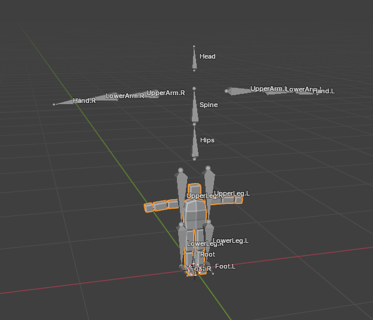

下面使使用 Blender 创建一个简单的 Character，并导入到 Unity 播放动画的效果。

# 骨骼结构

 

- 位于原点有一个 Root Bone，用于 Root Motion。
- Hips 与 Root Bone Disconnect。
- Hips 下面是 Spine，Spine 下面没有 Chest 和 Neck，直接就是 UpperArm 和 Head。

  Chest 和 Neck 在 Unity 中是可选的。
  
  UpperArm 和 Head 与 Spine Disconnect。
  
  Disconnect 只是 Blender 中的概念和功能，Unity 中没有 Disconnect 概念。
  
  在 Unity 中所有 Bone 与 Parent 都是 Disconnected 的，都可以自由移动。

- 没有手指、脚趾骨骼，它们也是可选的

# 蒙皮

- 模型使用简单的 Cube 表示身体的各个部分
- 建立骨骼时，只建立了一侧骨骼，并自动添加 .L 后缀，然后用 Symmetrize 功能自动创建另一侧的镜像骨骼（注意必须沿着 X 轴）
- 创建 Mesh 时使用 Mirror Modifier 自动创建另一边的镜像
- 为 Mesh 添加 Armature Deform Modifier，并自动为每个 Bone 创建空的 Vertex Group
- 手动离散权重赋值，每个 Bone 完全控制它对应的 Cube，每个 Cube 也只被它对应的 Bone 控制
- 因为 Mesh 是镜像的，只需要为编辑一侧的 Vertex 指定 Vertex Group 和权重，此时另一边骨骼的 Vertex Group 都是空的。最后 Apply Mesh 的 Mirror Modifier，会自动将另一侧的 Mesh Vertices 分配到相应的骨骼的 Vertex Group 中，并与镜像一侧的 Vertex 具有相同权重

 

# 导入到 Unity 中

导入到 Unity 中注意 scale = 0.01，并取消勾选 Unity 的 "Convert Units(1cm to 1m)"。

这样模型的大小就与 Blender 中一样，不会被缩放。

 

在 Rig 页面

- 为 Animation Type 选择 Humanoid
- 为 Avatar Definition 选择 Create From This Model，让 Unity 为这个模型自动创建一个 Avatar
- 创建 Avatar 时，模型必须尽量接近 Unity 的 Avatar T-Pose，否则可能导致创建 Avatar 无效

  Avatar T-Pose：角色竖直站立，双脚向前，双臂水平展开，手心向下

  使用 Unity Avatar 的骨骼名字，并尽量接近 Avatar T-Pose 可以最大便利 Unity 为模型生成 Avatar。这个模型导入后创建 Avatar 一次即成功。

# 播放动画

将模型拖拽到 Scene 中，会自动创建 Animator GameObject，并将 SkinnedMesh 和 骨骼结构放在其下。

这里使用 Animancer 的 SoloAnimation 播放动画。选择 Unity AssetStore 上的 Kevin Iglesias 的 Human Animations 合集中的一个动画 Run，将它的动画片段指定给 SoloAnimaiton 的 Clip，进入 Play Mode，就可以看见角色正常地播放 Run 动画了。

实际上，SkinnedMesh 与动画的播放过程无关，它与 Animation 是两个独立的系统。

- Animation，包括 Rigging，IK 等，只负责操作 Animator 下面的骨骼 Hierarchy，完全无视 SkinnedMesh 的存在
- SkinnedMesh 也不管 Animator 下的骨骼 Hierarchy 是怎样运动的（动画片段、过程化动画、脚本），它只负责读取骨骼相对 Rest Pose 的位移和旋转，然后对 Mesh 进行变形

网上无论时免费的动画库，还是 Unity AssetStore 上的动画库，已经包含了大量的常用的，基础甚至中高级的动画片段了。如果不是做非常重视动画（真实度）的游戏，这些动画资源已经足够了。另外 Animation Rigging 和 FinalIK 还能基于现有动画创建过程化动画，无需创建动画片段。

对应模型，如果只专注 Minicraft（Lowpoly/Voxel + Pixel Texture），Blender 和 Blockbench 也已经足够了。只需要创建模型和简单骨骼（手动离散蒙皮）即可，动画就直接使用已有资源足够。甚至都不需要创建蒙皮 Mesh，只创建一个简单骨骼。然后在 Unity 中，为每个骨骼绑定一个简单的 Mesh（例如 Cube，甚至稍复杂一点的几何体，例如梯形台，圆柱体）。模型的 Rest Pose 就是 T-Pose，按照 T-Pose 为骨骼组装一套简单集合体 Mesh 构成的 Mesh，只要 T-Pose 时外观看起来正确，动画时就一定正确。

例如这个模型的 Body 其实有一段的连续权重，身体上部被 Spine 控制，下部被 Hips 控制，中间的 Vertices 在 Spine 和 Hips 之间有一个过渡：

但其实可以完全使用多个简易几何体 Mesh 来组装一个 Body，然后每段都想上面一样整体被一个骨骼控制，这样就完全不需要 SkinnedMesh 了：

这样用简易不可变性的几何体创建角色的方法不仅简单，还具有独特的风格，另外替换身体的部分（替换为更华丽的）或添加额外的配件都很容易。

将几何体绑定到骨骼上的方法既可以直接将几何体放在相应骨骼的下方。还可以用 Unity Constraints 将几何体通过约束绑定到骨骼上。后一种方法更好，因为它不会侵入原来的骨骼结构，骨骼结构专门用于动画。而且替换身体部分时非常容易，可以替换 GameObject，还可以直接替换 MeshFilter 中的 Mesh。另外，Constraints 还可以引用多个 Source Target，为每个 Target 指定一个权重，这样可以实现类似 SkinnedMesh 的多个骨骼控制一个 Vertex 的功能，这里是多个骨骼控制一个几何体，每个骨骼的影响权重在 Constraint 中指定即可，这样可以实现类似 SkinnedMesh 的更加平滑的变形。

另外注意，无论是 SkinnedMesh 还是简单几何体构成的角色 Mesh，它们不需要完全和骨骼结构契合（即完全包裹骨骼）。因为 Humanoid Avatar 中每个骨骼只能旋转，因此只要将旋转传导到 Vertices 或几何体，角色 Mesh 一样可以正确播放动画。

类似下面这样，用简单几何体构成一个不到 Armature 一半大小的模型，只要它的外观与 Armature Rest Pose （Avatar T-Pose）一致，并正确绑定到每个骨骼，应该一样能正确动画，因为骨骼只有旋转。只要模型中每个部分跟随相应地骨骼一起旋转，就能正常展示原来的动画。

这样的好处是，不需要为不同大小的角色都单独创建骨骼，只需要一个 Armature，然后创建不同 size 的 mesh 即可。

但是更好的办法是 Duplicate Armature。只创建一个骨骼的，对每个模型 Duplicate Armature，然后创建和 Armature Size 匹配的模型。在游戏中，根据期望的大小，缩放整个模型（Animator GameObject），这样更干净，更简单。
