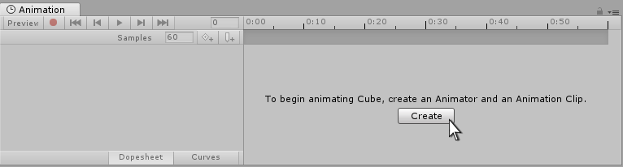
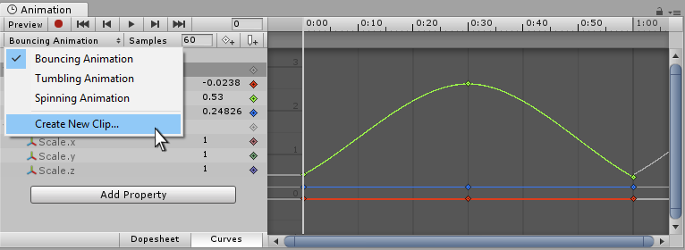
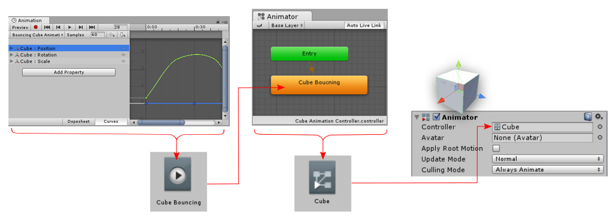

要创建新的 Animation Clip：

- 选择 GameObject
- Window > Animation > Animation，打开 Animaition Window

如果 GameObject 没有赋予 Animation Clip，Create 按钮显示在 Animation Window 的中心。

点击 Create 按钮，Unity 提示你将新的空 Animation Clip 保存到 Assets folder。当保存新的 clip 时，Unity 还会：

- 在 Assets folder 中创建一个新的 Animator Controller Asset
- 添加新的 clip 到 Animator Controller 为 default state
- 添加一个 Animator Component 到选择的 GameObject
- 将新的 Animator Controller 赋予 Animator 组件

Animator 组件用来播放动画文件，将动画 clip 中记录的属性曲线应用到 GameObjects 上。

Animator Controller 是用来组织 clips 的，它将 clips 组织为状态机、Layers、BlendTree，让游戏逻辑通过 Animation Condition 来切换游戏角色动画。

因此 Animator Controller 就是动画状态机资源，如果不使用 Unity 状态机，例如 Animancer，就不需要 Animator Controller 了。但是 Animator 还是需要的，因为它是真正将数据转换为属性动画的组件。Animancer 和 Animation Controller 都是一个目的，组织 Clips 数据，将数据输出到 Animator。

# 创建另一个动画 Clip

如果当前选中的 GameObject 已经分配了一个或多个 Animation Clips（动画剪辑），并且你打开了 Animation 窗口，则不会显示 Create（创建） 按钮。相反，窗口会显示分配给该选中 GameObject 的其中一个动画剪辑。

要在多个动画剪辑之间切换，请使用 Animation 窗口 左上角、播放控件下方的菜单。

若要在已存在动画的 GameObject 上创建一个新的 Animation Clip，请从该菜单中选择 Create New Clip（创建新剪辑）。Unity 会提示你保存这个新的空动画剪辑。

# 如何组装在一起

上述步骤会自动设置好为 GameObject 添加动画所需的组件和资源。理解这些组件、剪辑和资源之间是如何相互关联的会很有帮助：

- 一个 GameObject 必须拥有一个 Animator 组件
- 该 Animator 组件 必须分配有一个 Animator Controller 资源
- 该 Animator Controller 资源 必须分配有一个或多个 Animation Clips（动画剪辑）

下图展示了 Unity 是如何从新建一个 Animation Clip 开始，分配这些组件和资源的。

在创建了新的 Animation Clip 之后：

- Animation 窗口显示了一个带有白色播放线的时间轴。在剪辑菜单中，选择了 Cube Animation Clip 剪辑。
- 在 Inspector 窗口中，Cube GameObject 拥有一个 Animator 组件。其 Controller 字段被分配了 Cube Animator Controller 资源。
- Project 窗口中有两个新资源：Cube Animator Controller 资源 和 Cube Animation Clip 动画剪辑资源。
- Animator 窗口显示了 Cube Animator Controller 资源的内容。Cube Animation Clip 被设为默认状态，如橙色高亮所示。

