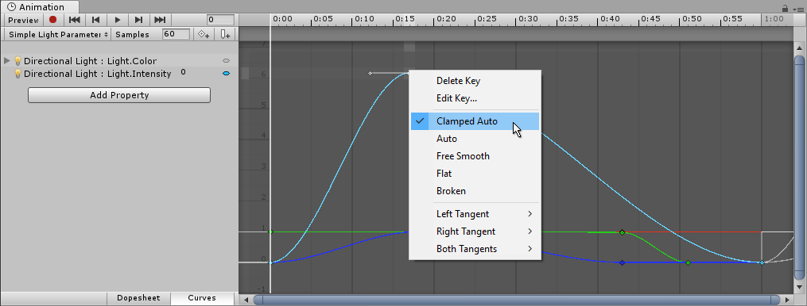

Unity Editor 中有很多不同的功能使用 Curves 来展示和编辑数据。你用来查看、编辑 curves 的方法在所有这些地方几乎都是一样的，只有有一些很少的例外。

- Animation Window 使用 curves 来展示和编辑 Clip 中随时间被动画的属性的值

  

- 一些脚本组件可以拥有 Animation Curve 类型的成员变量，它可以用于任何事情。在 Inspector 中点击这些 Animation Curve 类型变量，可以打开 Curve Editor。

  

- Audio Source 组件使用 Curves 控制 以到 Audio Source 距离为自变量的函数，例如 roll-off 等属性

  

- 粒子系统使用 curves 随时间变化粒子属性

这些控制尽管有一些微小的不同，但是它们都以几乎一样的方式编辑 Curve。

# 在 Curve 上添加和移动 Keys

## 添加 key

- 可以在 Curve 上任何你想要添加 key（曲线在指定时间必须通过的点）的地方双击来添加一个 key。
- 可以右键点击 curve 并选择 Add Key 菜单项

## 移动 key

- 点击 Key 选择它，然后鼠标拖拽
- 移动时按住 Ctrl 可以将 key 对齐到 grid

## 可以同时选择多个 keys

- 按住 Shift，选择多个 keys
- 点击 Ctrl，取消选择一个 key
- 绘制一个矩形，选择其中所有的 keys
- 按住 Shift，可以将矩形选择的 keys 添加到现已选择 keys 中

## 删除 keys

选择要删除的 keys，按 Delete 键，或右键 Delete Key。

# Edit Keys

- 按 Enter 或 context menu 开始编辑选择的 keys

  

  选择一个 key 后，按 enter，就可以弹出这个对话框，可以直接编辑 key 的 time（x 轴）和 value（y 轴）。

  这对于一些需要精确设定的 key 非常方便，尤其是起始和终点，手动移动 key 很难将 key 精确设定到 time = 0 或 time = 1，或 value = 0 或 value = 1 的点。

  因此在动画编辑中，手动输入数据也是非常重要的功能。比如 Animation Window 左边的属性列表中也提供了手动输入数值编辑 key 的功能。

- Tab：在 fields 之间切换

  在编辑对话框中，循环输入 time 和 value。

- Enter 提交

  保存对 key 的编辑。

- Escape 取消编辑

  取消编辑对话框，并且不保存。

# 在 Curve View 中 navigating

无论是用 Ctrl/Shift 选择多个 keys，还是用矩形选区选择一组 keys，都会在 keys 四周显示一个矩形框，可以拖拽矩形框的四个边，整体缩放这组 keys 的位置。

无论是选择单个 key，还是选择一组 keys，按 F 键可以聚焦选择 keys，将其缩放到填满当前编辑窗口。按 A 可以缩放将整个 curve 填满窗口。

## Zooming

鼠标滚轮、触摸板、Alt+右键拖拽，可以整体缩放 Curve View。还可以水平、垂直分别缩放：

- Ctrl+上面的操作：仅水平缩放
- Shift+上面的操作：仅垂直缩放

还有，可以拖拽 Curve View 的水平、垂直滚动条两端的 caps 来缩放 Curve View。

## Panning

拖拽整个 Curve View：

- 鼠标中键拖拽
- Alt+左键拖拽

# Editing Tangents

Key 有两个切线 tangents：左边的控制进入的坡度 slope（斜率），右边的控制离开的坡度 slope（斜率）。

Tangents 控制了两个 Keys 之间的 curve 形状。

你可以选择很多不同的 tangent 类型来控制 curve 如何离开一个 key，和进入下一个 key。key 是指定时间，curve 必须通过的点。

右键点击 key，可以在 context menu 中选择这个 key 的 tangent 类型。

两个 Tangents 是 curve 上同一个点（key）的左右两侧斜率。

为使被动画的属性通过 key 时平滑的改变，左右 tangent 必须是共线的（可导的）下面的 tangent 类型保证平滑：

- Clamped Auto

  这是默认的切线模式。切线会自动设置，使得曲线能够平滑地通过关键帧。当编辑关键帧的位置或时间时，切线会自动调整，以防止曲线“超出”目标值（即避免过冲）。如果在 Clamped Auto（受限自动） 模式下手动调整了某个关键帧的切线，该模式会切换为 Free Smooth（自由平滑） 模式。在下面的示例中，当移动关键帧时，切线会自动形成一个斜率并逐渐趋于平缓。

  

- Auto

  这是一种​​旧版（Legacy）Tangent 模式​​，出于与​​旧项目​​的​​向后兼容​​而保留为可选项。
  
  **除非你有明确理由使用此模式，否则请使用默认的 ​​Clamped Auto​**​。
  
  当某个关键帧被设为此模式时，切线会被自动设置为使曲线​​平滑地通过该关键帧​​。不过，与 ​​Clamped Auto​​ 相比存在两点差异：

  - 当你编辑关键帧的​​位置​​或​​时间​​时，切线​​不会自动调整​​；它们只在最初将该关键帧设为此模式时调整一次。

  - 在计算切线时，Unity ​​不会​​考虑避免目标值的​​“过冲（overshoot）”​​。

- Free Smooth

  拖拽 tangent 可以自由设置 key 两端的 tangents。它们被锁定共线，因此保证了曲线通过这个 key 时的平滑（可导）。

  

- Flat

  Tangents 总是被设置水平的，这是 Free Smooth 的一个特例。

  

但是注意，不是所有动画都需要平滑，很多时候动画的值突变是才是想要的效果。因此根据你想要的动画效果选择 tangent 类型，key point 两侧的 tangent 不一定必须平滑。

有时，你可能不想要曲线平滑地通过一个 key，例如想要在一个 key 处，属性突变，呈现一种令人震惊的效果。要在 curve 上创建尖锐的突变，需要选择一个 Broken 模式。当使用 broken tangents 时，key 两端的 tangent 可以被独立地改变，left、right tangent 中的每个都可以设置为以下 tangent 类型：

- Break-Free：拖拽 handle 来自由地设置一端的 tangent

  

- Broken-Linear

  taggent point 总是指向相邻的 key。Left tangent 总是指向前一个 key，Right tangent 总是指向下一个 key。

  

- Broken-Constant

  curve 在两个 keys 之间保持为常量（value 在此期间不变）。

  每个 left key 的 value 决定了 curve segment 的 value。

  Tangent = 0，曲线不会平滑进入 key point，而是直接跳到 key point，曲线是断开的。

  

Animation Curve 的 tangent 和 Curve/Spline 的贝塞尔曲线的 Control Point 的 Tangent 不一样的地方在于，后者还可以控制 tangent 的长度来控制进入或离开 key point（control point）的平滑度，而 Animation Curve 的 tangent 的长度是固定的，只能控制它的方向。

动画曲线不需要完美，只要显示了曲线的明确特征即可。因为在运行时用它控制物体属性的动画时，哪些不完美的“瑕疵”很难用肉眼观察到，转瞬即逝。

## Tangent 菜单

Key 的 left/right tangent 的设置很微妙。其右键菜单中的选项并不仅仅设置 key 的两个 tangent，还用于显示其当前状态。

Auto 是遗留模式，不予讨论

注意，key 的右键菜单设置的是这个 key 两边（进出）的 tangent（斜率），尤其是下面的 left tangent/right tangent 都是操作这个 key 的 tangent，不是这key 左边的 key 的 tangent 或右边的 key 的 tangent。

菜单分为 3 部分：

- 上部：删除 key 或编辑 key
- 中部：key tangent 的平滑状态
- 下部：分别对 left 和 right tangent 的设置

Key tangent 有两种平滑状态：

- co-linear（共线）
- break

其中 co-linear 又有三种：

- ClampedAuto
- FreeSmooth
- Flat

默认是 ClampedAuto，一旦操作 tangent，就自动变成 FreeSmooth，Flat 是为水平 tangent 提供的快捷方式，不用手动将 tangent 设为水平，但是仍然一旦操作 tangent，就自动变成 FreeSmooth。

break 也有三种模式：

- Free
- Linear
- Constant

Free 可自由调节 tangent，曲线在进入（left）key 或离开（right）key 时以 tangent 直线的斜率进入。Linear 将 left tangent 锁定指向左边的key，right tangent 锁定指向右边的 key，不需要手动也不能手动调整 left tangent，调整 keys 时 tangents 会自动跟随调整。Constant 是曲线不再平滑进入或离开 key，而是直接跳到 key。两个相邻的 keys，只要前一个 key 的 right tangent 或后一个 key 的 left tangent 为 Constant，不管另一个是什么，这两个 keys 之间的曲线都会变成水平线。而水平线段的 value（高度）总由左边的 key 的 value 决定，不管是哪个 key 的 tangent 被设置为 Constant 的。

如果 tangent 当前是 co-linear 状态，不需要先在菜单中选择 Break，然后再去菜单下部设置 Left Tangent/Right Tangent/Both Tangent。只需要直接选择 Left Tangent/Right Tangent/Both Tangent，key 的 tangent 就会自动变成 Break 的，要回到 co-linear 的状态就去选择菜单中部的 ClampedFree/FreeSmooth/Flat。

因此菜单中部的 Break 其实并没有什么作用，它只是显示当前 key 的 tangent 当前是否处于 break 状态：

- 从 co-linear 变成 break，只需要在菜单下部直接为 left 或 right tangent 选择一个 break 模式（free，linear，constant）
- 从 break 变成 co-linear，就点击菜单中部的 ClampedAuto、FreeSmooth、Flat

另外，co-linear 模式下，ClampedAuto 是默认 tangent 模式。Curve Editor 会根据 key 和它两边相邻的 key 自动计算一个 co-linear 的 left/right tangents。只要不拖拽 tangent 的 handle 操作，就始终会自动计算斜率，让 curve 在 key 处自然平滑。但是一旦操作 tangent handle 改变其斜率，tangents 就会自动变成 FreeSmooth，不需要在右键菜单中显式设置，相反右键菜单会自动勾选 FreeSmooth 以显示 tangents 的最新状态。

Both Tangent 同时为 left tangent 和 right tangent 设置 break mode 以及是否为 weighted 的，相当于以相同设置手动设置了一下 Left Tangent，再设置一下 Right Tangent。

### Weighted Tangent

无论 left tangent/right tangent 是 co-linear 的还是 break 的，只要允许以 tangent（斜率）平滑进入或离开（ClampedAuto，FreeSmooth，Flat，BreakFree），就可以将其设置为 weight 的。默认是没有 weight 的，left tangent/right tangent 的长度总是等长且固定的，如果设置为 weighted，两个 tangent 的长度也变成可调节的，并且长度影响曲线的曲率，与 Curvy/Spline 的贝塞尔曲线的控制点一样。

注意 weighted 菜单项放在 Left Tangent/Right Tangent/Both Tangent 下面，因为它们也同样是为两个 tangent 单独设置的。但是它并不改变 key 的 tangent 模式，不会将 co-linear 变成 break 的，而其他三个选项（Free、Linear、Constant）都会把 key tangent 变成 break 的（如果它们还不是的话）。

可以有一边 tangent 是标准的（长度不可调整），另一边 tangent 是 weighted（可调整长度的）。
