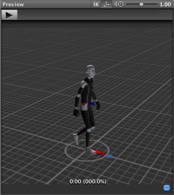

# Body Transform

Body Transform 是角色的 CenterOfMass。它被用于 Mecanim 的重定向引擎，并提供最稳定的位移模型。Body Orientation 是上半身与下半身朝向相对于 Avatar T-Pose 的平均值。

Body Transform 和 Orientation 存储在 Animation Clip 中（使用在 Avatar 中设置的 Muscle definitions）。它们是存储在 Animation Clip 中的**唯一世界空间曲线**。其他所有内容：肌肉曲线和 IK 目标（Hands 和 Feet）均相对于 Body Transform 存储。

# Root Transform

Root Transform 是 Body Transform 在 Y 平面上的投影，并在运行时计算。在每一帧，都会计算 Root Transform 的变化量。随后，该变换的变化量会被应用到 Game Object，使其产生移动。

角色底部的圆圈表示 root transform。

# Animation Clip Inspector

Animation Clip Editor 的设置——Root Transform Rotation、Root Transform Position (Y) 和 Root Transform Position (XZ)——让你能够控制如何从 Body Transform 投影得到 Root Transform。根据这些设置，Body Transform 的某些部分（分量）可能会被转移到 Root Transform。例如，你可以决定运动的 Y 位置是属于 Root Motion（轨迹） 还是 姿势（Body Transform） 的一部分，这被称为 Baked into Pose。

如果 Y 是属于 Root Motion 的，那么播放动画时 GameObject 也会在 Y 轴上运动（动画中身体的各个部分在没有这个 Y 的运动成分）。如果 Y 是属于 Body Transform 的，则 Root Motion（GameObject）只会水平运动，角色动画中身体各部会将 Y 轴上的移动混合到其中。

如果关闭 Root Motion，则 GameObject 根本不会移动，只有角色身体在空间中移动，而且动画播放完毕还会回到起点。

# Root Transform Rotation

Bake into Pose：该朝向将保留在 Body Transform（或姿势）上。Root Orientation 将保持恒定，且 增量朝向（Delta Orientation）将为单位矩阵。这意味着该 AnimationClip 不会对 GameObject 产生任何旋转影响（只有 Body Transform 在旋转）。

只有那些 起始和结束 Root Orientation 相似 的 AnimationClip 才应使用此选项。在用户界面中，你会看到一个 绿色指示（Loop Match），提示该 AnimationClip 是一个合适的选择。典型的适用情况包括 直线行走 或 奔跑 动画。

这是因为如果动画不是 Loop Match 的，Bake into Pose 会产生和原动画不一样的效果。例如一个动画，是空中旋转 90 度。这样这个动画原本的效果是播放两次，角色会朝向之前的反方向，播放三次，会跳到之前的 270 度的方向。但是如果 Bake into Pose，Root Transform 不会旋转，Body Transform 每次播放都是从原来的位置空中旋转到 90 度，然后回到原位，播放两次、三次都是一样，这就与动画原来的效果不一样了。这种情况就需要手动处理 Root Transform，播放一次，将 Root Transform 旋转 90 度一次。

Based Upon： 该选项允许你设置 clip 的朝向 orientation。如果选择 Body Orientation（身体朝向），剪辑将根据身体的 forward vector 进行朝向调整。此默认设置适用于大多数 动作捕捉（Mocap） 数据，如行走、奔跑和跳跃；但对于 横向移动（strafing） 等运动（其运动方向与身体前向向量垂直）则可能失效。在这种情况下，你可以使用 Offset（偏移） 设置手动调整朝向。最后，选择 Original（原始） 将自动添加导入剪辑中自带的 偏移量。该选项通常用于 关键帧数据，以尊重艺术家设定的朝向。

偏移（Offset）： 当选择 Based Upon 选项时，用于输入所需的 偏移量。

# Root Transform Position（Y）

这使用与 Root Transform Rotation 相同的概念。

Bake Into Pose： Y 分量将保留在 Body Transform（Pose） 上。Root Transform 的 Y 分量将保持恒定，并且 Delta Root Position Y 将为 0。这意味着该剪辑不会改变 GameObject 的高度。同样，你会在界面中看到一个绿色指示，提示该剪辑是否适合将 Y 运动烘焙到姿势中。

大多数 AnimationClips 都会启用此设置。只有会改变 GameObject 高度的剪辑（如跳起或下落）才应关闭。注意：Animator.gravityWeight 由“Bake Into Pose 位置 Y”驱动。启用时为 1，禁用时为 0。在状态之间过渡时，会对各剪辑的 gravityWeight 进行混合。

很多动画需要尊重和保持动画片段中对整个角色的移动、旋转。因为这是动画设计者为满足艺术效果或真实性制作出来的，角色播放这个动画后就应该停留在距离初始位置的某个地方和朝向，下次播放从这个位置/朝向继续。尽管这可以通过脚本对 Root Transform 完成，但是这样不仅需要动画设计者提供 Root Transform 每次播放要指向的位移和旋转，还将动画的逻辑扩散到了程序中。

Based Upon： 与 Root Transform Rotation 类似，你可以从 Original 或 Mass Center（Body） 中进行选择。还有一个对**会改变高度**的剪辑（即禁用 Bake Into Pose）非常方便的 Feet 选项：启用后，Root Transform Position Y 将**使所有帧**与最低的 Foot 的 Y 对齐。因此，混合点始终保持在脚部附近，从而防止在混合或过渡时出现浮动问题。

Offset： 与 Root Transform Rotation 类似，你可以使用 Offset 设置在使用该选项时的 AnimationClip 高度进行手动调整。

# Root Transform Position（XZ）

同样，这里使用了与 Root Transform Rotation 和Root Motion Position (Y) 中描述的相同概念。

Bake Into Pose 通常用于“Idles”，在这种情况下你会希望强制让 delta Position (XZ) 为 0。它会在多次求值后阻止小幅增量的漂移累积。它也可以用于基于 Original 的关键帧剪辑，以强制使用由美术师设定的已创作位置。

# Loop Pose

Loop Pose（类似于 Blend Trees 或 Transitions 中的 Pose Blending）是在 Root Transform 的参考系中发生的。一旦计算出 Root Transform，Pose 就会相对于它成为相对姿态。系统会计算起始帧与结束帧之间的相对姿态差，并将该差值在剪辑的时间范围内（从0–100%）进行分布。

Root Transform 是一个虚拟 Transform，又动画根据各种 Bake 选项计算出来。

# Generic Root Motion and Loop Pose

其工作方式本质上与 Humanoid Root Motion 相同，不同之处在于它不是使用 Body Transform 来计算/投影 Root Transform，而是使用在 Root Node 中设置的 Transform。Pose（位于 Root Motion 骨骼之下的所有骨骼的变换）会相对于 Root Transform 成为相对姿态。

外部工具创建的动画，可能不一定使用 root bone 作为真正的 root，所有动画的 bone 可能基于更下层的某个 bone 运动的，后者是动画的真正“root bone”，其上面的 bone 甚至还有 Sibling 旁支骨骼链，可能仅作为管理或附加其他物体使用，它们在动画过程中不移动也不旋转。因此需要为 Generic 动画指定一个作为 Root Node 的 bone。
