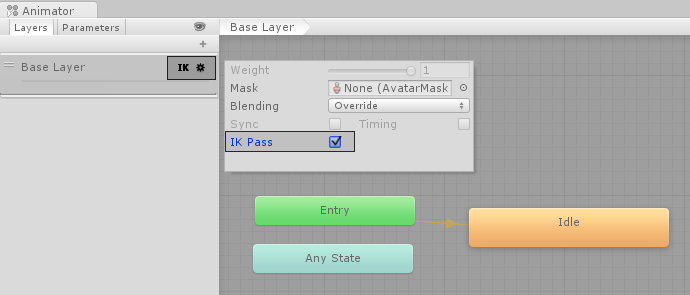

大多数角色动画是通过将骨架中的关节角度**旋转**到预定值来创建的。子关节的位置会随其父关节的旋转而改变。关节链的端点由链上各个关节的角度及其相对位置共同决定。这种为骨架设定姿态的方法称为正向运动学（Forward Kinematics）。

然而，从相反的视角来设定关节姿态通常也很有用。从空间中的某个选定位置（或一个目标）开始，反向推导如何为关节定向，使端点能够到达该目标。当你希望角色抓住一个物体或在不平坦的表面上站立时，这种方法非常有用。该 approach 称为逆向运动学（Inverse Kinematics，IK）。在 Mecanim 中，只要角色是人形并且拥有正确配置的 Avatar，即可支持 IK。


上面的图片显示了一个角色触碰要给圆柱体。实现这个 IK，遵循以下步骤：

- 为角色创建 Avatar
- 为 character 创建一个至少带一个 animation 的 Animator Controller
- 在 Animator window 的 layers 层，点击 Base Layer 的齿轮图标，从 context menu 中开启 IK Pass（后处理）。开启后，IK Pass 发送一个 OnAnimatorIK 回调，你在脚本中使用这个回调实现 Inverse Kinematics

  

- 确保为 Animator 指定了 Animator Controller

  

- 将下面的脚本添加到角色上。它为角色右手设置 IK target。它还改变 lookAt position，使得 character 在抓取 cylinder 时能看向 cylinder。

  ```C#
  using UnityEngine;
  using System;
  using System.Collections;
  
  [RequireComponent(typeof(Animator))]
  public class IKControl : MonoBehaviour {
  
      protected Animator animator;
  
      public bool ikActive = false;
      public Transform rightHandObj = null;
      public Transform lookObj = null;
  
      void Start ()
      {
          animator = GetComponent<Animator>();
      }
  
      //a callback for calculating IK
      void OnAnimatorIK()
      {
          if(animator) {
         
              //if the IK is active, set the position and rotation directly to the goal.
              if(ikActive) {
  
                  // Set the look target position, if one has been assigned
                  if(lookObj != null) {
                      animator.SetLookAtWeight(1);
                      animator.SetLookAtPosition(lookObj.position);
                  }
  
                  // Set the right hand target position and rotation, if one has been assigned
                  if(rightHandObj != null) {
                      animator.SetIKPositionWeight(AvatarIKGoal.RightHand,1);
                      animator.SetIKRotationWeight(AvatarIKGoal.RightHand,1);  
                      animator.SetIKPosition(AvatarIKGoal.RightHand,rightHandObj.position);
                      animator.SetIKRotation(AvatarIKGoal.RightHand,rightHandObj.rotation);
                  }
              }
  
              //if the IK is not active, set the position and rotation of the hand and head back to the original position
              else {          
                  animator.SetIKPositionWeight(AvatarIKGoal.RightHand,0);
                  animator.SetIKRotationWeight(AvatarIKGoal.RightHand,0);
                  animator.SetLookAtWeight(0);
              }
          }
      }
  }
  ```

- 要避免右手穿越 Cylinder 表面，IK 运动到 Cylinder 的中心，添加一个 empty child GameObject 到 cylinder 上，命名为 Cylinder Grab Handle
- 调整 Cylinder Grab Handle 的 Position/Rotation，使右手接触 Cylinder 但不穿越 cylinder. 实际中因为角色的位置不同，会在不同的方向接触 Cylinder。为此，可以在 Cylinder 外围设置一圈 Grab Handle 然后计算一个面对 Character 最靠右的那个，或者使用物理检测的方法确定 Grab Handle
- 将 Cylinder Grab Handle 指定给 IKControl 脚本的 Right Hand Obj 字段
- 将 Cylinder 指定给 IKControl 脚本的 Look obj 字段，这样当 IK Active 开启时，角色将看向 Cylinder 的中心
- 进入 Play Mode。现在角色应该可以随着开启或关闭 IK Active 选项而触摸和释放 Cylinder 了。同时改变 Cylinder 的位置和旋转，观察右手和角色 LookAt 如何反应。

# API

要为 character 设置 IK，通常需要在场景中有角色需要交互的 objects。你可以在脚本中，使用这些 objects 和 character 设置 IK。你可以使用以下 Animator 函数：

- void SetIKPositionWeight(AvatarIKGoal goal, float weight)
  
  设置一个 IK goal 的 translative（转移）weight。0 位于 IK 前的原始动画，1 位于 goal
  
  一个 IK goal 是特定身体部分的一个 target position 和 rotation。

  Unity 可以计算如何从起始点（例如，从 animation 得到的当前 position 和 rotation）向 target 移动身体部分。

  这个函数设置一个 0-1 之间的值，来决定起始点和 IK 瞄准的 goal position 之间的距离有多远。

  IK target 的 position 单独使用 SetIKPosition 设置。

  ```C#
  using UnityEngine;

  public class Example : MonoBehaviour
  {
      public Transform objToPickUp;
      Animator animator;

      void Start()
      {
          animator = GetComponent<Animator>();
      }

      void OnAnimatorIK(int layerIndex)
      {
          // Retrieves the value of the parameter "RightHandReach" that must be created in the AnimatorController.
          float reach = animator.GetFloat("RightHandReach");

          // Sets IK Position and IK Position Weight.
          animator.SetIKPositionWeight(AvatarIKGoal.RightHand, reach);
          animator.SetIKPosition(AvatarIKGoal.RightHand, objToPickUp.position);
      }
  }
  ```

- void SetIKPosition(AvatarIKGoal goal, Vector3 goalPosition)

  为 IK goal 设置 target position。

  这个函数设置最终目标在世界空间中位置。

  实际 body part（left_foot, right_foot, left_hand, right_hand）在空间中停留点，还被 weight 参数影响。它是 animation current 的 position 和 target position 之间的插值因子。

- void SetIKRotation(AvatarIKGoal goal, Quaternion goalRotation)

  goalRotation：目标身边部分应该在世界坐标系中的旋转。

  一个 IK goal 是为特定身体部分（LeftHand，RightHand，LeftFoot，RightFoot）指定的 target position 和 rotation。Unity 计算如何将 goal（身体部分）从起始点运动到达指定的目标（position，rotation）。例如从动画中得到的当前位置和旋转。

  这个函数为世界空间中设定 IK 的旋转目标。当指定 IK goal rotation 时，应该遵循 Unity 的世界坐标系约定：

  - X 轴与手掌（或脚底）平行，向侧边指向手（脚）的右边
  - Y 轴垂直手掌（脚底），指向手心外部
  - Z 轴与手掌（或脚底）平行，指向手指（脚趾）方向

  这是对齐到 target rotation 的身体 goal 的本地坐标系。

  建议让 ​​Avatar 骨架 pose ​​的​​骨骼朝向​​遵循 ​​Unity 的世界坐标系约定​​。若骨架姿态采用了不同的约定，施加到对应 ​​GameObject​​ 的​​骨骼旋转​​可能与 ​​IK 目标旋转​​不一致。

  可设置一个​​权重值​​来控制 ​​IK 目标旋转​​对​​起始旋转​​的影响程度。使用 ​​SetIKRotationWeight​​ 设置 0​​-1​​ 的权重：​​0​​ 表示无影响，​​1​​ 表示完全影响。

  ```C#
  using UnityEngine;

  public class Example : MonoBehaviour
  {
      Transform objToAimAt;
      Animator animator;
  
      void Start()
      {
          animator = GetComponent<Animator>();
      }
  
      void OnAnimatorIK(int layerIndex)
      {
          Quaternion handRotation = Quaternion.LookRotation(objToAimAt.position - transform.position);
          animator.SetIKRotationWeight(AvatarIKGoal.RightHand, 1.0f);
          animator.SetIKRotation(AvatarIKGoal.RightHand, handRotation);
      }
  }
  ```

- void SetIKRotationWeight(AvatarIKGoal goal, float weight)

  无论 weight 指定为多少（0.5，还是 1），IK 都会立即将 IK goal 运动到 target 的位置/旋转。没有过渡动画，计算是立即完全的。要想平滑过渡，在 OnAnimatorIK 回调中为 Animator 设定实时追踪的 target 位置、旋转以及设定权重。

- void SetLookAtPosition(Vector3 lookAtPosition)

  在动画过程中为角色设置 LookAt 位置。这应该是专门用于 Head 的 IK。SetIKPosition/SetIKRotation 的 AvatarIKGoal 只包含了四肢。

  将该方法与 Animator.SetLookAtWeight 结合使用，以确定角色应朝指定位置注视的强度。

  你只能从 MonoBehaviour.OnAnimatorIK 或 StateMachineBehaviour.OnStateIK 回调中调用 Animator.SetLookAtPosition。如果在其他上下文中调用，该方法不会产生效果并发出警告。

- SetLookAtWeight

  变体

  - void SetLookAtWeight(float weight);
  - void SetLookAtWeight(float weight, float bodyWeight);
  - void SetLookAtWeight(float weight, float bodyWeight, float headWeight);
  - void SetLookAtWeight(float weight, float bodyWeight, float headWeight, float eyesWeight);
  - void SetLookAtWeight(float weight, float bodyWeight = 0.0f, float headWeight = 1.0f, float eyesWeight = 0.0f, float clampWeight = 0.5f);

  参数

  - weight：LookAt 的全局 weight，其他 weight 参数的 global 因子
  - bodyWeight：body（脊柱 bone）多少程度参与 LookAt
  - headWeight：head 多少程度参与 LookAt
  - eyesWeight：eye 多少程度参与 LookAt
  - clampWeight：0.0 表示角色在运动上不受限制。1.0 表示角色被限制（无法进行 LookAt）。0.5 表示角色能够在可能范围的一半内移动（180 度）。

- Vector3 bodyPosition

  body CenterOfMass 的世界空间的位置。只应该在 OnAnimatorIK 函数中设置这个值。

- Vector3 bodyRotation

  body CenterOfMass 的世界空间的旋转。只应该在 OnAnimatorIK 函数中设置这个值。

IK 主要负责微调动画以将动画中的身体位置（旋转）匹配到实际播放的场景中的世界位置（旋转），是在 Animation 之后运行的后处理。IK 是实时解算的，因为运行时，角色的动画、target 的位置都可能在实时改变。给定起始和目标位置（旋转），给定 weight，会立即将身体部分运动到那个点，这是每一次 IK 的解算结果（参考 Constraints）。但是为了实现一个平滑过渡，可以平滑插值 weight。因为要动态实时指定 target 的位置（旋转），因此 IK 解算也是在一个 Play Loop 回调进行的，OnAnimatorIK(int layerIndex)

IK 会立即将身体部分从当前位置运动到 target 的位置（weighted），不管当前的位置是什么，如何得到。即使当前处于静止状态，没有播放动画，也是有当前位置的，也可以指定目标，进行 IK 计算。它是 Animator 的后处理，但是 Animator 当前可以没有播放任何动画。

IK 计算应该考虑了 Avatar 骨骼的 Muscle Setting（每个骨骼的移动、旋转范围），避免因为 IK 计算导致不合理的姿势 Pose。另外，如果 Muscle Setting 的约束达到最大，骨骼仍然到不了指定的 Position/Rotation，那 IK 计算的结果就是骨骼在满足约束的情况下能接近 target 的最大位置（旋转），但不会强行到达。

但是 Unity 内置的 IK 只能用于 Humanoid Avatar。Final IK 可以用于任何通用的模型。

AvatarIKGoal:

- LeftFoot
- RightFoot
- LeftHand
- RightHand

# Animancer IK

**Animancer 处理 IK 的方式概览**

- **Animancer** 定位为直接播放与管理 **AnimationClip** 的系统，可完全替代或与 **Animator Controller** 混用；它支持 **Humanoid** 动画重定向、通用骨骼、**Root Motion**、动画事件以及 **IK**。这意味着你可以在 Animancer 驱动的角色上继续使用 Unity 原生的 **Animator IK** 机制（如手部、脚部、头部的末端 IK），也可以在需要更强控制时接入 **Animation Rigging** 等 Rig 方案。Animancer 的优势在于更灵活的数据驱动与轻量控制，同时保留与 Animator/Ik 的兼容性。

**方案一 使用 Animator 的内置 IK 与 Animancer 共存**
- 适用场景：在已有动画上做末端微调，如**手抓取、脚贴地、头部指向**等。
- 关键要点：
  - 在角色的 **Animator Controller** 中，给需要执行 IK 的层勾选 **IK Pass**，否则帧更新中不会执行 IK 回调。
  - 在脚本中实现 **OnAnimatorIK(int layerIndex)**，通过 **Animator.SetIKPosition/Rotation + SetIKPosition/RotationWeight** 更新目标与权重，实现与动画的无缝叠加。
  - Humanoid 内置 IK 支持的末端链共有 **5 条**：**头（Look At）**、**左手**、**右手**、**左脚**、**右脚**；其中手臂/腿部 IK 链分别到 **肩/髋** 为止，不会自动驱动脊柱或腰部去“探身”。如需全身协调，见下文 FIK 方案。
  - 与 Animancer 的配合方式：Animancer 负责播放与混合 **AnimationClip**，Animator 仍负责状态与 **IK Pass**；在 **OnAnimatorIK** 中写入你的 IK 目标与权重即可生效。

**方案二 使用 Animation Rigging 实现更强的 IK 与全身控制**
- 适用场景：需要在已有动画上叠加更复杂的约束（如 **TwoBoneIK、Multi-Parent、Aim、Chain**），或希望**手部指向的同时让肘部朝向提示方向**，甚至实现**全身协调**（探身、弯腰等）。
- 基本步骤：
  - 通过 **Package Manager** 安装 **Animation Rigging**；为角色添加 **Rig Builder**，在模型下创建 **Rig**。
  - 在 Rig 下添加 **TwoBoneIKConstraint**（手臂/腿部）、必要时配合 **Aim/RotateOffset/Hint** 等约束，通过脚本控制 **constraint.weight** 实现平滑开关与过渡。
  - 与 Animancer 搭配：Animancer 播放动画，Rig 在同一帧内对骨骼链进行解算叠加；若需要全局身体协调，可使用 Rigging 提供的全身约束组合，或在复杂需求下引入 **Full-Body IK** 方案（如 Final IK）。

**方案三 仅用脚本在 Animancer 下做简单 IK 或目标对齐**
- 适用场景：不需要 Animator 的 **IK Pass**，或希望直接在 **Update/Tick** 中以脚本控制骨骼/Transform。
- 做法要点：
  - 直接操作骨骼 **Transform**（位置/旋转）或使用 **Animation Rigging** 的约束与权重进行程序化控制；这种方式与 Animancer 的数据驱动思路契合，便于与状态机、参数、事件系统集成。
  - 若你此前在 Animator 中做过 **Foot IK**（如在 Animator 状态里勾选 **Foot IK**），迁移到 Animancer 后通常改由 **Rig** 或脚本实现，以获得更直观的控制与调试体验。

**实践建议与避坑**
- **权重渐变**：无论采用哪种 IK，都建议对 **IK 权重**做插值（如 0→1 的淡入淡出），避免手/脚“弹跳”或“撕裂”。
- **层级与蒙版**：需要仅对上半身或下半身生效时，结合 **Animator Layer** 与 **Avatar Mask** 控制影响范围，减少不必要求解。
- **探身与全身协调**：Humanoid 内置 IK 不会主动驱动 **脊柱/腰部** 去“够”远处目标；此类需求请使用 **Animation Rigging** 的多约束组合或引入 **Full-Body IK**（如 Final IK）。