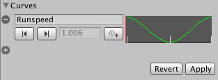

有时你的动画是“原地”的，这意味着如果把它放到场景中，它不会移动其所附加的角色。换句话说，该动画不包含 Root Motion。

对于这种情况，你可以通过脚本来修改根运动。要将所有内容组合在一起，按照以下步骤操作（注意：实现同一结果有多种变体，这里只是其中一种做法）。

1. 打开包含 in-place 动画的 FBX 文件的 Inspector 的 Animation Tab
2. 确保 Muscale Definition 设置为你想控制的 avatar
3. 选择一个 animation clip
4. 确保 Loop Pose 被正确对齐，开启了 Loop Pose 选项

   

5. 在 animation view 中预览动画，确保动画开始和结束平滑的对齐，即 character 是 in-place 移动的

6. 在 animation clip 中创建一个 curve，它将控制 character 的 speed
7. 为 curve 提供一个有意义的名字，例如 Runspeed

   

8. 创建一个新的 Animator Controller
9. 将想要的 clip 拖入其中创建一个与 clip 同名的 state
10. 为 Controller 添加与 curve 同名的参数（Runspeed）
   
    

11. 选择 Hierarchy 中已经添加的 Animator 的角色 GameObject
12. 将 Animator Controller 指定给 Animator 的 Controller 字段
13. 此时进入 Play Mode，角色会在原地播放 run 动画
14. 最后，控制运动，创建一个脚本（RootMotionScript.cs），实现 OnAnimatorMove 回调

    ```C#
    using UnityEngine;
    using System.Collections;
    
    [RequireComponent(typeof(Animator))]
    
    public class RootMotionScript : MonoBehaviour {
    
       void OnAnimatorMove()
       {
          Animator animator = GetComponent<Animator>();
    
          if (animator)
          {
             Vector3 newPosition = transform.position;
             newPosition.z += animator.GetFloat("Runspeed") * Time.deltaTime;
             transform.position = newPosition;
          }
       }
    }
    ```

15. 你应该将 RootMotionScript.cs 脚本附加到 “Dude” 对象上。当你这样做时，Animator 组件会检测到该脚本包含 OnAnimatorMove 函数，并将 Apply Root Motion 属性显示为 Handled by Script。

    