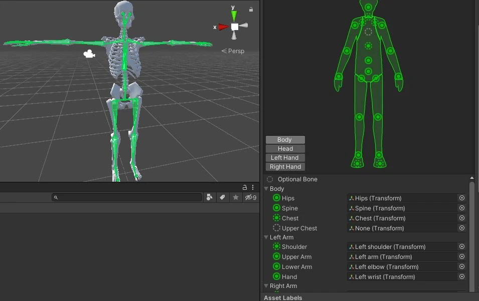
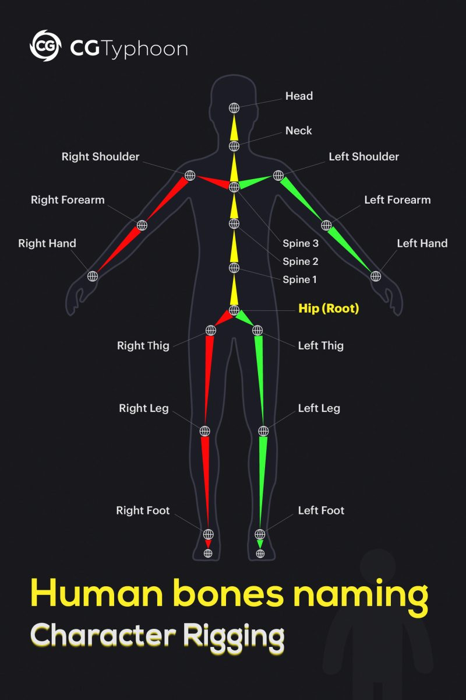

# Hips 骨骼的起点与终点放置规则​​

- 在 Unity 的人形骨骼中，​​Hips​​ 应该作为整棵骨架的​​根骨骼（Root）​​，有时也叫 Pelvis。

- 只保留​​一个 Hips 骨骼​​，不要在它下面再额外创建一根“Hip/骨盆”子骨。

- 将 Hips 的​​头部（Head）​​放在角色的​​髋臼/髋关节中心​​（两侧大腿根之间的中点），让骨骼的​​方向指向角色的前方（通常为 +Y）​​。

- 四肢链从 Hips 向下延伸：从 Hips 挤出 ​​UpperLeg → LowerLeg → Foot → Toes​​；脊柱向上延伸：从 Hips 挤出 ​​Spine → Chest/UpperChest → Neck → Head​​。

- 这样设置可确保 Unity 的 ​​Humanoid Avatar​​ 正确识别根运动与重定向参考姿态（常见做法是以 T-Pose 为参考）。

## ​​为什么这样做​​

- Unity 的 ​​Humanoid Avatar​​ 以 Hips 为根来计算​​根运动（Root Motion）​​与全身姿态；若在 Hips 下再放一根“Hip”子骨，或把 Hips 放在错误位置，常导致 Avatar 校验失败、根运动漂移、动作偏移或重定向异常。
- 规范的层级与方向能保证动画在不同角色间的​​重定向​​与 ​​IK​​（如手/脚对点对齐）稳定工作；许多教程与实践都强调从 Hips 开始、向上脊柱、向下四肢的标准链式结构。

## ​​在 Blender 中的具体做法​​

- 在 3D 视图将​​3D 游标​​放到角色髋关节中心（常用操作：选中模型→Shift+S→Cursor to Selection），切换到前视图（Numpad 1）或侧视图（Numpad 3）对齐。

- Shift+A 添加 Armature→Single Bone，进入编辑模式（Tab）将该骨命名为​​Hips​​，将其​​Head​​对齐到髋臼中心，​​Tail​​沿角色前方伸出一小段（便于后续挤出脊柱）。

- 从 Hips 挤出脊柱到胸廓，再创建​​Spine、Chest/UpperChest、Neck、Head​​；从 Hips 向下挤出双腿链到脚趾，必要时为手指添加 ​​Thumb/Index/Middle/Ring/Little 的 Proximal/Intermediate/Distal​​ 三级。

- 姿态模式下摆成​​T-Pose​​（或 A-Pose），应用变换（Ctrl+A→All Transforms），再导出 FBX。Unity 侧将 Animation Type 设为 ​​Humanoid​​，进入 ​​Configure…​​ 检查映射是否全绿并通过。

- 导出时尽量避免在 Hips 下生成多余子骨（如“Hip/骨盆”），以免破坏根骨骼定义与 Avatar 识别。

​## ​常见错误与快速修正​​

- 错误：Hips 下再挂一根“Hip/骨盆”子骨。修正：删除该子骨，确保整棵骨架只有​​一个 Hips 根骨​​，其余链从它挤出。

- 错误：把 Hips 放在大腿根部或胯部一侧。修正：将 Hips 的​​Head​​移回​​髋臼中心​​，让角色在 Unity 中​​脚底不陷入地面​​、站立姿态自然。

- 错误：骨骼朝向混乱（非统一前向）。修正：统一骨骼轴向（常见为 Y 轴向上、骨骼前向为 +Y），再进入 Unity 配置 Avatar 并校验。

## Bone

每个 Bone 就是 Head->Tail 这一对 Transform。Bone 的位置在 Head，Head 也是 Bone 的 Pivot。Tail 给骨骼提供了一个长度。在骨骼链中，Tail 就是下一个 Bone 的 Head。对于末端 Bone，有一个额外的 Tail Transform 为它提供一个 End 和长度。

有时 Child Bone 也可以不与 Parent Bone 相连，此时 Child Bone 的 Head 和 Parent Bone 的 Tail 保持一定的位移。但是它仍然会随之 Parent Bone 位移而位移，旋转而旋转。可以认为每个 Child Bone 的 Head 都与 Parent Bone 的 Tail 有一定的位移。但是默认位移是 0，因此 Child Bone Head 总是和 Parent Bone Tail 在一起。这也说明每个 Bone 都是 Head、Tail 两个 Transform 定义的。

下面是一些 Unity Humanoid 骨骼设定

可见，没有额外的骨骼在 Hips 之上用于操作整个骨架，Hips 本身就是 Root Bone，它也负责臀部的骨骼蒙皮。在 Hips 之上再设置 Bone 是错误的做法。将 Hips 作为 Root Bone 就能得到一个干干净净的骨架结构，完美匹配人体真实骨骼。

# Unity Avatar 骨骼

**Unity Avatar 的骨骼构成与可选性**

**总体说明**
Unity 的人形 Avatar 使用一套标准的人体骨骼映射。模型至少需要**15**块关键骨骼才能创建有效 Avatar；在 Avatar 配置界面中，骨骼节点以圆形图标显示，**实线圆**为必须匹配的骨骼，**虚线圆**为可选骨骼。可选骨骼即使未显式映射，其运动也会由系统基于必需骨骼进行**自动插值估算**，但为了更好的兼容性与动画质量，建议尽量补齐可选骨骼并摆成**T 姿势**。

**必需骨骼清单**
- 根部位（通常命名为**Hips**，作为骨架根与运动根）
- 脊柱链：**LowerSpine → Chest/UpperChest → Neck → Head**
- 左臂链：**LeftUpperArm → LeftLowerArm → LeftHand**
- 右臂链：**RightUpperArm → RightLowerArm → RightHand**
- 左腿链：**LeftUpperLeg → LeftLowerLeg → LeftFoot**
- 右腿链：**RightUpperLeg → RightLowerLeg → RightFoot**
说明：
- 上述是创建有效 Humanoid Avatar 的最小必备集合；其中**Hips**既是根骨骼也是骨盆/髋部节点，是整个映射的起点。
- 命名尽量语义化（如 LeftArm、RightForearm 等），可显著提升自动匹配成功率。

**可选骨骼清单**
- 脊柱上部细化：**UpperChest / Chest**（在已有 Chest/UpperChest 时用于更精细的胸廓控制）
- 颈部细分：**Neck**（在已有 Neck 时可进一步细分）
- 面部/眼睛：**LeftEye / RightEye**
- 手部：**LeftFingerBase / RightFingerBase**（手指根部，用于手指动画的基础映射）
- 足部：**LeftToes / RightToes**（脚趾根部，用于脚趾动画）
- 肩部：**LeftShoulder / RightShoulder**（许多模型没有独立肩骨，但若存在并正确映射，可提升上肢姿态求解质量）
提示：
- 这些骨骼在 Avatar 界面以**虚线圆**显示；未映射时由系统插值估算，映射后可提升动画还原度与控制精度。

**实用建议**
- 在 Avatar 配置中，若自动映射不理想，可依次使用：**Sample Bind-pose → Automap → Enforce T-Pose**，并确保角色最终为**T 姿势**；必要时手动拖拽分配骨骼，映射正确与否以界面**绿色/红色**提示为准。
- 为便于跨角色重定向与维护，建议使用一致的**骨骼命名规范**（如 LeftArm/RightForearm 等），并在项目中保存可复用的**Human Template（.ht）**映射文件。

## Should 骨骼

**连接关系与层级要求**

- **Shoulder 应该作为 Chest 的子骨骼**（直接父级）。在 Unity 的 **Humanoid Avatar** 拓扑中，胸廓节点（**Chest/UpperChest**）之下必须是左右肩（**Left/RightShoulder**），再往下才是上臂（**UpperArm**）。这是 Avatar 的硬性层级约束；同时，**Neck 与 Head** 也必须位于 **Chest** 之下。未提供 **UpperChest** 时，**Chest** 之下同样应是 **Shoulder**。Spine 的直接子级通常是 **Chest/UpperChest**，不应跳过胸廓节点把 Shoulder 直接连到 Spine。
- 没有 ​​Chest​​ 时，​​Left/RightShoulder​​ 应作为 ​​Spine（脊柱根，即 Hips 的直接子级）​​的子骨骼。
- Unity 的硬性要求是：​​Neck 与 Head 必须位于 Chest 之下​​；而 ​​Shoulder 必须位于 Chest 之下​​。当模型没有 Chest 时，Unity 会把 ​​Spine​​ 当作“逻辑上的 Chest”来校验，因此 Shoulder 改挂在 Spine 下即可满足拓扑约束。
可选骨骼缺失不会导致 Avatar 无效，系统会基于已映射的必需骨骼进行估算；但为了姿态求解更准确，建议尽量补齐可选骨骼或在缺少时确保层级关系正确
- 不需要把 **LeftUpperArm** 接到 **Chest** 的尾部。正确的约束是层级上的父子关系：当模型没有 **Shoulder** 时，**LeftUpperArm** 应作为 **Chest** 的直接子骨骼（或通过最多 **2** 个中间骨骼间接挂在其下）；而 **Chest** 本身应作为 **Spine** 的子骨骼。Unity 的人形 Avatar 对手臂链的要求是：**RightUpperArm 必须是 RightShoulder 的子级（允许 0–2 个中间层级）**；若没有 Shoulder，UpperArm 直接作为 Chest 的子级即可满足“Shoulder 位置存在可映射的骨骼”的约束。不要把 UpperArm 接到 Spine 与 Chest 之间的“间隙”或尾部代理上，这会破坏胸廓到上臂的合理层级。 

**在 Unity 与 DCC 中的正确做法**

- Unity 配置
  - 在模型的 **Rig → Animation Type = Humanoid → Configure** 中，确保映射为：**Hips → Spine → Chest/UpperChest → Neck → Head**，以及 **Chest/UpperChest → Left/RightShoulder → UpperArm → LowerArm → Hand**。若自动映射不理想，使用 **Sample Bind-pose → Automap → Enforce T-Pose**，并校直到标准的 **T 姿势**。  
- DCC 建模/绑定（以 Blender 常见流程为例）
  - 脊柱链：**Hips → Spine → Chest**（可选 **UpperChest**）→ **Neck → Head**。
  - 手臂链：**Chest → Shoulder → UpperArm → LowerArm → Hand**（Shoulder 为 Chest 的子级；若模型没有独立 Shoulder，可让 **UpperArm** 直接作为 **Chest** 的子级，Unity 会将其识别为 Shoulder）。

**常见错误与排查**

- 把 **Shoulder** 直接连到 **Spine**（跳过 **Chest/UpperChest**）会导致 Avatar 校验失败或手臂运动求解异常。正确做法是让 **Shoulder 成为 Chest 的子级**。  
- 误把 **Shoulder** 当作 **Spine** 的子级，或把 **Neck/Head** 接到 **Spine** 而非 **Chest**，都会破坏必需拓扑。  
- 没有 **UpperChest** 也可以：直接使用 **Chest**，但其下仍需接 **Shoulder**；有 **UpperChest** 时，层级为 **Spine → Chest → UpperChest → Neck/Head**，而 **Shoulder** 始终挂在 **Chest** 下。
- 把 **Shoulder** 直接连到 ​​Hips​​ 或跨过 ​​Spine​​ 连到其他高位骨骼，都会破坏拓扑，导致校验失败或手臂求解异常。
- 误以为没有 **Chest** 就必须把 **Shoulder** 连到 **Neck/Head**​；这是错误的，正确做法仍是连到 **Spine**
- 缺少 **UpperChest** 不会影响 Avatar 有效性；没有 **Chest** 时依然可用 **Spine** 作为替代父级，但建议在可实现的范围内补齐 **Chest**/**UpperChest** 以提升上身动画还原度

## Avatar 配置界面

**含义说明**
- **灰色虚线圆圈**：表示该骨骼是**可选**的。未映射时，Unity 会基于已映射的必需骨骼**自动插值估算**其运动；映射后可用于更精细的控制与重定向。仅当至少所有**必需骨骼**都正确匹配时，Avatar 才能被视为有效。为提高匹配成功率，建议使用语义清晰的骨骼命名（如 LeftArm、RightForearm 等）。
- **绿色虚线圆圈**：表示该**可选骨骼已被成功映射**，并且当前骨骼选择/姿态在 Avatar 检查中**通过**（系统认可该映射合理）。绿色并不代表“必需”，只是“可选且当前有效”。

**与颜色和状态的关系**
- **实线圆圈**：表示**必需骨骼**，必须正确映射，否则 Avatar 无效。
- **绿色（实线/虚线）**：对应骨骼当前**匹配正确/通过检查**；实线=必需且正确，虚线=可选且正确。
- **红色**：对应骨骼**映射错误/不被认可**，需要手动修正或重新映射。
- **灰色（非虚线，即灰色实心圆）**：常见于未映射的**可选骨骼**（尚未指定具体骨骼）。如果变成**灰色虚线**，一般仅是界面强调其为“可选”的视觉提示，核心仍是“是否已映射且通过检查（绿色）”。

**快速自检与修正**
进入 Avatar 的**Configure**界面后，先执行**Sample Bind-pose → Automap → Enforce T-Pose**，并确保角色处于标准**T 姿势**；若某处显示红色，优先手动拖拽分配正确骨骼；若提示“Character not in T-Pose”，用**Enforce T-Pose**或微调相关骨骼旋转，直至不再报错并尽量让可选骨骼显示为绿色。

## 最小骨骼结构

Chest 也是可选的，可以让 Spline 直接伸展到 Neck Head 处，然后取消 Chest。

Upper Arm 不需要连接到 Chest。Child Bone Head 不一定要连接到 Parent Bone 的 Tail，可以保持一定的位移。Parent Bone 移动和旋转时可以正常地带动 Child Bone 移动和旋转，只是保持一定的偏移而已。
