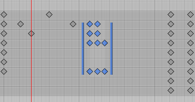
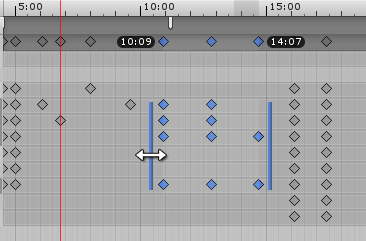
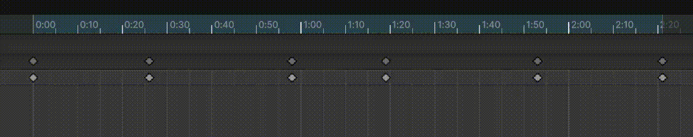

在 ​​Animation 窗口​​的 ​​Dopesheet​​ 模式下，使用​​框选（Box Selection）​​可以选择多个​​关键帧​​。借助框选，你可以一次性选择并操作多个关键帧。

执行以下操作可选择多个关键帧：

- 按住 ​​Shift​​ 并单击，将单个关键帧添加到当前选择。
- 用鼠标拖出一个矩形，框选一组关键帧。
- 按住 ​​Shift​​ 并拖动矩形，向当前选择中添加或移除一组关键帧。
- 按住 Ctrl 可以选择一个 key
- 无论哪种方法，一个 key 被选中两次，会被从当前选择中取消（例如矩形选择）

随着你向选择中添加关键帧，框选控制柄（Box Selection handles）会出现在所选关键帧的左右两侧。如果你继续添加或移除关键帧，这些框选控制柄会自动调整它们的位置和大小，以包围所有当前选中的关键帧。

Box Selection handles 展示 selected keys 的左右边界。

​​使用框选控制柄移动、缩放和 ripple 编辑所选关键帧。

# 移动选择 keys

在框选范围内的任意位置单击并拖动，即可移动所选的关键帧。你无需直接点击某个关键帧，只需点击框选控制柄（Box Selection handles）之间的任意空白区域即可。

当你拖动所选的关键帧时，第一个和最后一个关键帧的时间会显示出来，帮助你精确定位框选范围。如果你将所选关键帧向左拖动，当释放鼠标时，那些处于负时间（0 标记左侧）的关键帧将被删除。

# 缩放选择 keys

当你选中了多个关键帧后，就可以对它们进行缩放操作。例如，你可以通过增大所选关键帧之间的间距来减慢动画速度，也可以通过减小它们之间的间距来加快动画速度。要进行缩放，只需点击所选关键帧左侧或右侧的框选控制柄（Box Selection handle），然后水平拖动即可。

在缩放所选关键帧的过程中，第一个和最后一个关键帧的时间会显示出来，帮助你精准控制动画的缩放。在缩放时，有些关键帧可能会最终落在同一帧上。如果出现这种情况，在你释放鼠标按钮时，那些占据同一帧的多余关键帧将被丢弃，最终只保留最后一个关键帧。

# Ripple edit

Ripple Edit 是一种在框选（Box Selection）中移动或缩放关键帧的方法。它还会影响与所选关键帧同属性的未选中关键帧。未选中关键帧受影响的方式取决于 Ripple Edit 是 ripple move 还是 ripple scale。

- Ripple Move：按住并保持按住2键，然后在框选范围内拖动。这会移动框选的关键帧，并根据你的拖动方向将未选中的关键帧向左或向右推移。波纹移动会保持未选中关键帧之间的距离不变。
- Ripple Scale：按住并保持按住2键，然后拖动框选控制柄（Box Selection handles）之一。这会根据你的拖动方向，缩放所选关键帧之间的时间间距。同时会将未选中的关键帧向左或向右推移，并保持未选中关键帧与框选范围之间的距离不变。

Ripple Edit 就是按住 2 键，同时拖拽、缩放选择的 keys 的包围框。如果选择的 keys 包围框移动或缩放时，不影响左边、或右边的 key，它们就保持不变，如果包围框挤占、超过了旁边的 keys，就把那个方向的所有 keys 向那个方向推挤到更远。

选择单个 key 也可以 Ripple Edit，但是只能 Move，没有 Scale。
