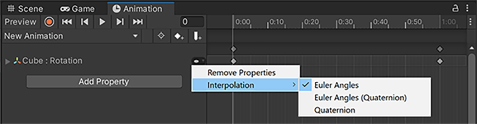

# Rotation interpolation

可以使用 Animation Window 选择 Unity 如何对 GameObject 应用旋转。

Unity 使用插值来计算 animation 中一个 GameObject 如何从一个 orientation 旋转到另一个。

Unity 提供了 3 种类型的动画插值：

- Euler angle interpolation

  - Euler Angles：欧拉角插值会按照输入的角度，将完整的运动范围应用到 GameObject；如果旋转角度大于360 度，GameObject会先完整地转完一圈，再停在正确的朝向。
  - Euler Angles(Quaternion)：使用上述插值方法，但会将信息​​烘焙​​到一条​​四元数曲线（Quaternion Curve）​​中。该方法会占用​​更多内存​​，但运行时性能会​​略快​​。

- Quaternion interpolation

  四元数插值会让 GameObject 沿着朝向目标的最短路径进行旋转。例如，无论旋转值是 5 度还是 365 度，对象都只会旋转 5 度。

  四元数只会在球面上走最优劣弧，因此旋转角度总小于等于 180 度。

# External animation sources

来自外部源的​​动画​​通常包含以​​欧拉格式​​记录的​​旋转关键帧​​。

Unity​ ​会对这些动画进行​​重采样​​，并为动画中的每一帧生成新的关键帧，以避免出现超出​​旋转四元数​​有效范围的情况。

例如，如果有两个相隔 ​​6 帧​​的关键帧，且 ​​X​​ 轴的值从 ​​0​​ 变为 ​​270 度​​，在不重采样的情况下，使用​​四元数插值​​会在相反方向旋转 ​​90 度​​，因为这是从起始朝向到达目标朝向的​​最短路径​​。相反，如果进行重采样并在每一帧都添加关键帧，则关键帧之间的旋转增量仅为 ​​45 度​​，从而得到正确的旋转结果。

​​四元数插值​​总是沿最短路径到达目标朝向，因此无法表示超过 ​​180 度​​的单次旋转；而​​欧拉角插值​​会按你输入的角度执行完整的旋转范围。若需要保留完整的旋转过程或避免“最短路径”翻转，可在导入设置中关闭​​Resample Curves​​，改用原始​​欧拉曲线​​在运行时计算旋转。

## Resolve rotation problems with external animation sources

如果导入动画的​​四元数重采样​​与原始数据不够接近，你可以关闭​​动画重采样​​，在运行时使用原始的​​欧拉动画关键帧​​。
