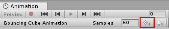
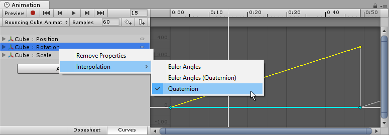
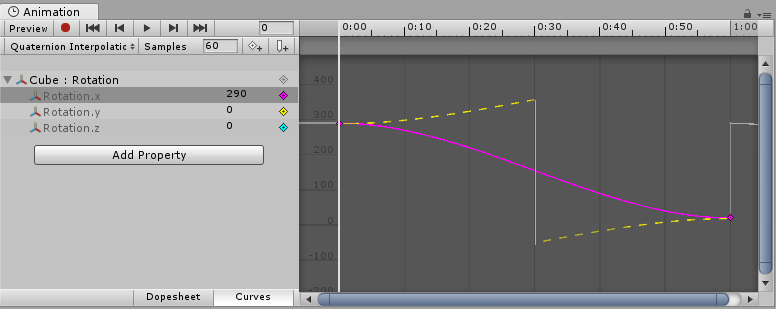

# 属性列表

在 Animation Clip 中，如果某个可动画属性（animatable property）拥有 Animation Curve（动画曲线），这意味着该属性的数值会随时间变化。

在 Animation View（Animation 窗口）左侧的属性列表区域（Property List）中，会列出当前正在被动画化的所有属性。

当窗口处于 Dope Sheet 模式时，各属性的动画值仅以线性轨道（linear tracks）显示；而在 Curves 模式下，你可以看到每条属性的数值变化以曲线的形式在图表中可视化呈现。

无论使用哪种模式，曲线本身都存在：Dope Sheet 模式只是以更简化的形式展示数据，仅标示关键帧（keyframe）发生的时间点。

在 Curves 模式下，Animation Curves 会以彩色曲线指示器（colored curve indicators）显示。每种颜色对应属性列表中当前所选的一个属性的数值。

# Curves, Keys, Keyframes

Animation Curve（动画曲线）包含多个关键点（keys），这些是曲线必须经过的控制点。在 Curve Editor（曲线编辑器） 中，它们会以曲线上的小菱形标记显示。若在当前预览的某一帧中，一条或多条已显示的曲线在该帧都有关键点，则该帧称为关键帧（keyframe）。

Curve Editor 仅显示已选属性的曲线。当你在属性列表中选择了多个属性时，这些曲线的指示会叠加在一起显示。如果某个属性在当前预览帧处有关键点，该属性的曲线指示器会变为菱形，并且属性列表中的数值旁也会出现菱形标记。

# 添加和修改关键帧

可以点击 Keyframe 按钮在当前 previewed frame 添加一个关键帧。

可以通过点击 Keyframe（关键帧） 按钮，在当前预览的帧处为所有当前选中的曲线添加一个关键帧。  
也可以通过在曲线上双击想要添加关键帧的位置，为某一条曲线在任意指定帧添加一个关键帧。  

还可以右键单击关键帧线（Keyframe Line），然后从弹出的上下文菜单中选择 Add Keyframe（添加关键帧） 来添加关键帧。  

一旦放置好关键帧，可以用鼠标拖动它们来调整位置，也可以同时选中多个关键帧进行批量拖动。  
要删除关键帧，可以选中它们后按 Delete 键，或者右键单击关键帧并从上下文菜单中选择 Delete Keyframe（删除关键帧）。

# 可动画属性

​​Animation View（Animation 窗口）​​不仅可以用于动画化 ​​Game Object​​ 的​​位置（Position）​​、​​旋转（Rotation）​​和​​缩放（Scale）​​，还可以动画化​​任意组件（Component）​​与​​材质（Material）​​的属性——甚至是你自己脚本组件的​​公共变量（public variables）​​。

要实现具有复杂视觉效果与行为逻辑的动画，只需为相关属性​​添加 Animation Curves（动画曲线）​​即可。

可动画的属性类型包括但不限于：​​Float、Color、Vector2、Vector3、Vector4、Quaternion、Boolean​​；不支持​​数组​​以及除上述类型之外的​​结构体或对象​​。

对于​​布尔值​​，​​0​​ 表示 ​​False​​，其他任意值表示 ​​True​​。

典型用法示例：

- 为​​光源（Light）​​的​​颜色（Color）​​与​​强度（Intensity）​​设置曲线，实现​​闪烁/呼吸​​效果；
- 为​​音频源（AudioSource）​​的​​音高（Pitch）​​与​​音量（Volume）​​设置曲线，制作​​风声、引擎声、流水声​​等动态音效；
- 为​​材质（Material）​​的​​纹理偏移（Texture Offset）​​设置曲线，模拟​​传送带/流水/特效流动​​；
- 为​​粒子系统​​的​​发射状态（Emit）​​与​​速度（Velocities）​​设置曲线，制作​​烟花/喷泉​​等特效；
- 为​​脚本组件​​中的变量设置曲线，驱动​​随时间变化的行为

# Rotation 插值类型

在 Unity 中，旋转在内部以 四元数（Quaternion） 表示。四元数由 .x、.y、.z、.w 四个分量构成，通常不应手动修改这些分量，除非你非常清楚自己在做什么。实际制作中，旋转一般通过欧拉角（Euler Angles）来操作，欧拉角使用 .x、.y、.z 三个值分别表示绕对应轴的旋转角度。

在两个旋转之间进行插值时，既可以对四元数值进行插值，也可以对欧拉角度值进行插值。Animation View（Animation 窗口）允许你在为 Transform 的旋转制作动画时选择使用哪种插值方式。但无论采用哪种插值方式，旋转在界面中始终以欧拉角数值的形式显示。

Animation Window 在界面上，只以欧拉角的形式表示旋转。但是在 Unity 内部旋转总是被转换为四元数。

时刻记住，除了单一坐标轴的旋转（只围绕一个坐标轴的旋转），一定不要以欧拉角的形式理解旋转，尤其是以 Inspector 中的 Rotation 的三个分量 X Y Z 来理解最终的旋转效果。只以四元数的形式考虑旋转。单一坐标轴的欧拉角是四元素（轴+角度）的特例。在编辑时，只使用 Scene View 中的 Rotation Handler 操作 GameObject 的旋转，让 GameObject 旋转到相应的方向即可。

四元数和欧拉角可以相互转换，有一一对应关系。因此一个旋转既可以用四元数表示，也可以用欧拉角表示。

在创建旋转关键帧的时候不必担心万向锁问题，因为可以在 Scene View 中通过 Rotation Handler 任意旋转 GameObject，Rotation Hander 本质是在用四元数（轴+角度）来旋转 GameObject 的。

两个旋转关键帧就是明确记录的两个四元数的值，或者欧拉角的值，这没什么问题。但是关键帧中间的帧，旋转必需通过两个关键帧的数据插值得到。而以四元数的形式进行插值和以欧拉角的形式进行插值是不同的。

因此 Animation Window 提供了选项，是以四元数的形式插值，还是以欧拉角的形式插值。

- 以四元数的形式插值：将关键帧的旋转转换为四元数，在中间帧中，在两个四元数之间进行插值（Lerp 或 Slerp）
- 以欧拉角的形式插值：将关键帧的旋转转换为欧拉角，在中间帧中，在两个欧拉角（两个 Vector3）之间进行插值（Vector3.Lerp）

## Quaternion Interpolation

四元数插值始终会沿着两个旋转之间的最短路径产生平滑的旋转变化。这可以避免诸如万向锁（Gimbal Lock）之类的旋转插值瑕疵。然而，**由于四元数插值总是选择最短路径(最优劣弧)，它无法表示超过 180 度的旋转**。（可以这样想象：在球面上选取两点，它们之间的最短连线绝不会绕球体超过半圈。）

如果使用四元数插值，并且将数值旋转设置为彼此相隔超过 180 度，Animation 窗口中绘制的曲线仍会显示为覆盖超过 180 度的范围，但对象的实际旋转会走最短路径。

当使用​​四元数插值（Quaternion interpolation）​​时，如果将两个关键帧的旋转设置为相隔​​270 度​​，插值会沿着最短路径反向行进，实际只跨越​​90 度​​。窗口中显示的​​洋红色曲线（magenta curve）​​是动画窗口里实际呈现的曲线；而对象的真实插值轨迹由图中​​黄色虚线（yellow dotted line）​​表示，但该虚线在编辑器中并不会实际显示。

对旋转使用​​四元数插值（Quaternion interpolation）​​时，修改 ​​X、Y、Z​​ 任意一条曲线的​​关键帧​​或​​切线​​，也可能改变另外两条曲线的数值，因为这三条曲线都是由内部的​​四元数表示​​共同推导而来。使用四元数插值时，关键帧始终是​​联动​​的：在某一时刻为三条曲线中的任意一条创建关键帧，系统会同时在另外两条曲线上创建对应时刻的关键帧(Animation Window 在界面上只显示欧拉角)。

## Euler Angles Interpolation

欧拉角插值（Euler Angles interpolation）是大多数人更习惯使用的方式。欧拉角可以表示任意幅度的旋转，并且其 .x、.y、.z 三条曲线彼此相互独立。当同时绕多个轴旋转时，欧拉角插值可能会出现诸如万向锁（Gimbal Lock）等瑕疵；**但在一次只绕一个轴进行简单旋转时，其操作直观、易于上手**。采用欧拉角插值时，Unity 会在内部将曲线烘焙（bake）为内部使用的四元数（Quaternion）表示。这一过程与从外部软件导入动画到 Unity 时的处理类似。需要注意的是，这种曲线烘焙可能会在过程中引入额外的关键帧，并且使用Constant（常量）切线类型时，在子帧（sub-frame）级别上可能会出现不够精确的情况。

# 编辑器 Update

很多时候，很多插件，都会在 Editor 中更新，以预览动画效果。这需要在组件脚本中，为 MonoBehaviour class 上标记 [ExecuteInEditMode]. Editor 模式下，Update 不会像 Runtime 那样频繁更新，可能 1s 执行几次 Update，但是这样已经足够预览动画了。另外 UniTask，DOTween 都提供了在 Editor 模式下运行的选项，用来预览动画效果。

但是在 Editor 模式中，很多时候组件的引用属性可能为空，尤其是脚本刚添加到 GameObject，还没有设定各个属性的时候。因此在 Editor 运行的 Update 尤其要检测组件属性是否有效，仅在有效的时候运行更新逻辑。
