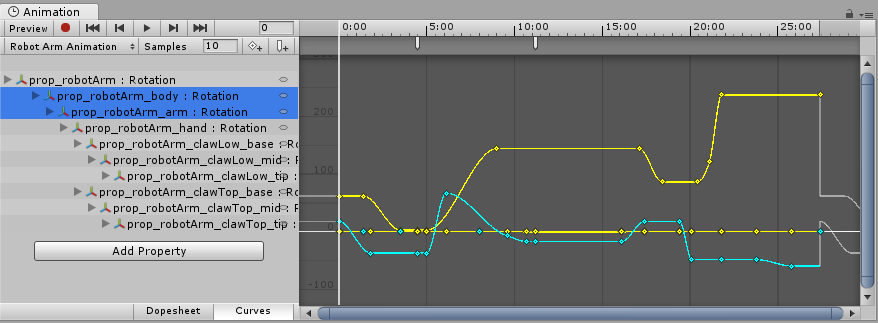
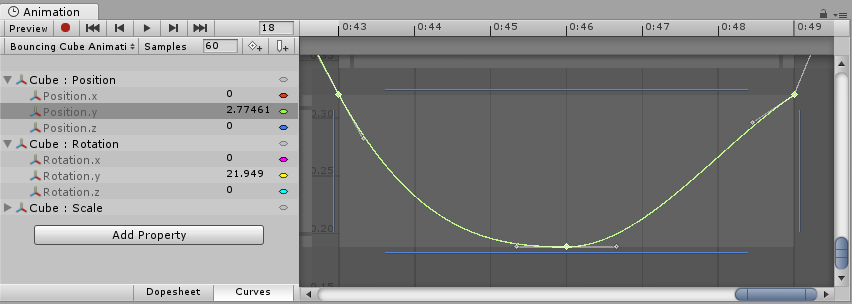
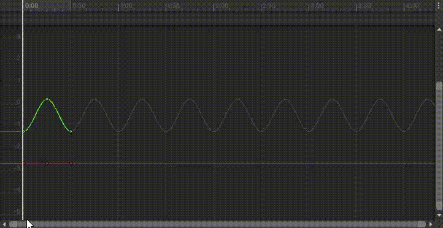
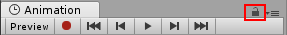

# Viewing Animations on a GameObject

Animation 窗口与 Hierarchy 窗口、Project 窗口、Scene 视图以及 Inspector 窗口相链接。

与 Inspector 类似，Animation 窗口会显示当前所选 GameObject 或 Animation Clip 资源的时间轴和关键帧。

你可以使用 Hierarchy 窗口或 Scene 视图选择 GameObject，也可以使用 Project 窗口选择 Animation Clip 资源。

Animation Window 可以预览两种 source：

- 带有 Animation 的 GameObject
- Project 中的 Animation Clip

# Animated Properties list

在下图中，Animation 窗口（左侧）显示了当前所选 GameObject 所使用的动画，如果其子 GameObject 也受该动画控制，则也会一并显示。

右侧是 Scene 视图 和 Hierarchy 视图，它们表明 Animation 窗口 显示的是附加到当前所选 GameObject 上的动画。

在 Animation 窗口 的左侧是动画属性列表。在一个尚未录制任何动画的新建剪辑中，该列表为空。

当你开始为此剪辑中的各种属性制作动画时，这些被动画化的属性将会出现在此列表中。如果该动画控制了多个子对象，该列表还将包含每个子对象被动画化属性的层级子列表。

在上面的示例中，机械臂 GameObject 层级中的各个部分都是在一个相同的动画剪辑中进行动画化的。

像这样在单个剪辑中对 GameObject 层级进行动画化时，确保你是在该层级中的根 GameObject 上创建动画。

每个属性都可以折叠和展开，以显示在每个关键帧处记录的确切数值。如果播放头（白色线条）位于两个关键帧之间，数值字段将显示插值后的数值。

你可以**直接编辑这些字段**。如果在播放头位于关键帧上方时进行更改，则会修改该关键帧的数值。如果在播放头位于两个关键帧之间（因此显示的数值为插值数值）时进行更改，系统会在此位置创建一个新的关键帧，并使用你输入的新数值。

# Animation Timeline

Animation 窗口的右侧是当前剪辑的时间轴。每个被动画化属性的关键帧都会显示在这个时间轴中。

时间轴视图有两种模式：Dopesheet（摄影表） 和 Curves（曲线）。要在这两种模式之间切换，请点击动画属性列表底部的 Dopesheet 或 Curves。这两种模式提供了动画时间轴和关键帧数据的两种不同视图方式。

## Dopesheet mode

Dopesheet 模式提供更为紧凑的视图，可以在各自的水平轨道中查看每个属性的关键帧序列。这使得能够简洁地概览多个属性或GameObject的**关键帧时间**。

## Curves mode

Curves 模式会显示一个可调整大小的图表，其中展示每条被动画化的属性的数值如何随时间变化。

所有已选属性会以叠加方式显示在同一图表视图中。该模式让你能够更精细地控制数值的查看与编辑，以及它们在关键帧之间的插值方式。

### Fitting your selection to the window

在使用 Curves 模式 查看动画时，有一点非常重要，那就是不同属性的数值范围有时会差异很大。例如，考虑一个简单的旋转弹跳立方体的动画剪辑：其弹跳的 Y 轴位置值 可能仅在 0 到 2 的范围内变化（意味着立方体在动画中弹跳的高度为 2 个单位）；然而，其旋转值却从 0 到 360（代表其旋转的角度）。当这两个曲线同时显示时，由于视图会缩放以适应旋转值的 0–360 范围，使得位置值的动画曲线将变得非常难以看清：

按下键盘上的 F 键 可将视图缩放到当前选中的关键帧。这是一个便捷的方法，可以快速聚焦并将窗口重新缩放至动画时间轴的某一部分，以便更轻松地进行编辑。

在列表中点击单个属性，然后按下键盘上的 F 键，可以自动重新缩放视图以适配该数值的范围。你也可以通过拖动视图滚动条滑块两端的拖拽手柄，手动调整曲线窗口的缩放比例。

按下键盘上的 A 键，可以将窗口缩放并重新调整，以显示剪辑中的**所有关键帧**，无论哪些关键帧当前处于选中状态。如果你想查看整个时间轴，同时保留当前的选择，这个操作非常有用。

如图所示，Curve View 的水平、垂直滚动条不仅可以滚动窗口，两端还有高亮的部分， 

- Alt+Shift+右键拖拽：仅垂直缩放 curve view
- Alt+右键拖拽：可以整体（水平、垂直）缩放 curve view

## Playback and frame navigation controls

要控制 Animation clip 的 playback，使用 Animation View 左上角的 Playback Control。

这些控件从左到右是：

- 预览模式（toggle on/off）
- 录制模式（toggle on/off）：注意当开启 record mode 时，Preview mode 也会开启
- 双左箭头：将 playback head 移动到 clip 的开头
- 单左箭头：将 playback head 左移一帧
- 三角箭头：从 playback head 的位置
- 单右箭头：将 playback head 右移一帧
- 双右箭头：将 playback head 移动到 clip 的结束

快捷键：

- 逗号：前一帧或前一秒
- 点号：下一帧或下一秒
- Alt+逗号：前一个关键帧
- Alt+点号：后一个关键帧

## Locking window

可以锁定Animation 编辑器窗口，使其不会自动切换 Hierarchy（层级） 或 Scene（场景） 中选择的 GameObject。锁定窗口在你希望专注于某个特定 GameObject 的动画，同时仍能在场景中选择和操作其他 GameObject 时非常有用。

