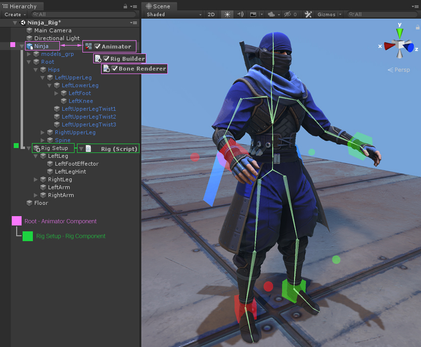
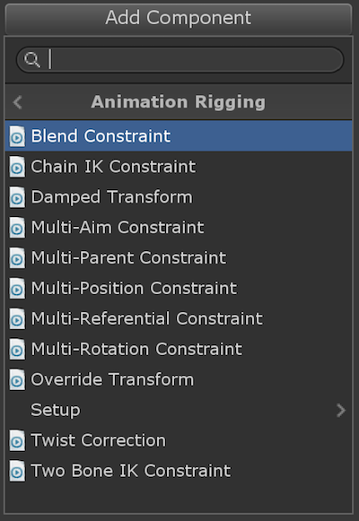

# Animation Rigging

Rig 操纵，骨骼操作，就像皮影戏、提线木偶一样，通过一个点控制另一个点。

IK 是 Rig 的一种，Rig 是通过一个 GameObject 控制其他 GameObjects 运动的通用机制。

Rig 也可以成为约束 constraint，一个 GameObject 的运动被另一个 GameObject 的运动定义，至少部分定义（blending）。在 Blender 中 IK 也是放在 constraint 下面的。

将一个 GameObject 定义为另一个 GameObject 的 Child 就是一种 rig。Unity 内置的 Constraints 就是 Rig 功能的一种。此外 Unity Animation Rigging 提供了更多的 Rig 功能。这说明的 Rig 功能的重要性。

FinalIK，PuppetMaster 都是 Rig 的具体实例。

这就是 Animation Rigging 的用途：GameObject constraint。Animation Rigging 提供了简单的 IK 功能，FinalIK 则对 IK 类别的 Rig 提供了终极的解决方案。这即 Animation Rigging 和 FinalIK 之间的区别。

例如角色手持武器，通常需要将武器 gameobject parent 到 hand 下面，这本身就是一种 rig（可以认为武器成为一个新的 bone）。但是这将操作角色骨架的 GameObject Hierarchy，而 hand bone 在 Hierarchy 中非常深的层次，定位非常费力，另外如果角色缩放了，hand 的 scale 还会影响武器的缩放。而使用 Parent Rig（constraint），则不需要修改骨架 Hierarchy，武器不在 Hierarchy 中，但是 Parent Rig 可以将武器约束到 hand 的位置和旋转，并一起运动，同时还忽略 scale。这就是 rig constraint 的好处。

Rig 功能在 gameplay 中非常常见，之前都是自己手工去写的脚本，例如让 camera 跟随 character，很多地方都把这称为将 camera rig 到 character 上。这些功能如此常见，原来不知道这是一类通用的功能，以后对于这类约束功能优先使用 Unity Constraint 或 Animation Rigging，只在不满足需求的情况下再自己写脚本。

Unity 导入的 FBX 文件甚至可以导入 Maya FBX 文件中的 Constraint，说明 Constraint 是非常常见和通用的模块化功能，大部分场景不要自己手写。

Rig/Constraint 可以串联叠加，GameObject1 通过 Constraint1 被 GameObject2 约束，GameObject2 通过 Constraint2 被 GameObject3 约束，以此类推。IK 也是约束的一种。运行时 IK 也是和 Parent/Position/Rotation 约束一样，每帧求值，只是求值过程要复杂的多。

游戏中一个物体影响另一个物体的运动都可以统称为约束。例如 FK 动画中，parent GameObject 影响 child GameObject 的运动。IK 中 end effector 影响 bone chains 的 pose。物理系统中，关节 joints 之间基于物理法则的相互约束，碰撞体之间禁止相互侵入的约束，等等。

使用 Animation Rigging 来创建和组织 constraints 的集合可以解决很多 rigging 需求。例如，可以创建带有 procedural secondary animation 的 deform rigs，以控制 armor，props，以及 accessories（配件）。可以创建 world interaction rigs（IK 和 Aim constraints 的集合），用于交互式 adjustments，targeting，animation compression correction（动画压缩修正）。

Animation Rigging package 包含了一组预定义的 constraints，来定义 animation rigs。

Animation Rigging 应用到 Animator 组件中的动画操作的骨骼，而不是一般的 GameObject Hierarchy。这就是为什么 Animation Rigging 名字中带有 Animation 以及需要 Animator 的原因。

**Animation 是专用于 Animator 骨骼动画的 Rig constraints，Unity Constraints 则是通用的 Rig constraints. AnimationRigging 需要和 Animator 一起工作。**

## Learn how Animation Rigging can level up animation in your project

创建可信和动态的动画从来不是容易的事情。

Animation Rigging package 使得同时完成 runtime rigging 和 animation authoring（动画制作）成为可能。

- Runtime rigging

  Runtime rigging 是骨骼动画在 gameplay 期间使用诸如 TwoBoneIK 或 Multi-Aim 的 constraints 作为 post-process 进行修改。在游戏开发中，它对诸如 attaching hands 到 props 或 aiming head 以 look at 特定 target 的场景很有用。它还通常用来设置变形修正 deformation fixup，例如 shoulder twist correction。所有这些可以针对特定 gameplay situations 的定制更精确、质量更好的动画结果。

- Animation authoring

  Animation Rigging 也可以用于动画制作。使用 Animation Rigging package，可以使用 Animation Rigging Constraints 设置具有 visual rig effectors 的 control rigs（控制 rigs） —— 和这在外部 DCC 应用程序完成是类似的。在 Unity Editor 中，可以在 Animation window 创建和编辑 keyframes，还可以在 Timeline 中 sequence 和 blend 多个 clips。结果就是一个新的 skeletal animation clip，它可以在 gameplay 期间被播放。

  Blender 使用 IK 制作的动画，在导入 Unity 时都会被转换为 FK 动画。但是因为 Animation Rigging 可以在运行时约束骨骼，因此可以仅通过动画控制骨骼，就可以创建骨骼动画。

使用新的 Bidirectional Motion Transfer 工具为 animators 提供了更灵活的 workflow，通过允许你在 constraints 和 bones 双向 transfer（转移）motion 。

- 可以 bake skeleton motion 到 rig constraints，在这里编辑 keyframe 更容易编辑（FK Pose -> Rigging Constraints）
- 还可以 bake constraints 产生的动态 motion 到 skeleton，以在运行时获得优化的性能（Rigging Constraints Pose -> FK）

### Animation Rigging 使用场景

一个主要的目标是降低创建高质量动画的门槛。Animation Rigging 是对包含很多工具很多人修改同一个动画片段的工作流的一个强大补充。

Animation Rigging package 可以增强几乎任何类型游戏的 motion，甚至当 animation resources 受限的时候。

## Introducing the Animation Rigging

Animation Rigging package 允许 user 在运行时在 animated skeleton 上设置 procedural motion（过程化动作）。

可以使用一组预定义的 animation constraints 来为 character 手动构建一个 control rig hierarchy，或者使用 C# 开发自己的 constraints。这使得在 gameplay 期间完成很多强大的事情称为可能，例如 world interactions，skeletal deformation rigging，和基于物理的辅助动作（physics-based secondary motion）。

Runtime Procedural Motion 指的是在骨骼动画播放的同时还能够程序化地精确控制骨骼，使得正常动画的播放和精确的程序控制可以自然地混合在一起。

### Animation Rigging overview

Animation Rigging package 提供一个 rig constraints 的库，你可以用在运行时创建 procedural motion。这通常称为 runtime rigging。Constraints 在称为 Rigs 的 groups 中设置，在挂载到 Animator Root 的 Rig Builder 组件中被组装。

这可以让玩家在 gameplay 期间对 animated skeletons 做诸如 world interactions 的强大的事情。比如，让 character hands 和一个 prop 交互，或者瞄准 world 中的一个 target。还可能使用 procedurally controlled bones 为 skeletal deformation rigging 获得更高质量的 rigging，例如在 skinned mesh character 上对 shoulder/wrist 的 twist correction。

### Bone Renderer

为了在 Unity Editor 中操作 rigs，Bone Renderer 组件帮助在 Scene view 中查看和交互 skeleton。它允许添加一个 transforms 的 list，并以各种方式显示它们。

使用多个 Bone Renderer 组件组织 skeleton 的不同部分通常很有用。例如同一个 character 有多个 Bone Renderer 组件，使得 body，fingers，twist bones 分别有不同的显式样式。这帮助使用不同的艺术 workflow，例如 rig setup，keyframing 或 gameplay debuging。

### Rig Builder and Rigs

- 首先，我们需要添加 Rig Builder 组件到 Animator Root，即 Animator 组件所在的 GameObject。通常是 rig hierarchy 的最上层 transform
- 接下来，创建新的 child gameobjects，在这里添加各种 Rig 组件
- 最后，将 Rig 设置到 Rig Builder 的 Rig Layers List

这是最小化的有效 rig setup。在下面的步骤添加 constraints。

Rig Builder 真正棒的事情是 Rig Layers list 可以包含多个 rigs。这对于创建在 gameplay 时打开和关闭的特定行为非常有用。当每个 Rig 有自己的 weight value 使得它可以和其他 rigs 混合时更加有用。

### Rig Constraints

Rig Constraints 是用来组装 rigs 并在运行时产生 procedural motion 的构造块 building blocks。它们被设计为模块化、通用目的，使得它们可以以很多不同的方式联合使用，以解决运行时你的动画游戏设计。

下面这个 package 发布的 Rig Constraints list

例如，设置 Rig Constraint（TwoBoneIK）的步骤：

- 首先，添加一个 GameObject 到 Rig 下面
- 然后添加一个 TwoBoneIK Constraint
- 接下来将 bones 和 effectors 赋值到 TwoBoneIK Constraint
- 最后，当 Play 时，我们可以在运行时 Constraint evaluates

### Rig Constraint sample

AnimationRigging 类似 Unity Constraints，都是约束 GameObject 位置和旋转的。不同的是，Animation Rigging 专门用于约束 Animator 操作的骨骼，并且其执行阶段是 Animator 输出 Pose 的后处理阶段。而 Unity Constraints 的执行阶段就是普通的 Update。
