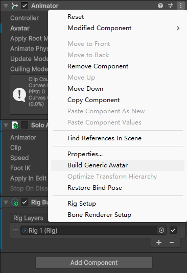
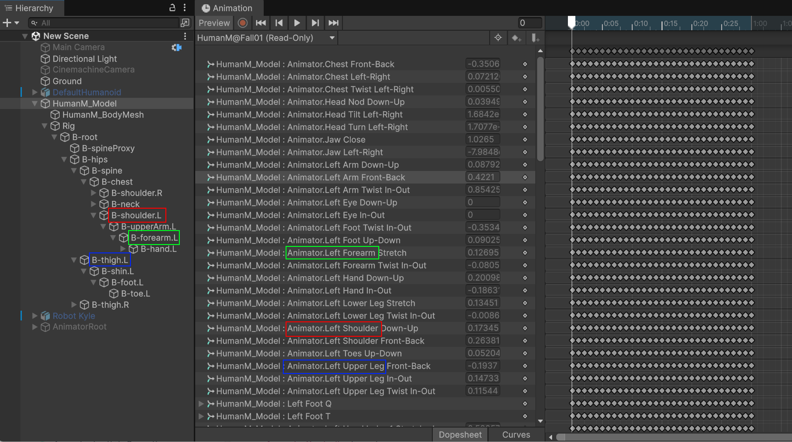

在带有 Animator 的 Character 上使用 Avatar asset 来控制 hierarchy 如何活动。

必须创建一个 Avatar 以使用 humanoid animation。如果带有 generic animation 的角色没有 Avatar，则会在 Animator 内部创建一个 Avatar。

通常 Avatar 通过 ModelImporter 创建，但是它可以使用 AvatarBuilder 手动创建，或者通过 Animator context menu 中的 “Build Generic Avatar”（在 Animator 内部创建一个 Generic Avatar）。



* Generic Avatar

  对于 Generic Animation，使用 AvatarBuilder.BuildGenericAvatar 来指定哪个 Transform 是 animated hierarchy 的 root（它可以嵌套在 Animator Hierarchy 的内部，默认 Animator Transform 就是 animated hierarchy 的 Root），以及 root 的名字（它持有 root motion animation）。

* Human Avatar

  对于 Humanoid Animation，使用 AvatarBuilder.BuildHumanAvatar 来指定哪个 Transform 是 animated hierarchy（它可以嵌套在 Animator hierarchy 的内部，默认是 Animator），以及提供 transforms 到 human bones 映射信息的 HumanDescription。

可见 Generic Rig 也是有 Avatar 的，但是它的 Avatar 只定义了一个 Bone，就是 Root Bone，也就是指定动画片段 Clip 从哪个 Transform 开始寻找动画属性的路径并应用动画曲线。它默认就是模型或播放动画的 Root GameObject（即 Animator 默认内部生成的 Generic Avatar。

这就是为什么 Generic Animation Clip 可以播放在其他具有相同 Hierarchy 结构但是名字不同的 Root GameObject 上的原因。之前说是 Animation 内部将动画片段的 root 记录为 ```.```，所以才可以应用到任何 GameObject 上。这是不正确的，真正的原因是 Animator 内部会为默认生成一个 Generic Avatar，它只映射一个 Bone，就是 Root，并且默认就是 Animator GameObject。然后 Animator 就会告诉 Clip 从哪个 Root Transform 开始寻找动画属性路径。这才是为什么 Generic 动画可以在不同 名字的 Root GameObject 上播放动画的原因。

以 Humanoid Clip 为例，在 Animation Window 中可见，动画片段中的 Bone 名字已经变成了 Avatar 中的标准骨骼名字了，不是 Animator 下面的 Bone Structure 的名字：



Generic 也是一样。经过 Root Bone 映射，在 Animation Window 中就会显示 Animation Clip 所在的 GameObject 的名字，而不是动画片段创建时候 Root GameObject 的名字。

就像 Humanoid Avatar 一样，Hips 或 Spine 可以在任何骨骼上播放（只要你在 Avatar 中定义好映射），Generic 动画也可以在 Animator 下面 Hierarchy 的任何 GameObject 上播放，只需要创建 Generic Avatar，并指定 Root Bone 即可，但是通常默认在 Animator GameObject 上播放已经足够。

