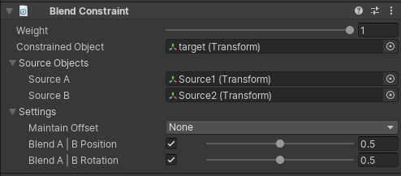

# Blend Constraint

Blend constraint 允许 constrained GameObject 在 Source A 和 Source B 之间 blend Position 和 Rotation。

| Properties | Description |
| --- | --- |
| Weight | constraint 的 weight。如果为 0，constraint 对 Constrained Object 没有效果。如果为 1，应用给定设置的全部影响 |
| Constrained Object | 被 Source GameObjects 影响的 GameObject |
| Source A | 影响 Constrained Object position 和 rotation 的 Source A GameObject |
| Source B | 影响 Constrained Object position 和 rotation 的 Source B GameObject |
| Maintain Offset | Source 和 Constrained objects 之间维持的 offsets (Position, Rotation or both) |
| Blend A - B Position | 如果开启，constrained GameObject 获得 Source A B 的 blended position |
| Blend A - B Rotation | 如果开启，constrained GameObject 获得 Source A B 的 blended rotation |
|  |  |