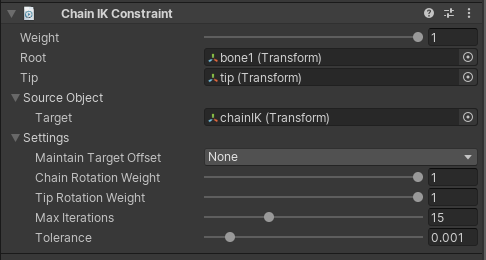

# Chain IK Constraint

Chain IK constraint 允许 inverse 一个 GameObjects hierarchy 的 control，以提供一个类似 chain 行为的操作。通过定义 Root 和 Tip GameObjects，Chain IK constraint 将能够发现和约束中间所有的 GameObjects。

这个 constraint 实现 FABRIK solver（Forward and Backward Reaching Inverse Kinematic）。

| Properties | Description |
| --- | --- |
| Weight | ... |
| Root | chain hierarchy 的 root GameObject |
| Target | 影响 constrained chain GameObject hierarchy 的 GameObject |
| Maintain Target Offset | tip 和 target objects 之间维持的 offsets（position，rotation，or both）|
| Chain Rotation Weight | 应用到整个 chain 上的 rotations 的 weight。Weight = 1 导致 chain 完全到达它的 target goal，weight < 1 混合 chain 中当前 FK rotations |
| Tip Rotation Weight | 应用到 chain 的 tip GameObject 的 rotation weight。如果为 1，tip 对齐它的 rotation 到指定的 target，否则它混合 blend 它的当前 value |
| Max Iterations | 如果 tolerance 不满足，执行的 Max solver iterations |
| Tolerance | target 和 tip GameObjects 之间的 Distance tolerance。考虑它时，即使 max iteration 没有达到，solver 也会停止运行 |
|  |  |
