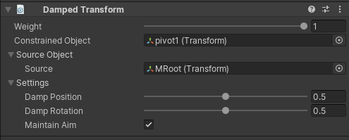

# Damped Transform

Damped transform constraint 允许从 source GameObject 到 constrained GameObject 阻尼 damping position 和 rotation transform values。

| Properties | Description |
| --- | --- |
| Weight | ... |
| Constrained Object | 被 Source 影响的 GameObject |
| Source | 影响 constrained GameObject 的 GameObject |
| Damp Position | 阻尼 position 的 weight。如果为 0，没有 damping 应用，object 跟随 source，如果为 1，完全的 damping 被应用 |
| Damp Rotation | 阻尼 rotation 的 weight。如果为 0，没有 damping 应用，object 跟随 source，如果为 1，完全的 damping 被应用 |
| Maintain Aim | 如果开启，Constrained GameObject 到 Source Object 的原始方向被维持 |
|  |  |
