# Unity 的模型文件的使用

模型文件导入到 Unity 之后，直接拖拽到 Scene/Hierarchy，如 Robot Kyle，就可以使用，也只能如此使用，因为它里面包含了骨骼结构。如果手动创建 SkinnedMesh，则还需要手动创建骨骼 Hierarchy，并且保证位置，这是不可能的。而且手动拖拽已经做了几乎所有必需的工作，没理由手动创建（即使理论上可以完全手动创建）。

如果模型文件只包含一个角色，当把拖拽到 Scene 中，会生成一个 Root 和两个 Child GameObject 的结构：

```
ModelRoot
|- ModelSkinnedMesh
|- ModelBoneHierarchy
```

* ModelRoot 是一个纯容器 GameObject，上面带一个 Animator。

  因此如果播放动画，是在这个 GameObject 上播放。它相当于 Blender 中的 Armature，Blender 中所有 Root Bones 都放在 Armature 下面。动画片段中所有的 Bone 路径都是从这个 Armature 开始记录的。

  这里没有使用 Animator Controller 组织 Animation Clip，而是使用 Solo Animation 管理 Clip（单个 Clip）。

  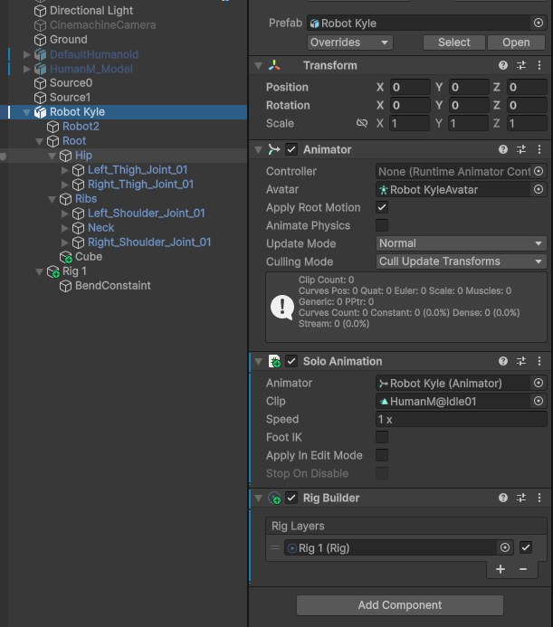

* ModelSkinnedMesh：

  保存模型的蒙皮 Mesh：

  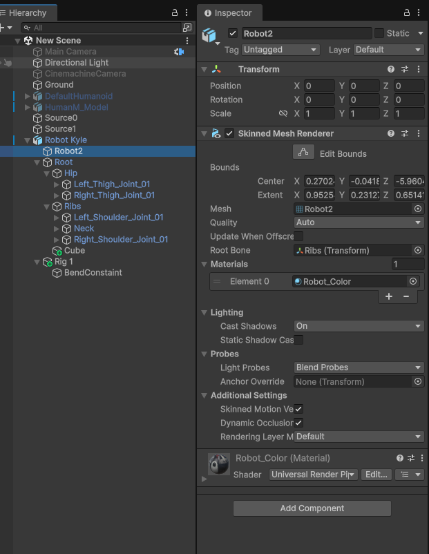

* ModelBoneHierarchy

  模型的骨骼结构：

  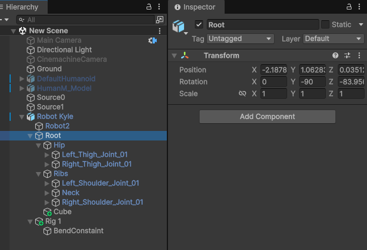

如果一个模型文件，只包含这个模型的蒙皮 mesh，骨骼，和动画，那它拖拽到 Scene 就只包含这些东西。带 + 号的是后面手动新加的一些 GameObjects，后面会讲解。

一般而言，模型在 Project View 中导入为一个 Prefab，其中包含了模型中的所有东西。当把它拖拽到 Scene 中，就创建了一个 Prefab Instance，它下面包含了模型中所有对象（无论是静态 Mesh，还是带动画的 SkinnedMesh，还是 Camera、Lights），都会在 Scene 中实例化，并放在一个空的 Root GameObject 下面。因此如果模型文件中混合很多东西，一起拖拽到场景中就会很混乱，还需手动清理。不同的模型不应该混合在一起导出。Blender 的导出选项中可以选择逐 Colleciton 导出，即每个 Collection 导出为一个模型文件。而且 Collection 可以层次化组织，一个 Collection 下面还可以有子 Collection。因此可以将不同用途的 Mesh，每个角色都放在各自的 Collection，然后逐 Collection 导出，这样每个角色就有单独的模型文件，就可以直接拖拽到 Scene 中了。

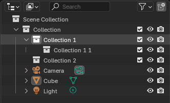

# 如何设置 Animation Rigging

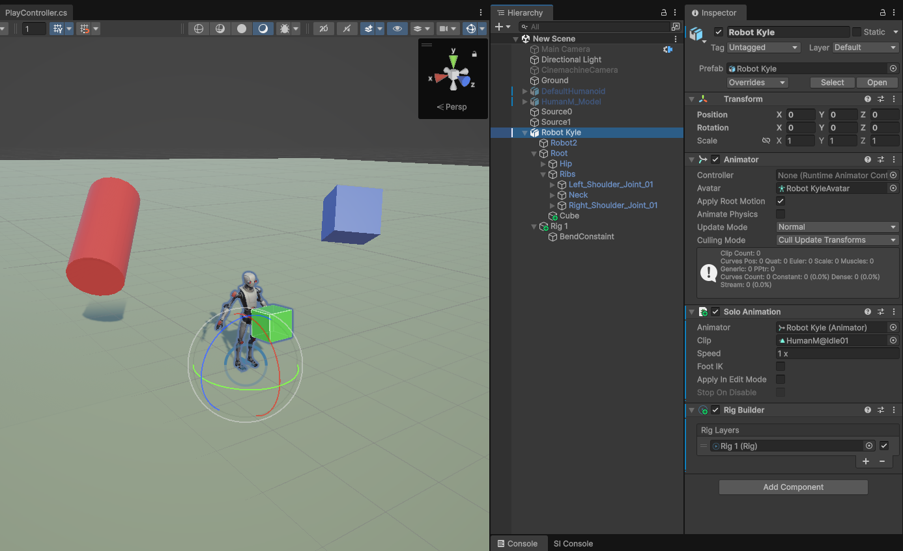

* Animation Rigging 应该放在 Animator 所在的 GameObject 上，而且它只能操作 Animator 的 Bone Structure。如果为它指定不是 Animator Hierarchy 的 Bone，Unity 就会报错。
* 选择 Animator GameObject，选择菜单 Animation Rigging > Rig Setup，就会为这个 GameObject 设置必要的 GameObject 和组件，包括

  - 为 Animator GameObject 创建一个 Rig Builder 组件，它是 Rigging 的最终组装车间，它的 Rig Layers 是一个 Rig 列表，堆栈，Layers，Rigging 会按顺序一次应用每个 Rig，并且可以选择开启或关闭一个 Rig
  - 在 Animator 下面，Bones 同级，创建一个初始 Rig 1，并将它填充到 Rig Builder 的 Layers 中
  - Rig 1 负责收集它和它下面 GameObjects 上的所有 Constraints，可以在 Rig 1 的 Hierarchy 中添加任意多个、各种 Constraints。如果一个 Constraints 需要 effector（用于控制约束的 GameObject），也应该添加到相应的 Constraint 下面，以便于组织。Rig 唯一暴露的属性，就是 weight，用于调整这个 Rig 的贡献程度，0 等效地关闭这个 Rig，1 完全发挥作用

这里在 Rig 1 下面添加了一个 BlendConstaint。它控制一个 Animator 下的骨骼，以两个 Transform 为 sources（它们无需在 Animator 之下，可以是场景中的任何 Transform，但是为了管理，通常应该放在 Constraint 之下），将两个 Souces 的 Transform 的 Position 和/或 Rotation 的加权平均值应用到这个骨骼上。


这里没有直接操作模型的骨骼，而是在 Bone Hierarchy 下面加上了一个额外的 Cube 用来展示 BlendConstraint 的作用。一个原因是这个角色的动画可能约束了骨骼的位置，导致 Blend Constaint 的 Position 约束不起作用，因此添加了一个额外的 Cube 来显示 Blend Constaint 的作用。

# 简化测试模型

Animator 对 Rigging 是必需，如果尝试移除 Animator 就会报错：

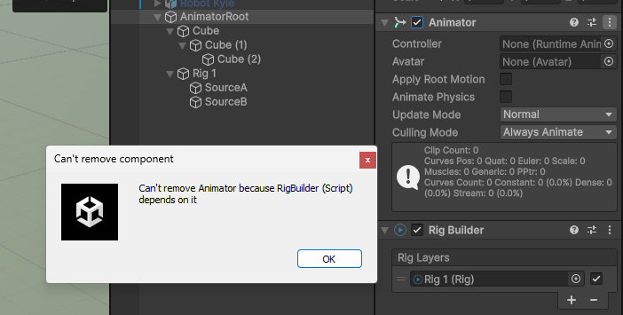

如果只添加了 RigBuilder，没有 Animator 也会报错。

但是 RigBuilder 也只依赖 Animator。下面建立了一个简化的模型，没有 SkinnedMesh，Animator 上也没有动画片段（没有 Animator Controller 或 SoloAnimation），只有由 3 个 Cube 构成的 Transform Hierarchy，Rigging 一样可以正常运行。注意两个 Sources 被移动到 Constraint 下面，这是建议的管理方式，将一个 Constraint 的控制器 Transform 都放在它的下面，以便于管理，如果需要与场景中其他的 GameObject 同步（位置、旋转），可以使用 Position/Rotation Constaints 与控制器同步，即使可以直接引用场景中的其他 GameObject，但是在 Rig Constraint 下面创建控制器 GameObject，可以让 Rig Constraint 变成自包含的。因为它可以用在任何场景中。

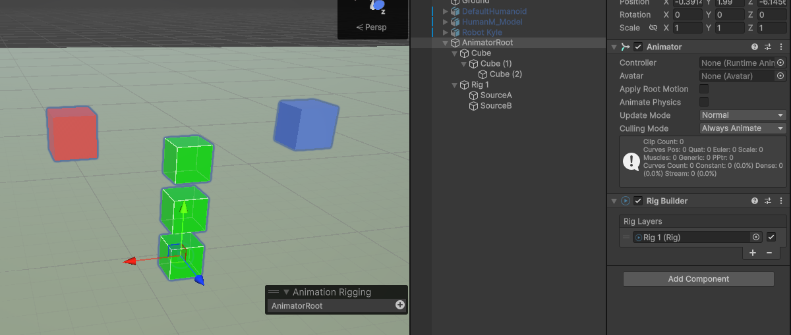

下面是在这个简化模型上测试 BlendConstraint 的结果：


注意，Rigging 只在运行时生效，在编辑器状态没有效果。

可见，Rigging 不关心是人形骨骼还是通用骨骼蒙皮，还是简单刚体 mesh（不是蒙皮骨骼模型），这些对它也没有意义，它只专注约束 Animator 下面的 Transform Hierarchy。是否蒙皮，由 SkinnedMeshRenderer 和 MeshRenderer 控制。是否是 Humanoid 由 Animation Clip 控制（Humanoid 模型导入时，Animation Clip 已经对 Humanoid 进行了标准化，动画片段里的 Bone 已经变成了 Avatar 中的标准骨骼名字，Avatar 中没有的骨骼，在动画片段中也被移除，因此只要 Animator 下面有和 Avatar 骨骼名相同的 Transform Hierarchy，动画片段就是逐骨骼应用动画曲线，不管这些骨骼是否建立为人体形状。

# 动画片段如何记录属性

为上面的 AnimatorRoot 创建一个简单动画片段，可见属性名也是按照 Hierarchy 组织的：

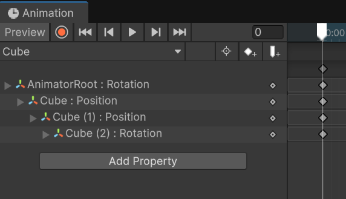

Root GameObject 名为 AnimatorRoot，下面的 GameObject 也按照创建动画片段时的 GameObject 名字。

如果将这个动画片段放在另一个简单 Cube 上，Animation Window 中就可以看见，Root GameObject 名字变成了 Cube，但是下面的 GameObject 仍然保持创建时的名字，如果新的 GameObject 下面没有相应的 GameObject，就显示 Missing。

这说明一个动画片段可以应用到任何 GameObject，而且 Root GameObject 的名字是无关的，无论是什么名字，在 Animation Window 中都会显示当前 GameObject 的名字，这是因为动画片段中将 Root GameObject 记录为 ```.```，就像 Unix 路径中的当前目录一样。下面的 Hierarchy GameObject 则保持为创建时的名字。因此如果新 GameObject 想要播放这个动画片段，它下面也应该有相应的同名同 Hierarchy 的 GameObject，只要有就能播放。如果没有，在 Animation Window 就会提示属性 Missing。但是动画仍然正常播放，指示这个属性曲线被忽略。

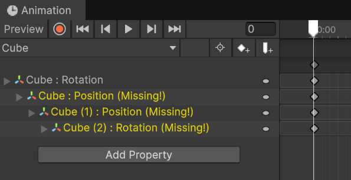

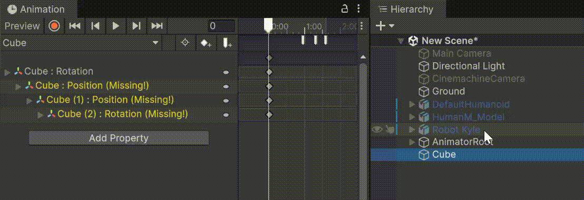

# Animator 和 Rigging 同时工作

无论时 Unity IK 还是 Animation Rigging，还是 FinalIK，都是 Animator 的后处理。Animator 输出的 Pose 不再是最终 Pose，不再直接应用到 Animator Bone Hierarchy 上。Animator 输出的 Pose 作为输入，输入到这些后处理系统中，后处理系统处理后输出的 Pose 才是最终 Pose。最简单就例如上面的 Blend Constraint，它使用两个 Source Transform 定义一个加权的平均 Position 和 Rotatin，然后在 Animator 输出这个 Bone 的 Position/Rotation 和 Constraint 定义的 Bone 的 Position/Rotation 之间进行线性插值 Lerp(Pos1, Pos2, weight)，作为 Bone 的最终值。因此如果 Rig 的 weight = 1，会完全有效地覆盖掉 Animator 输出的 Pose，即 Bone 完全由 Rig 的 Constraints 控制。只有 Rig 的 weight < 1，才可能看见原始的动画。如果 weight = 0，则 Rig 完全无效，Bone 完全被 Animator 控制。


# 循环动画曲线编辑

使用 DopeSheet 编辑的动画用于循环播放时，很多时候在两个播放周期切换处不能做到平滑，是因为 DopeSheet 创建的属性曲线默认两端都是水平 ease in 和 ease out 的，它们在两个周期切换处如下图所示：

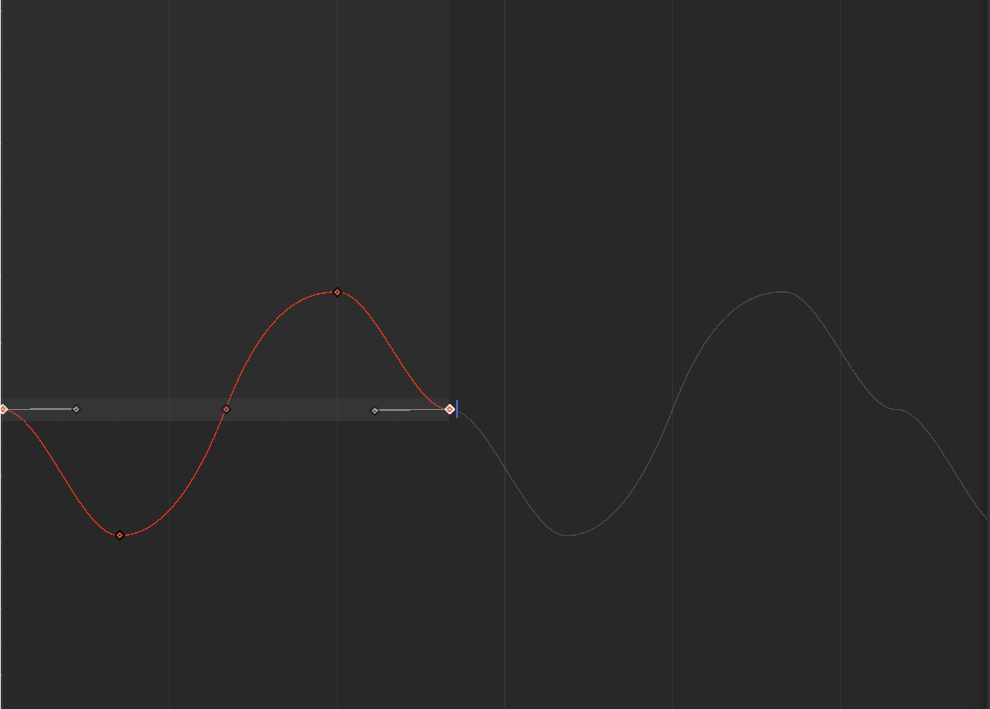

可见动画曲线在切换到下一个周期时有一个突变（即使它也是平滑的，但是与整体曲线走向不一致）。要想在两个周期切换时无缝平滑，必须将曲线调整成平滑的，如下图所示：

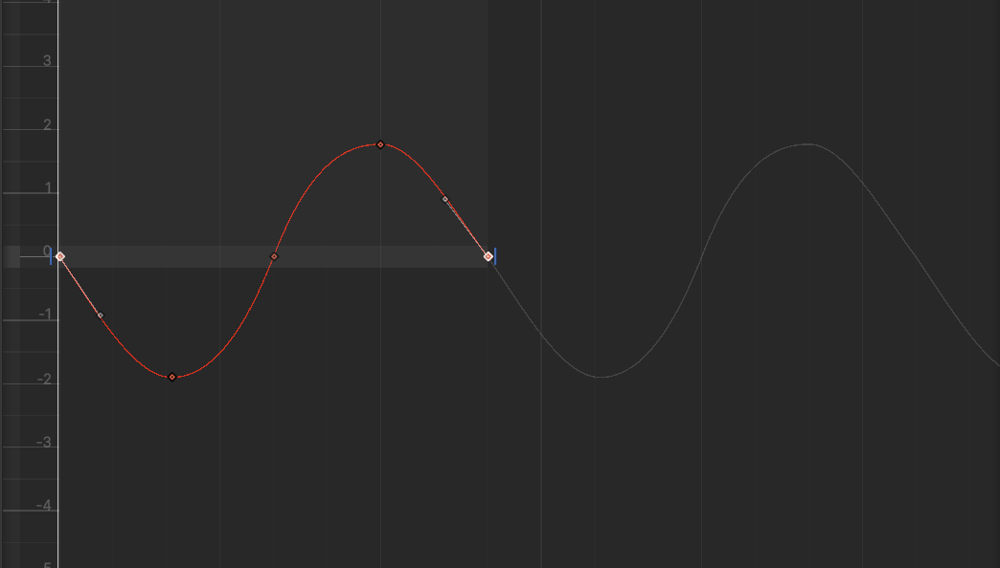

这就需要进入 Curve Mode。但是 Unity 默认创建的 Animation Clip 不是 Loop 的，因此属性在动画播放完毕后，保持最后一帧的值，因此最后一帧之后，曲线变成直线。要显示循环曲线，开启 Clip Inspector 中的 Loop Time，然后还要触发一下 Animator Window 的刷新（例如点击一下不同的属性），就可以看见循环的动画曲线了，编辑曲线两端的 tangent，让曲线在两个周期切换处平滑，动画时就不会有突变了：

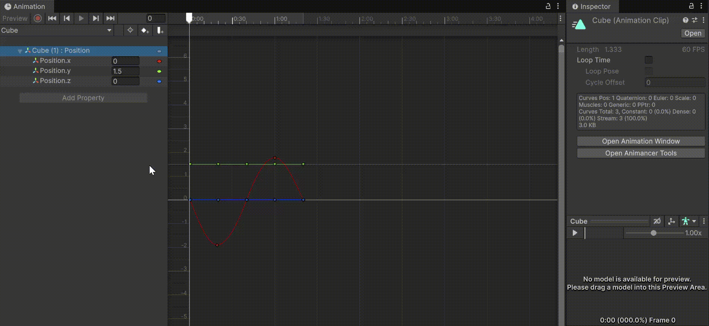

# Animator 与 Avatar

Unity 提供 Avatar 系统，是为了解决，网络上不同的作者，不同的工具，创建的角色模型的人形骨骼各种各样，无法统一标准的问题。有的人这样命名，有的人那样命名，有的人在这里多加了几个骨骼，有的人在那里多加了几个骨骼。因为这样，为一个角色骨骼创建的动画，就只能用在这个角色的骨骼上，无法用在其他模型的骨骼上。因此它创建了一个通用的标准骨骼界面，让每个模型文件都指定自己的骨骼到通用标准骨骼的映射，然后基于定义的映射，将动画片段转化为对标准 Avatar 骨骼的动画曲线，这样动画片段就是对 Avatar 骨骼的标准骨骼动画，它可以脱离任何 Avatar 单独存在。

如图可见，Animator 中可以指定一个 Avatar 映射文件。它将 Animator 下面的 Bone Structure 映射为 Avatar 标准骨骼，然后动画文件本身已经是记录的标准骨骼动画，因此动画片段通过 Animator 引用的 Avatar 映射，将属性曲线应用到具体的骨骼上。

无论是 Avatar 文件还是 Animator 下面挂载的骨骼结构，都是直接将模型文件拖拽到场景中就直接设置好的。

Avatar Mask 也是一个简单地概念，就是屏蔽、忽略几个骨骼的属性曲线而已。因为将动画文件进行 Humanoid 标准化时，本身也可能会忽略掉一些曲线（那些不属于 Avatar 标准骨骼的动画曲线）。而且 Avatar Mask 定义也很简单，就在 Avatar 配置界面选择包含哪些 Avatar 标准骨骼就可以了。然后在播放动画时，指定 Avatar Mask 文件，就可以忽略其中指定的属性曲线了。

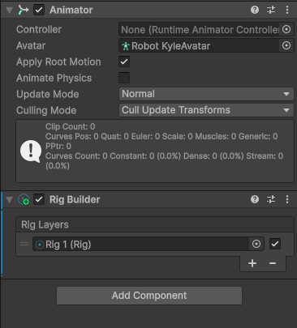

Unity 动画系统为人形动画提供 Avatar，是因为不同来源的人形动画骨骼难以标准化的问题。如果是自己的创建的动画，无论时人形的，还是 Generic 的，只有保证 Hierarchy 是相同，bone 名字是相同的，那么不需要 Avatar 作为中间层，直接动画就可以重用。因此如果只是做一些简单的卡通动画，可以保持骨骼结构相同，就可以在不同的动画直接重用，不管是人形还是通用骨骼。

模型导入时指定是否是 Humanoid，只是为了将不同来源不规范不标准的人形骨骼标准化，将动画片段标准化。一旦标准化，在运行时播放动画，就都是一样的机制，没有 Humanoid 还是 Generic 之分，只是简单的将动画片段的属性曲线应用到 Hierarchy 上的骨骼而已。如果能保证骨骼结构相同（例如在 Blender 中每次都直接复制 Armature，只是调整不同骨骼的位置、长度这些）那么就没必要用 Humanoid Avatar 功能，动画直接可以重用。

之所以只为 Humanoid 提供 Avatar 功能，是因为首先人形动画在游戏中非常常见，另外就是人形骨骼有明确的定义，可以进行标准化。除了人形以为的骨骼，范围就太宽了，动物的、怪物的、机械的、植物的、面料的等等。即使是动物，两足的、四足的，鱼类、鸟类等等，不是不能标准化，而是范围太广，没有意义。

另外 Humanoid Avatar 不只为 Body 的 Bone 提供映射，对 Head、手指、脚趾的 Bone 都有映射：

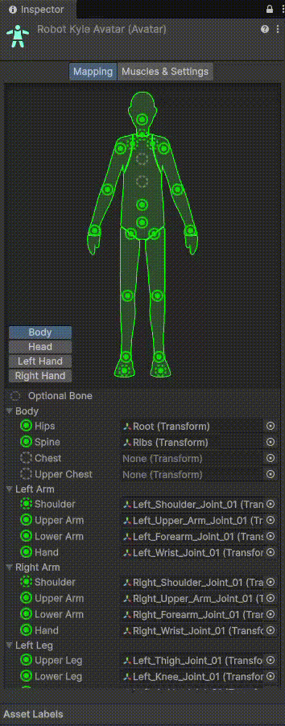

因为只是提供一个简单 Bone-Bone 映射。

另外很多时候只配置了 Body 映射，没有配置 Head、手指、脚趾的映射，说明 Avatar 不需要全部骨骼都映射，配置哪些，就动画哪些骨骼，就保留哪些骨骼的动画曲线。
