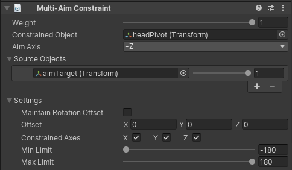

# Multi-Aim Constraint

Multi-Aim Constraint 旋转一个 GameObject 以面向它的 source GameObject。它通常应用到一个 GameObjet 上一个跟随一个或多个 GameObjects。你可以通过指定 Aim Axis 到想要的 vector (X, -X, Y, -Y, Z, -Z) 来指定 aim direction。可选地，你还可以指定 world up direction 来帮助 constrained GameObject 维持它的 upward position。

| Properties | Description |
| --- | --- |
| Weight | ... |
| Constrained Object | ... |
| Aim Axis | 指定 constrained Object 的 local aim axis 用来面向它到 Source Objects  |
| Up Axis | 指定 constrained Object 的 local up axis 用来旋转它的 upward 方向到 Up Direction |
| World Up Type | 指定使用哪个 mode 维持 constrained Object 的 upward direction  |
| World Up Vector | 当 World Up Type 设置为 WorldUpType.Vector，一个世界空间中的静态 vector 作为 upward direction |
| World Up Object | 当 World Up Type 设置为 Object Up 或 Object Rotation Up，用来计算 upward direction 的 GameObject |
| Source Objects | 影响 constrained GameObject 方向的 GameObjects 列表。每个 source 有一个 0 - 1 weight |
| Maintain Rotation Offset | 维持从 constrained GameObject 到 source GameObjects 的当前 rotation offset |
| Offset | 应用到 constrained object 的额外 post rotation offset。在 local space 指定 |
| Constrained Axis | Check X、Y、Z 来允许约束控制相应的 axis。Uncheck 一个 axis 来停止 constraint 控制这个 axis |
| Min Limit | 绕着 constraint GameObject 旋转的 axis Clamps rotation 最小值 |
| Max Limit | 绕着 constraint GameObject 旋转的 axis Clamps rotation 最小值 |
|  |  |

World Up Type 可以有以下值：

| Values | Description |
| --- | --- |
| None | 不使用 World Up vector. |
| Scene Up | scene 的 Y 轴 |
| Object Up | World Up Object 的 Y axis |
| Object Up Rotation | World Up Object 上被 World Up Vector 指定的 axis |
| Vector | World Up Vector |
|  |  |
