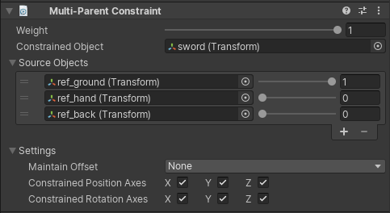

# Multi-Parent Constraint

Animation Rigging Constraint 必须和 Rig 组件和 Rig Build 组件一起使用，而 Rig Build 组件必须和 Animator 一起使用，因此 Animation Rigging 只用于 Animation 的 Rigging。

Multi-Parent Constraint 移动和旋转一个 GameObject 就好像它是另一个 GameObject 的 child 一样。参见 Unity Parent Constraint。

| Properties | Description | 
| --- | --- |
| Weight | ... | 
| Constrained Object | ... | 
| Source Objects | ... | 
| Maintain Offset | ... | 
| Constrained Position Axes | ... | 
| Constrained Rotation Axes | ... | 
| | |
