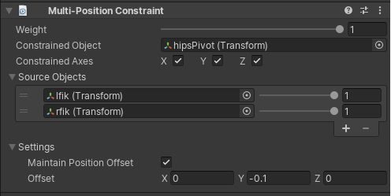

# Multi-Position Constraint

只有 Position 的 Multi-Parent Constraint。

| Properties | Description | 
| --- | --- |
| Weight | ... | 
| Constrained Object | ... | 
| Constrained Axes | ... | 
| Source Objects | ... | 
| Maintain Position Offset | ... | 
| Offset | ... | 
|  |  |
