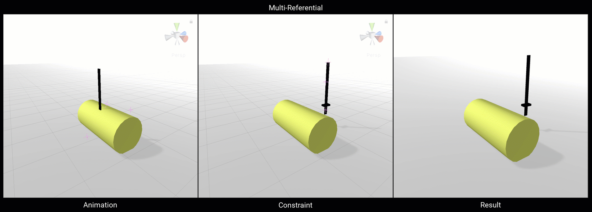

# Multi-Referential Constraint

Multi-Referential Constraint 允许 user 在一组 GameObjects 之间设置一个 parent-child like 的行为。选择的 driving GameObject 作为剩下的 referenced GameObjects 的 parent。任何 Reference Objects 可以被设置使当前 Driving GameObject 来影响其他 Objects。

| Properties | Description | 
| --- | --- |
| Weight | ... | 
| Driving | 一个给定的 Referenced GameObject 被设置为所有其他 Referenced GameObjects 的 driving parent | 
| Referenced Objects | 被指定 driver 驱动的 GameObjects 列表 | 
|  |  |
