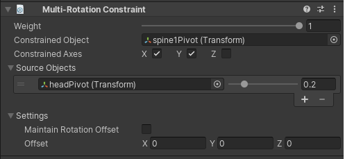

# Multi-Rotation Constraint

只有 Rotation 的 Multi-Parent

| Properties | Description | 
| --- | --- |
| Weight | ... | 
| Constrained Object | ... | 
| Constrained Axis | ... | 
| Source Objects | ... | 
| Maintain Rotation Offset | ... | 
| Offset | ... | 
|  |  |
