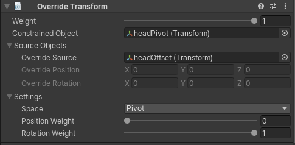

# Override Transform

在 World Space 中，Constrained GameObjects 的 Global Transform values 被 Override Source local transform values 的位移替换。换句话说，在 constraint 创建时，Override Source GameObjet 的当前 postiton 被认为是 world 原点。在 Local Space，Constrained GameObjects 的 Local Transforms values 被 Override source local transform values 的位移 displacement 替换（这用于具有 Parent 的 Child Transform）。

最后，在 Pivot Space 中，Override source local transform values 的 displacement 被添加到当前 Constrained GameObject transform，表现地就像一个 additive transform layer。对每个 Space 你可以使用一个 Override Source GameObject 或 Override Position/Rotation 字段来指定精确的数字值。

| Properties | Description | 
| --- | --- |
| Weight | ... | 
| Constrained Object | ... | 
| Override Source | 影响 constrained GameObject transform 的 GameObject。当指定时，Override Position 和 Rotation 字段被忽略 | 
| Override Position | 应用到 Constrained GameObject 的 Override position value。如果指定一个 Override Source，则忽略这个字段 | 
| Override Rotation | ... | 
| Space | World, Local or Pivot space 选项 | 
| Position Weight | position influence 的 weight。Weight = 1 导致 constrained GameObject 被 Override source 完全影响 | 
| Rotation Weight | ... | 
|  |  |
