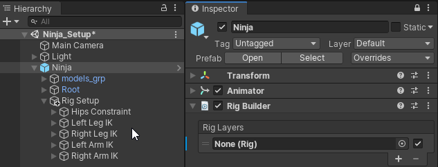
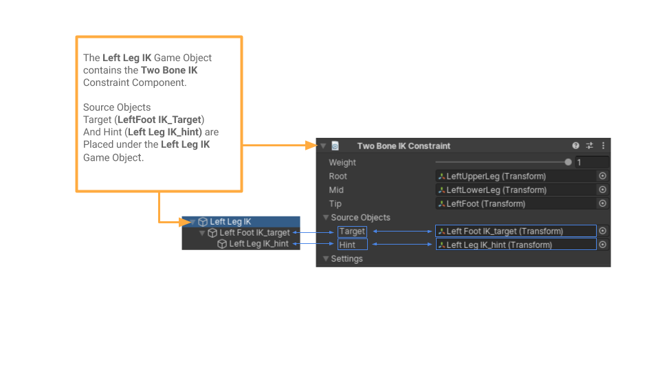
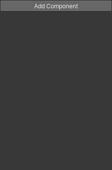
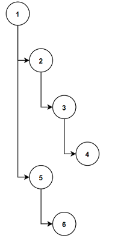
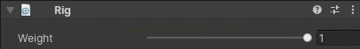
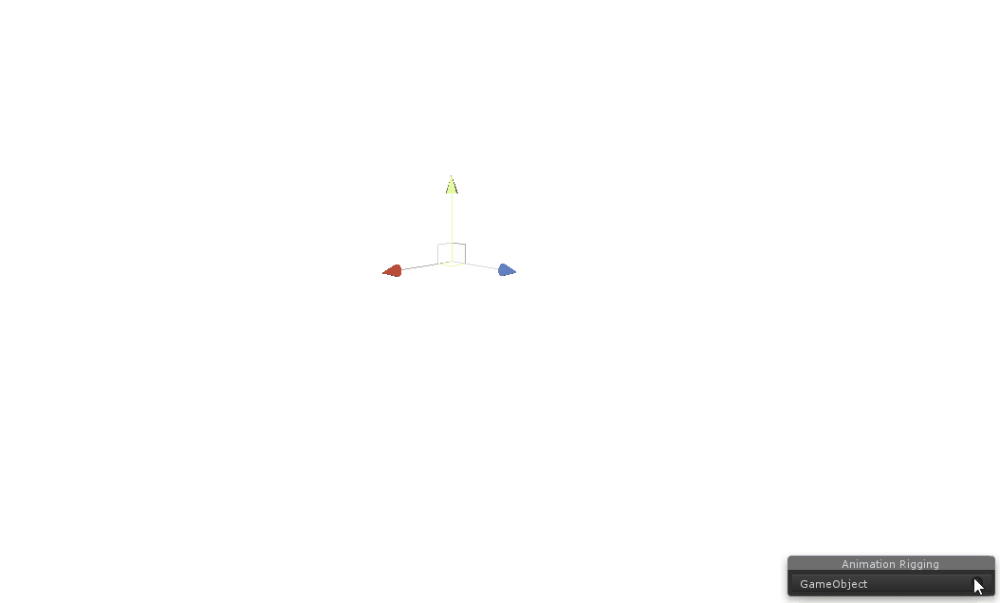
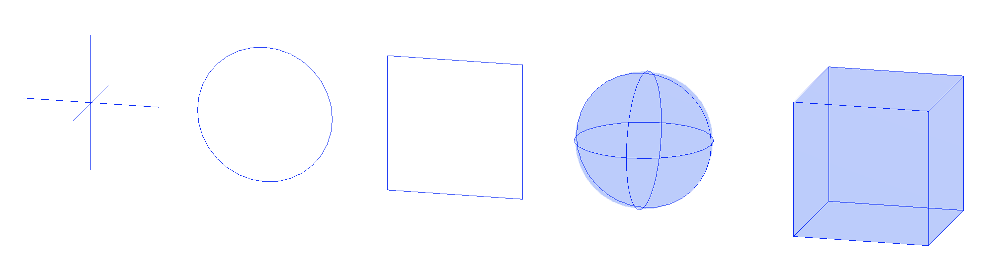
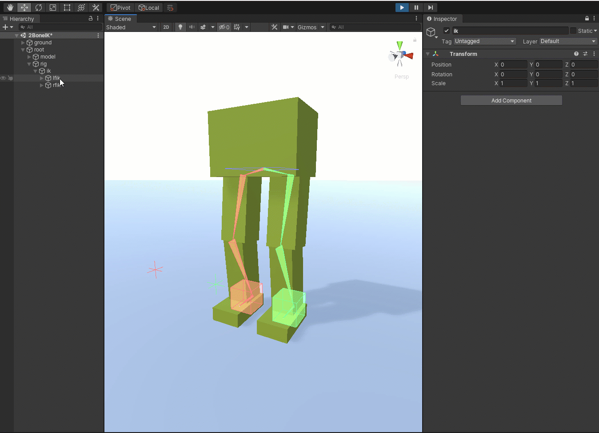

# Rigging workflow

本节展示定义一个 Animation Rig 必须的步骤和组件。

AnimationRigging 专门用于 Animator 骨骼动画的 Rig Constraints，Unity Constraints 则是通用的 Rig Constraints。

## Defining an Animation Rig

一个 Rig 是一个 GameObjects 的 hierarchy，其最少使用 4 个组件：

- Animator Component
- Rig Builder Component
- Rig Component
- Constraints

一个典型的设置是使一个带有 Animator 组件的 GameObjects hierarchy 添加到一个 root GameObject。

要使 hierarchy 对 Animation Rig 有效，Rig Builder 组件时必须的。一旦 Rig Builder 组件被添加到 root，可以创建一个 Rig GameObject 作为 root 的 child。当开启 animaiton rigging 时，Rig GameObject 必须包含 Rig 组件。然后连接 Rig 到 Animator，Rig GameObject 需要被赋予到 Rig Builder 组件的 Rig Layer 字段中。这将关联 Animation Rig 和 Animator。

下图表示了一个 Aniamtor 和 Animation Rig 组件内部依赖的图解概览

一旦带有 Rig 组件的 Rig GameObject 被连接到 Rig Builder 组件，保持 Rig Constraints 组件的 Rig 元素（effector GameObject，效应器）可以被添加到 Rig GameObject hierarchy 下面。不同的 rig elements 被组织为层次化结构来创建任何种类的 Rig，以满足任何 rigging 需求。

用于 Constraints 的 Source GameObjects，例如 Target Effectors 或者 Hint Effectors（IK Pole 或 Bend Goal，提示 IK 的 GameObject），可以被放置在它们关联的 Rig GameObject 下面。在下面的图示中，Left Leg 作为 Rig element，它包含一个 Two Bone IK Constraint 组件，同时它也是两个 LeftFootEffector 和 LeftLegHint source objects 的 parent。

## Rig Builder Component

Rig Builder component 和 Animator 组件在一起（同一个 GameObject），并创建一个 Playable Graph 并附加 append 到 Animator state machine 现有的 graph 上面。Rig Builder 组件需要被添加到 Animator 组件所在的 GameObject 上。Rig Builder 需要影响 Animator 同一个 hierarchy。

使用 Rig Layers，Rig Builder 组件允许多个 multiple Rigs 的层叠 stacking，它们可以在任何时候 enabled/disabled。

## Rig Component

Rig 组件时一个给定 Rig 的所有 Rig constraints 的主要入口。这个 component 被赋予 Rig Layer field 下面的 Rig Builder 组件。每个 control rig hierarchy 只应该有一个 Rig component。对于 multiple rigs，multiple control rig hierarchies 可以被赋予不同的 Rig Layers，并且独立地 enabled/disabled。Rig component 的主要目的是收集它的 local hierarchy 下面的所有 Constraint 组件，并产生一个 IAnimationJobs 的有序列表（求值顺序），然后它们将在 Animator 求值之后被应用（先应用 Animation Clip 的数据，然后应用 Rig Constraint 的数据）。Jobs 的求值顺序被组件的顺序以及 rig hierarchy 的构造方式定义，因为 constraints 是通过 GetComponentsInChildren 收集的，它遵循 DFS 遍历顺序：

换句话说，对一个 GameObject 下面的 constraints 进行分组，允许 user 通过改变 hierarchy 管理这些 constraints 的求值顺序。

Control rig hierarchies 应该持有所有必要的 rig elements，例如 effectors，constraints，以及 constraints definitions 所需的其他 objects/elements。一个 Control Rig Hierarchy root 应该于 skeleton root 在同一个 level，二者都在 Animator GameObject 下面。换句话说，它不应该在 skeleton hierarchy（骨骼）下面，而是在它旁边。

Rig components，就像所有 Constraint 组件，有一个 Weight 属性可以被 animated，scripted 以 enable/disable 或 ease-in/ease-out 整个 control rig hierarchy。

## Bone Renderer Component

Bone Renderer 组件允许 user 定义一个 transforms hierarchy 来绘制 bones 用于可视化和在 rigging process 进行选择。

Bones 的外观可以被定制。Bone size，shape 和 color 可以被修改。Local axes 的三脚架也可以被显示，而且它们的 size 可以调整到满足 user preference。User 可以从几种默认外观中选择一个：Pyramid，Line，或 Box。

## Rig Effectors

类似 Bones，Rig Effectors 允许 user 添加视觉 gizmos 到 transforms，用于可视化和选择。这些可以被添加到和 RigBuilder 或 Rig 组件相同的 hierarchy 中的任何 transform。Effectors 在 GameView 是不可见的。一个特殊的 Scene View overlay 被添加用来管理和定制 Rig hierarchy 中的 effectors。

Effectors 的外观也可以被定制。Effector Size，Shape，Color，Offset Position 和 Offset Rotation 可以被修改。Shape 可以是 Project 中任何可用的 Mesh Asset（因此可以定制外观）。Multiple effectors 可以同时创建，删除，编辑。

## Rig Transform

如果你的 rig hierarchy 的一个特定 GameObject 对于 manipulation 很重要，但是不被任何 rig constraints 引用，你需要添加 Animation Rigging/Setup 下面的 RigTransform 组件。就像下面的 video 显示的，为了使用它们 parent transform（ik）同时操作 2BoneIK 示例的 left 和 right foot IK targets（lfik 和 rfik），你将需要添加这个组件以得到期望的行为。

