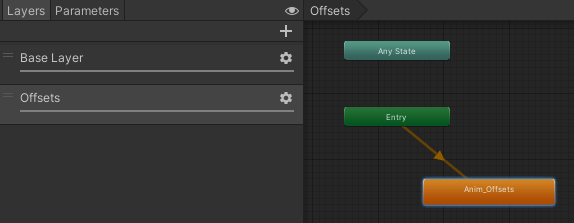
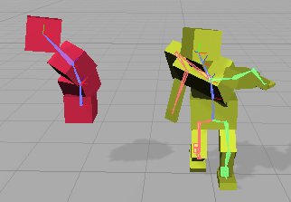

Rig 可以在 Editor 中预览，甚至可以和 Animation 一起。但是 RigBuilder 应该只在 Start 中收集和构建约束。当在 Editor 中改变 RigBuilder 之后，不能立即生效，必须使 Editor 程序集重新编译才可以。比如点击 Play，再退出。

这个实例中，Animator 中包含两个动画片段，一个操作模型骨骼，一个操作 Override Source 骨骼，即下图中的红色的 Cubes。这离那个动画使用两个 Layers 同时播放。

AnimationState 包含在 AnimationLayer 中。一个状态机包含多个 AnimationLayers，每个 Layer 包含各自的 States。在 PlayableGraph 中，一个 layer 就是连接 Output 的 Node 子树。

Unity 中，选中具有 Animator 的 GameObject 或 Child GameObjet（简而言之就是 Animator Hierarchy）之后，Animation 会显示 Animator 的当前状态的 AnimationClip。如果模型有多个动画片段，可以在 Animaiton 窗口左上角的下拉菜单中选择预览和操作那个动画片段。

Override Transform constraint 使用 Override Source GameObject 的 local space transform 偏移 displace 覆盖 Constrained GameObject 的 local space transform。对于 Root Constrained Transform，local 就是 world space。

这个例子中每个红色的 Cube 设置一个 OverrideTransform，指定 Constrained Object，Source Objects 就是 Cube 自身。当动画播放时，红色的 Cube 被动画操作，然后 transform 偏移通过 Rig 传递给黄色骨骼上的对应 bone。

指定了 target 和 source objects 之后，还可以指定 Space 和 Position/Rotation Weight. 如果不指定 Override Source GameObject，还可以直接指定 Override Position/Rotation（甚至可以通过动画手段设置这些值）。

