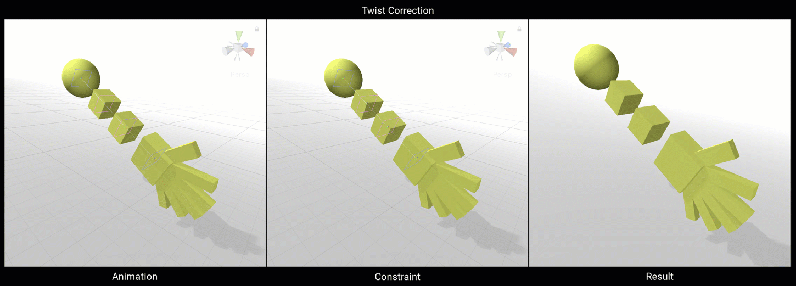

# Twist Correction

Twist correction 主要用于重新分布一定百分比的 source rotation 到 leaf bone 以修正 mesh body part 的 Twist deformation。

| Properties | Description | 
| --- | --- |
| Weight | ... | 
| Source | 影响 Twist Nodes 绕着一个指定 Twist Axis 旋转的 GameObject | 
| Twist Axis | Source GameObject local axis，rotation 从这里提取，并重新分配到 Twist Nodes 上 | 
| Twist Nodes | 被 Source GameObject 影响的 GameObjects 列表 | 
|  |  |
