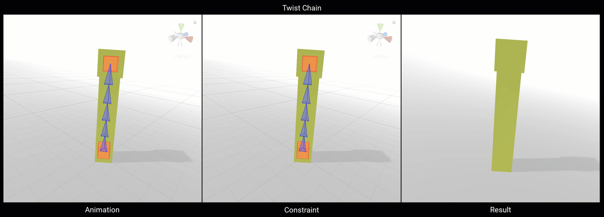
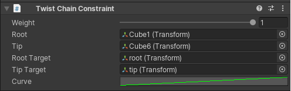

# TwistChain Constraint

Twist Chain constraint 允许在 GameObject chain hierarchy 两端控制 world rotations。Root 和 Tip rotations 沿着 chain 插值到中间的 GameObjects 来创建一个 smooth animated hierarchy。

 | Properties | Description | 
 | --- | --- |
 | Weight | ... | 
 | Root | Chain hierarchy 的 Root GameObject | 
 | Tip | Chain hierarchy 的 tip GameObject | 
 | RootTarget | 影响 constrained chain root GameObject rotation 的 GameObject | 
 | TipTarget | 影响 constrained chain tip GameObject rotation 的 GameObject | 
 |  |  |
