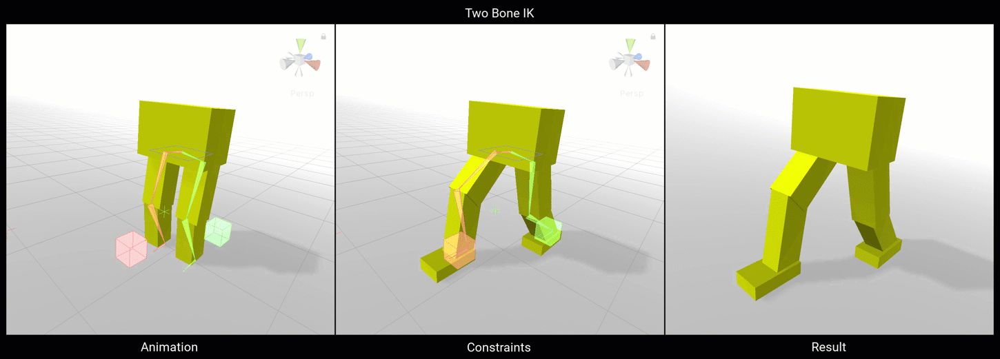
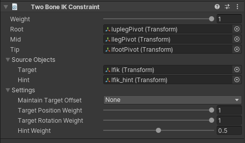

# Two Bone IK

Two Bone IK constraint 将一个由 2 个 bones 组成的简单 FK Hierarchy transform 到一个可以被一个 Target GameObject（Hand like control）和 Hint GameObject（elbow like control）控制和操作的 Inverse Kinematic expression。

| Properties | Description | 
| --- | --- |
| Weight | ... | 
| Root | Constrained GameObject hierarchy 的 root | 
| Mid | Constrained GameObject hierarchy 的 Middle | 
| Tip | Constrained GameObject hierarchy 的 last | 
| Target | 作为 chain IK target 或 effector 的 Source GameObject | 
| Hint | 可选的 Source GameObject，以控制 middle node bend normal 如何计算 | 
| Maintain Target Offset | 当没有设置为 None，tip 和 target 之间的当前 offset（position，rotation，or both）被维持 | 
| Target Position Weight | chain 到达 target effector 的程度。如果设置为 1，chain 尝试完全到达 target GameObject | 
| Target Rotation Weight | tip GameObject 旋转以匹配 target GameObject rotation 的程度。如果设置为 1，tip 旋转到完全匹配 target | 
| Hint Weight | Hint 在 hierarchy 的配置上拥有的影响权限。当设置为 1，hint 完全影响 hierarchy configuration。如果没有指定 hint GameObject，hint weight 被忽略 | 
|  |  |

## Auto Setup from Tip Transform

这个选项允许你自动创建必须的 effector GameObjects，并基于被指派 assign 的 Tip bone Game Object binding 分配所有 bindings。

要使用这个选项，首先创建一个 Two Bone IK Constraint，并指派 assign Tip bone Game Object。在这个 Two Bone IK Constraint 组件选项中，选择 Auto Setup from Tip Transform。这将会创建两个 effector Game Object（ik_target & ik_hint）并指派 assign 它们。这还会基于 hierarchy 查找最像 root & mid 的 bone Game Objects，并一样添加它们到这个组件上。

