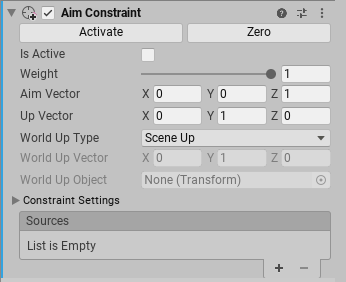

# Aim Constraints

Aim Constraint 旋转 GameObject 面向它的 source GameObjects。它还可以对另一个 axis 维持一个一致的 orientation 方向。例如，你可以添加 Aim Constraint 到 Camera。为了在 Constraint aim Camera 时保持它竖直向上 upright，为 camera 指定一个 up axis（local）和 up direction（world）进行对齐。

使用 Up Vector 来指定一个 constrained GameObject 的 up axis。使用 World Up Vector 指定 upward direction。当 Aim Constraint 旋转 GameObject 以面向它的 source GameObjects 时，Constraint 还对齐 up axis（local）到 up ward direction（world）。

## 属性

- Activate

  当旋转 constrained GameObject 并移动它的 source GameObject 之后，点击 Activate 来保存这个信息。Activate 保存来自 Rotation At Rest 和 Rotation Offset 中的 source GameObjects 的当前 offset，然后选中 Is Active 和 Lock。

- Zero

  设置 constrained GameObject 的 rotation 到 source GameObjects。Zero 重置 Rotation At Rest 和 Rotation Offset fields，然后选中 Is Active 和 Lock。

- Is Active

  Toggles 是否求值这个 Constraint。要应用 Constraint，还有确保 Lock 被 check

- Weight

  Constraint 的强度。Weight = 1 导致 Constraint 旋转 GameObject 和 source GameObjects 相同的 rate 移动。Weight = 0 完全移除 Constraint 效果。这个 weight 影响全部的 source GameObjects。Sources list 中每个 GameObject 还有自己的 weight

- Aim Vector

  指定朝向 source GameObjects 方向的 local axis。例如，如果要指定 GameObject 应该只将它的 Z axis 面向 source GameObjects，输入 Aim Vector = （0， 0， 1）

- Up Vector

  指定 GameObject 的 up axis。例如，要指定 GameObject 应该总是保持它的 +Y 轴向上，Up Vector = （0， 1， 0）

 - World Up Type

   指定 World Up Vector 应该如何计算。

   - Scene Up：scene 的 Y Axis
   - Object Up：World Up Object 引用的 Object 的 Y axis
   - Object Up Rotation：World Up Object 应用的 Object 的 local World Up Vector 向量
   - Vector：World Up Vector
   - None：不使用 World Up vector

- World Up Vector：World Up Type = Object Up Rotation 或 Vector 时，指定使用的 vector

- World Up Object：World Up Type = Object Up 和 Object Up Rotation 时，指定使用的 object

- Constraint Setting

  - Lock：开启这个设置让 Constraint 旋转这个 GameObject。Uncheck 这个属性来编辑 GameObject 的 rotation。你还可以编辑 Rotation At Rest 和 Rotation Offset 属性。如果 IsActive 为 true，当你选择 GameObject 或 source GameObjects 时，Constraint 为你更新 Rotation At Rest 或 Rotation Offset 属性，当你满意你的改变时，选中 Lock 来让 Constraint 控制这个 GameObject。这个属性在 Play Mode 没有效果。

  - Rotation At Rest：当 Weight = 0 或相应的 Freeze Rotation Axes 没有选中时的 X、Y、Z。要编辑这个字段，uncheck Lock

  - Rotation Offset：相对 Constraint 计算的 rotation 的偏移

  - Freeze Rotation Axis：选中 X、Y、Z 以允许 Constraint 来控制相应的 axes。Uncheck 一个 axis 来停止 Constraint 控制它。这允许你 edit，animate，或者 script unfrozen axis。

- Sources

  约束 GameObject 的 GameObjects 列表。Unity 以它们出现在列表中的顺序求值 source GameObjects。这个 order 影响 Constraint 如何约束这个 GameObject。为了获得你想要的结果，拖放 list 中的 item，改变它们的顺序。每个 Source 有一个 0-1 的 weight

