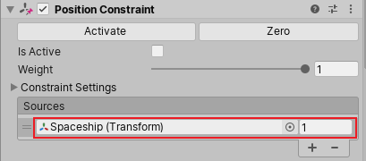
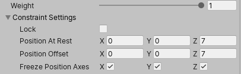
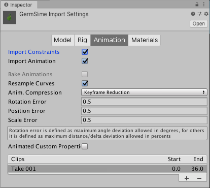

# Constraints

一个 Constraint 组件连接一个 GameObject 的 position，rotation，或 scale 到另一个 GameObject 上面，这也称为 Rig（提线木偶）。

一个 constrained GameObject 像它连接到的 GameObject 一样移动，旋转，缩放。

Unity 支持以下类型的 Constraint 组件：

- Aim：旋转 constrained GameObject 以面向 linked GameObject
- Look At：旋转 constrained GameObject 到 linked GameObject（简化的 Aim Constraint）
- Parent：和 linked GameObject 一起移动和旋转 constrained GameObject（没有缩放）
- Position：Parent 只移动
- Rotation：Parent 只旋转
- Scale：Parent 只缩放

## Linking to GameObject

在 Constraint 组件中的 Sources list 中指定连接到的 GameObjects。

例如，在一个 2D 射击游戏中，使一个 crosshair 跟随 player 的 spaceship，添加一个 Position Constraint 组件到 crosshair 上。将 spaceship 添加到 crosshair 的 Sources list 中。

A Position Constraint for a crosshair. The crosshair follows the player’s spaceship (red).

一个 Constraint 可以连接很多 source GameObject。此时，Constraint 使用 source GameObjects 的平均 position，rotation，或 scale。

Unity 按照 GameObjects 在 Sources List 中出现的顺序求值。这个顺序对于 Position 和 Scale Constraint 没有效果。然而，对 Parent，Rotation，和 Aim Constraint 有影响。要得到你想要的结果，调整 Sources List 的顺序。

约束可以串联，GameObject1 通过 Rig1 约束 GameObject2，GameObject2 通过 Rig2 约束 GameObject3.

## 设置 Constraint Properties

- Weight：修改 constraint 的影响权重
- Constraint Setting：
  - Position At Rest：当 Weight 为 0 或对应的分量在 Freeze Axes 没有 checked 时的 X、Y、Z 的值。就是不约束时的位置
  - Offset：指定当约束生效时，”child“ 相对 ”parent“ 的偏移
  - Freeze Axes：toggle X、Y、Z 哪些分量被约束

## 激活和锁定约束

操作 Constraint 有两个方面：activating 和 locking。

你可以激活一个 Constraint 来允许它求值 constrained GameObject 的 position，rotation，或 scale。Unity 不求值 inactive Constraints。

你锁定 lock 一个 Constraint 以允许它 move，rotate，scale GameObject。一个 locked 的 Constraint 控制这个 GameObject Transform 的相关部分。你不可以手动 move，rotate，scale 一个具有 locked Constraint 的 GameObject。你也不可以编辑 Constraint Settings。

要手动编辑 GameObject 的 position，rotation，scale，unlock 它的 Constraint。如果 Constraint 在 unlocked 时是 active 的，当你 move，rotate，scale 这个 constrained GameObject 或者它的 source GameObjects 时，Constraint 为你更新 Constraint Settings。

当你添加 Constraint 组件到 GameObject，Constraint 默认是 inactive 和 unlocked 的。这允许你在 activate 和 lock Constraint 之前仔细调整 constrained 和 source GameObjects 的 position，rotation，scale。

方便起见，Activate 和 Zero 按钮为你更新 Constraint Settings:

- Activate：保存来自 source GameObjects 的当前 offset，然后 activates 和 locks constrained GameObject
- Zero：重置 Resets position，rotation，scale 来匹配 source GameObjects，然后 activates 和 locks 这个 constrained GameObject

## Animating 和 combining Constraint

使用 animation clips 来修改 source Gamebjects（constrained GameObject 连接的 GameObjects）。当 animation 修改 source GameObjects 时，Constraint 修改你的 constrained GameObject。

你还可以 animated 一个 Constraint 组件的 properties。例如，使用一个 Parent Constraint 将一个 character 的 sword 从 hand 移到 back。首先，添加一个 Parent Constraint 到 sword GameObject。在 Sources List 中，连接 Constraint 到 character hand 和 character spine（back）。要 animate sword，为每个 source 的 weight 添加 keyframes。要 animate sword 从 back 移动到 hand，添加 keyframes 来改变 hand 的 weight 从 0 到 1，而改变 spine 的 weight 从 1 到 0.

你可以添加多于一种 constraint component 到同一个 GameObject 上。当更新 GameObject 时，Unity 按照 Inspector window 中第一个到最后一个的顺序 求值 Constraint 组件。一个 GameObject 对同一种 Constraint 组件只能有一个。例如，你不能添加超过一个 Position Constraint。

## Importing COnstraints

当从 Maya 和 MotionBuilder 导入 FBX 文件到 Unity Editor 中，你可以包含 Constraint。点击 Import Settings window 的 Animation Tab 并 check Import Constraints：

对 FBX 文件中每个 constraint，Unity 自动添加相应的 Constraint 组件并连接它到 GameObjects。

