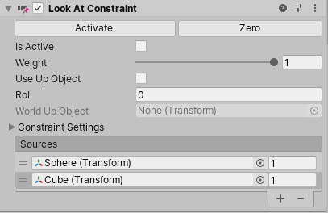

# Look At Constraint

Look At Constraint 旋转一个 GameObject 面向它的 source GameObjects。你通常应用 Look At Constraint 到 Camera 来跟随一个或多个 GameObjects。此外，如果你 import 一个 Target Camera，Unity 使用 Target Object 作为 source 创建一个带有 Look At Constraint 的 Camera 。

Look At 是一个简化的 Aim Constraint。Aim Constraint 允许你选择哪个 axis 将会跟随 constraining GameObjects，Look At Constraint 总是 follow z-axis。

你可以通过设置它到另一个 GameObject 的 y-axis，为 Look At Constraint 指定 upward direction，或者你可以指定一个 roll，这是一个绕着 z-axis（你的瞄准轴 aiming axis）的 rotation

## 属性

- Is Active
- Weight
- Use Up Object：开启这个选项使 GameObject 的 up vector 为 World Up Object 的 y-axis。如果关闭这个选项，up vector 被设置为 Roll value。GameObject 的 up vector 确定哪个 local 方向向上
- Roll：绕着 z-axis 的 rotation 角度（in degrees），用于 GameObject 的 up vector（upward direction）。只在 Use Up Object 被 disabled 时可用
- World Up Object：当 Use Up Object 开启时，引用一个 GameObject，使用它的 up vector 作为 Constraint 的 up vector。
- Constraint Settings
  - Lock
  - Rotation At Rest
  - Rotation Offset
  - Sources