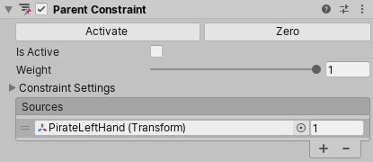

# Parent Constraints

Parent Constraint 移动和旋转一个 GameObject 就好像它是另一个 GameObject 的 child 一样。然而，它提供了一些将 GameObject 挂载到另一个 GameObject 称为父子关系的优势：

- Parent Constraint 不影响 scale
- Parent Constraint 可以连接到多个 GameObjects
- GameObject 不必是 Parent Constraint 连接到的 GameObject 的 child
- 你可以通过指定 weight 改变 Constraint 的效果，就像每个 source GameObjects 一样

例如，要将一个 sword 放在 character 的手上时，添加一个 Parent Constraint 组件到这个 sword GameObject 上。在 Sources list 中，连接 character hand。这种方式，sword 的移动被约束到 hand 的 position 和 rotation。

## 属性

- Active
- Zero
- IsActive
- Weight
- Constraint
  - Lock
  - Position At Rest
  - Rotation At Rest
  - Position Offset：相对 Constraint 释迦的 Transform 的偏移。要编辑它，先 unlock
  - Rotation Offset
  - Freeze Position Axes
  - Freeze Rotation Axes
- Sources
