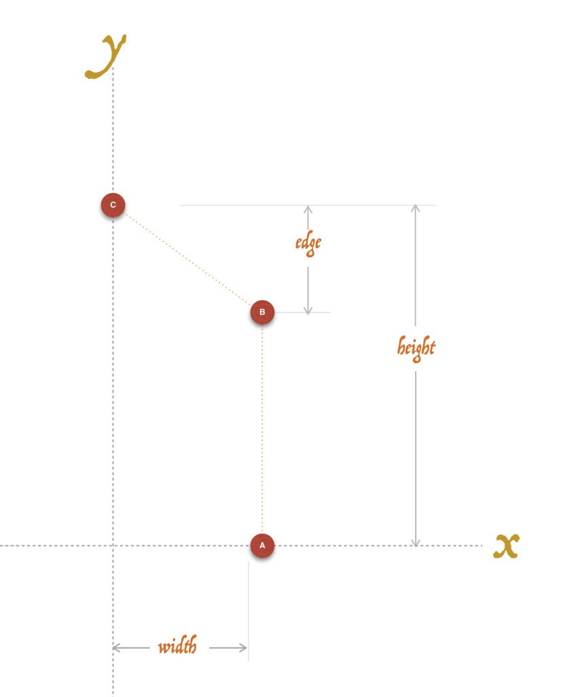
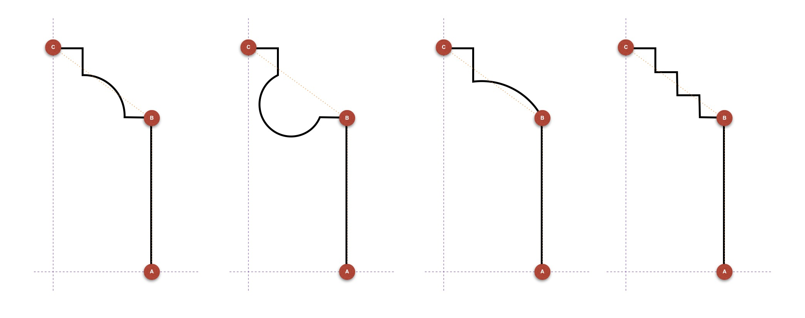
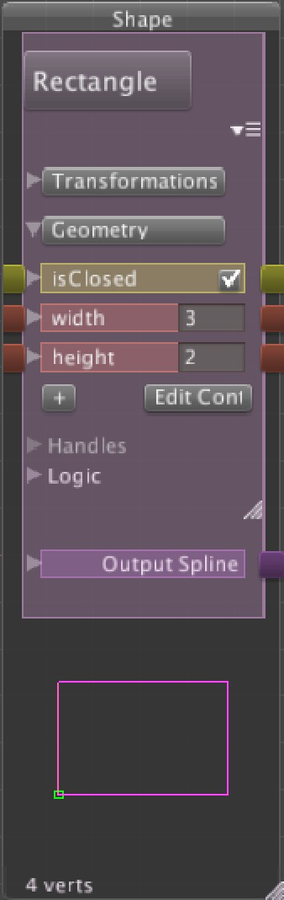
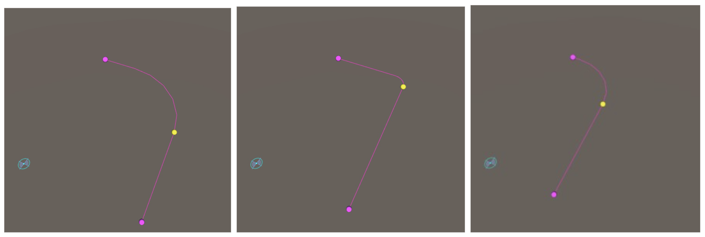
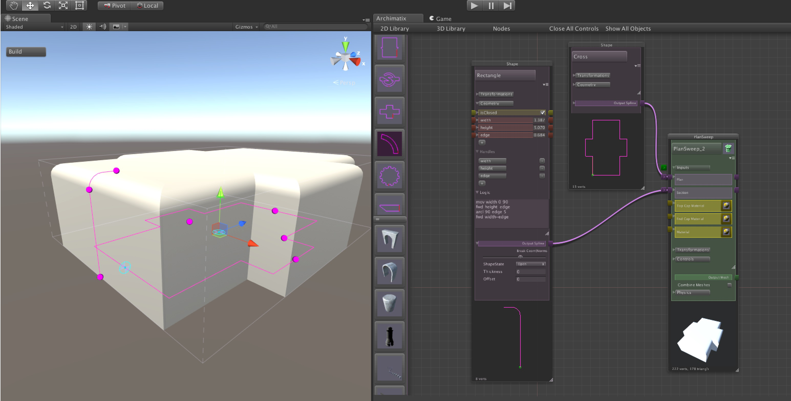
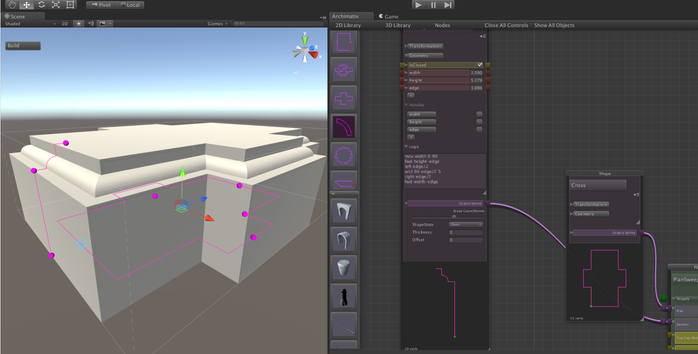

# Advanced Archimatix: Creating Custom Parametric Shapes

尽管 Archimatix Shape Library 带有很多可以彼此相加或相减的 parametric shapes，例如 Circle，Square，RoundedRectangle，Cross（十字线）, IBeam（工字梁） 等等，你使用 Turtle scripting code 自己的 Shapes 并定义自己的 SceneView Handles 也是有意义的。

当创建参数化 shapes 时，有 3 个值得关注的地方：

1. Parameters
2. Handles
3. Logic

这个列表通常反映了实现你的自定义 Shape 的顺序。当设计一个 Shape，创建一个 drawing 帮你（或者你的 Shape 的 user）可视化它的 geometry 和可以控制它的参数非常有用。它还是一个以 parameters 和 handles 开始的有趣的练习，因为很多 geometries 可以使用相同的 controls。

在下面的图中，可以看见一个图示，显示一个可以被认为是一个 molding profile 的 Shape 的 parameters 和 handles。

这个图中每个 handle，以一个 red dot 表示，可以在 handle editor 中定义，当拖拽时可以调整特定 parameter。例如 Handle B 可以同时控制 edge 和 width parameters，同时 Handle A 只控制 width，而 Handle C 只控制 height。



这些 parameters 和 handles 可以在添加任何 scripting 实际绘制 geometry 之前被添加到 node 上。实际上，相同的设置可以被用来控制大量 geometries。下面是一些例子：



特定的 Shape geometries 基于使用这些 parameters 作为变量的逻辑。这个逻辑使用 node palette 中简单的 turtle graphics scripting 实现。

使用上面的  molding 例子，让我们看一下如何创建 parameters 和 handles，然后在 logic 中使用它们。

## Adding Parameters

Parameters 用作 Shape 逻辑的变量（通过 Handle 来控制，在 Turtle Script 中使用 set 来赋值，let 用来创建和赋值 Turtle Script 中的局部变量）。例如，在一个 rectangle shape 中，主要的参数是 width 和 height。之后这些参数被用于 position SceneView 中的 handles，以及在 node palette 的 logic section 中描述 rectangle 的变量。

因为我们已经拥有了上面 molding diagram 中指定的这些相同 parameters，现在可以从 AX Library 开始我们的自定义的 Rectangle instance Shape。（从 Node Graph Editor Window 左手边 sidebar 选择 Rectangle Shape）。

要修改 Rectangle Shape，我们需要添加一个新的参数称为 edge。在 Archimatix NodeGraph Editor Window 中，这个参数可以在这个 parametric shape 的 node palette 中的 Geometry foldout 下看见。你可以添加任意多个 parameters 到 node，通过点击 parameter list 底部的 “+” button。一旦 add button 被点击，一个新的参数将会被添加到 ndoe，并被打开以进行编辑。



### Naming a Parameter

当参数被打开编辑时，name 字段将变成一个可编辑的 TextField。当选择一个 name 时，确保不要留下任何空白。这很重要，因为你需要在脚本中引用这个名字以执行 Shape 逻辑。

现在，我们只编辑 parameter 的名字，然而，你可能注意到，除了编辑名字，你可以选择这个 parameter 的类型（float，int or bool）并开始定义表达式确定 node 中其他参数在这个参数被修改时应该如何调整。

对于 molding 例子，编辑新参数的名字为 edge。

## Creating a New Handle

在 node palette 的 Handles foldout，你会发现一个命名的 handles 列表。这些 handles 中的每个生成一个 SceneView handle，并定义那个 handle 的行为，以及它如何修改 node 的 parameter。

在添加新的 handle 之前，我们需要调整当前 width 和 height handles 来 adapt 它们使得它们不在居中于 origin。继续并点击 width handle 然后为 X 编辑 position expression 为 width 而不是 width/2。还有，调整表达式为 width = han_x。不要担心 Shape 还没有跟随这些 handles。然后点击 height handle，并设置 Y-position 为 height 而不是 height/2，然后编辑表达式为 height = han_y. 

要为 edge parameter 创建一个 handle，点击 Handles foldout 下面的 “+” button，并命名为 edge。默认的 handle 类似为 “Point”，在这里没有问题。在 position 字段中，我们想要描述 handle 应该出现在哪里。这种情况下，handle 的 x-position 应该是 width，y-position 应该是 height-edge。

在输入这些表达式到 Position 的 x 和 y 字段之后，handle 应该会立即出现在 SceneView 中，尽管它还不是可拖拽的。要是 handle 可交互，我们必须告诉它当被拖拽时如何设置它的参数。为此，编辑 handle 的第一个表达式为 "width=hand_x"。这是说，无论这个 handle 的 x-value 是什么，它应该称为我们的 Shape 的 width value。在垂直方向，我们将使用 handle 的 y-value，或者 han_y。点击 ”+“ button 来添加一个新的表达式，并设置它为 ”edge=height-han_y“  

Now you should be able to drag your new handle and reset the parameters for edge and width.

现在我们应该能够拖拽我们的新 handle 并重置 edge 和 widht 参数了。

## Logic

现在我们有了我们的 parameters（以及 SceneView handles 来修改它们）。我们可以使用这些参数来绘制我们的 Shape 的 Geometry。

要进行绘制，我们使用一系列命令，告诉虚拟画笔（turtle）从之前的 line 绘制到哪里。mov x y dir 命令告诉 pen 移动到 position (x, y) 然后面向 dir 方向。如果脚本的下一行是 fwd 10，则 turtle 将会绘制一个从 (x, y) 到当前方向 10 个 units 外的直线。

一个简单的 chamfer molding 的例子

```turtle
mov width 0 90
fwd height-edge
arcl 90 edge 5
fwd width-edge
```

如你所见，在输入这个 script 到 node palette 的 Logic TextArea 之后，我们使用 parameters，variables，width，height 和 edge 来绘制我们的 Shape。现在，拖拽 edge handle 可以让我们生成这样的排列。



现在这个 shape 已经准备好用于一个 PlanSweep Node 的 section 了：



但是，如果我们想要 molding 拥有更多细节又如何呢？编写更多的 turtle 代码

```turtle
mov width 0 90
fwd height-edge
left edge/3
arcl 90 edge/3 5
right edge/3
fwd width-edge
```

这个版本中，我们以及添加了一些数学表达式例如 edge/3。结果 molding 看起来像这样：



Check for full documentation on the Archimatix Script API.


