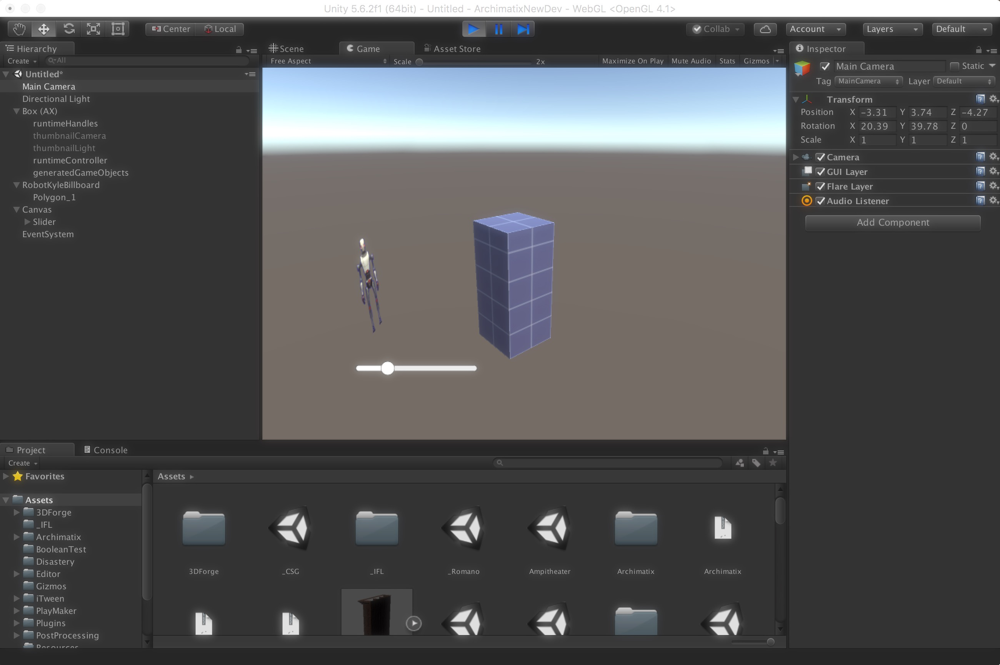

# Archimatix Runtime For Artists

如果你是不会编码的艺术家，但你仍然可以创建 Archimatix 运行时行为。

尽管 Archimatix 参数可以暴露在 model 的 interface，允许通过 game scripts 方便地访问它们，你还可以通过创建 runtime controller 以使用 Unity 的 built-in UI 系统或者 PlayMaker 控制 AX parameters 的 values，

下面展示一个使用 UI slider 在运行时控制 Box 高度的例子。在这个例子中，我们甚至不需要使用 Node Graph Editor。

Step 1. 从 Unity menu 创建一个 Archimatix Box

Step 2. 在 Scene 中选择 Box

Step 3. 在 Inspector 中选择暴露 Height 参数作为 runtime 参数，通过点击参数名左边的 checkbox

Step 4. 注意 Height 参数已经出现在 model runtime parameters 的列表中

暴露的 runtime 变量可以在任何 game script 中轻松地使用，但是他们还可以非常容易地绑定到 Unity UI system，PlayMaker，或者任何可以 connect dynamic variables 的系统。我们所做的一切是创建一个 AXRuntimeController asset。幸运的是，这是通过点击一个 button 完成的。

Step 5. 确保 AXModel GameObject 被选中

Step 6. 点击 “Create Runtime Controller” 按钮

Step 7. Save the new controller file anywhere  in your Asset folder.

**You’ve done it!**

你现在有了一个 Asset，连接到 Archimatix 的运行时参数，并作为 Unity UI system，PlayMaker 等系统的一个 source。当选择一个 connection 时，使用你刚创建的 runtimeController asset 作为你的 variables 的 source。

你可能还没有理解它，通过点击那个button：

1. 你在 AXModel Hierarchy 中创建了一个 GameObject
2. 给它添加了一个 component，即你创建的 runtimeController asset

如果你选择 AX model 中的其他参数暴露为 runtime parameters，只需要再次点击 “Create Runtime Controller” 按钮。这次它不会在询问你文件的位置，只是覆盖你已经创建的那个。

现在来看我们如何连接新的 controller 到 Unity UI。

Step 8. 创建一个 UI Slider。调整它的 Max value 到 10。

Step 9. 为 Slider 添加一个 Action

Step 10. Unfold the Box model, click on the Slider in the Hierarchy and drag the runtimeController to the ObjectField in the Slider Inspector.

Step 11. 在 Slider Inspector 中的 Function dropdown 中，选择你的 controller 和 Box_Height 变量

**By Jove! You’ve done it again!**

你已经 empowered 你的游戏接口来执行 runtime modeling 了！

Step 12. 选择你的 UI 确保 Slider 在 GameView 中可见。点击 Play 并操控 Slider。Box Height 将会随着你移动 Slider 而调整。

