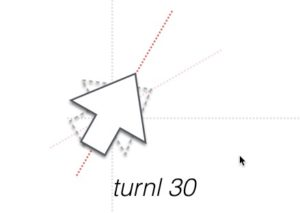
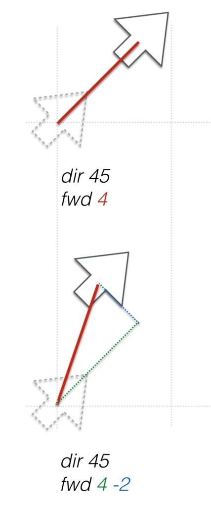

# Archimatix Turtle Script API

Turtle graphics, originally developed as a feature in the Logo programing language, is an important tool for the description of line shapes. Each line of a turtle script draws a 2D line relative to the current position of the turtle cursor. While this may seem conceptually simple, it is a powerful concept in parametric graphics. For example, to draw circular arc, with five segments, one need not calculate each of the five vertices, if one can simply tell the turtle to draw an arc to the right through 45 degrees at a radius or 3 units. The command in turtle script may look like this.

Turtle graphics 是一个描述 line shapes 的重要工具，它原本是作为 Logo 编程语言的一个 feature 开发的。Turtle 脚本中的每个 line 相对 turtle cursor 的当前位置绘制一个 2D line。尽管这看起来非常简单，它在参数化图形中是一个非常强大的概念。例如，要绘制具有 5 个 segments 的圆弧，我们不需要计算每个 vertices，只需要简单地告诉 turtle 向右边 45 度绘制一个半径为 3 个 units 的 arc，绘制 5 次即可。这个 turtle script 看起来就像这样：

```turtle
arcr 45 3 5
```

Archimatix 有自己的 turtle scripting API 实现，相比 Logo 更多地借用了 GSDL。

## Absolute Commands

```turtle
mov x y <a>
```

在绘制一个 shape 之前，我们必须将 turtle 放置到 2D 空间中的某个地方，并且指向特定方向。这个命令移动 turtle 到 point (x, y)，而不绘制任何 lines。可选参数 a 告诉 turtle 面向哪个方向。默认是 90 度（向右）。

```turtle
dir a
```

这个命令将 turtle 重新面向新的 方向 a，可以在脚本中的任何地方调用来改变方向。


```turtle
drw x y
```

从当前 point 到 (x, y) 绘制一个直线。

```turtle
closed
```

闭合这个 shape。Shapes 默认是开发的。

```turtle
//
```

注释

## Relative Commands

```turtle
rmov dx dy
```

移动 turtle 笔触（pen tip）到一个新的 point，并重置当前方向为直线的方向（之前的 cursor 但新的 cursor）

```turtle
turnl a
```

向左旋转当前方向一个角度。



```turtle
turnr a
```

向右旋转当前方向一个角度。

```turtle
fwd c <d>
```

沿着当前方向绘制 c 个 units 的直线。fwd 30，或者使用一个 parameter，fwd height。可选地，d 从方向 axis 偏移 point，使得绘制当前方向上的一个 c units forward 和 d units perpendicular（垂直）的对角线 diagonal line，这个 offset 适合绘制一个 fits in box 的 shape，但是它的 corner 被切掉。



例如，这是一个box，两个 top corners inset：


```turtle
back c <d>
```

向回绘制一个 c units 长的 line，当前方向相反的方向。


```turtle
right c
```
向右绘制一个 c units 的 line，而不改变方向。


```turtle
left c
```

向右绘制一个 c units 的 line，而不改变方向。

```turtle
arcr a r s
```

绘制角度为 a 的圆弧，半径为 r，从当前 point 开始，正切当前方向，并向右形成弧线。命令执行完之后，turtle 的方向自动转向 arc 末端的切线方向。例如，使用一个 dir 45，arcr 45 3 5 会将 turtle 留在 0 degrees direction，使得如果你在后面跟着一个 fwd 4，turtle 将会在角度为 0 的 4 个 units 的直线。


```turtle
arcl a r s
```

类似 arcr，但是向左弯曲。

## Mathf Functions

所有数学函数都被映射到 AX Turtle 脚本。它们遵循以下形式：

cos(degs) or Cos(degs)

这些函数内部执行 rad2degs 的转换，因此 argument 是角度而不是弧度。

另一个例子是

```turtle
atan(x, y)
```

数学变量也可以被用在公式中，例如 x * PI

```turtle
PI

degs2rad
```

## Looping

AX 脚本有一个受限的 looping 语法，使用一个 counter 重复 code

```turtle
loop repeats <counterName> <step>
```

loop 命令打开 loop 的作用于 scope。Repeats 参数指定循环的次数。可选地 counterName 是一个字符串名字用于循环内部的迭代变量（for 循环中的 i）。可选的 step 是一个数字表达式，告诉 loop 每次前进 counter 多少。

```turtle
endloop
```

endloop 指令结束 loop 作用于。

在这个例子中，loop 将会绘制一个包含 10 个不相连的 segment 的 dotted line。被乘以 span 的计数器变量 i 将会每 5 个 units 开始一个长度为 2.5 的不相连的 line segment。

```turtle
let segs 10
let span 5

loop segs i
    mov i*span 0 90
    fwd span/2
endloop
```

这个参数化 gear shape 的例子中，loop 将会绘制一个 gear shape，包含 teeth 个轮齿。这里不需要 counterName

```turtle
let degs 360/(2*teeth)
mov radius 0 90

loop teeth
    arcl degs radius segs
    right tooth
    arcl degs radius+tooth segs
    left tooth
endloop
```

注意在上面的 gear 中，所有变量都是 node 中的参数，除了 degs。degs 是在脚本中定义的临时局部变量。

这个例子生成一个楼梯形状。

```turtle
loop steps-1
fwd ariser
left tread  // left, right 不改变方向
endloop
```

## Conditional Block

条件命令不使用括号。当前没有 else 或 else if，尽管它们以及在计划中。

```turtle
if var1 GT var2
```

还可以引用一个 bool 参数

```turtle
if bool
```

```turtle
endif
```

endif 关闭条件分支代码块。

条件使用 boolean 操作符：

```turtle
LT for "less than"

LE for "less than or equal to"

GT for "greater than"

GE for "greater than or equal to"
EQ for "equals"

NE for "not equals"
```

当前没有 elseif，else，continue，或 break，但是它们都在计划中。else 的代替方法是创建第二个条件分支并使用相反的条件。

```turtle
end
```

end 命令终止执行 turtle 脚本
 
## Parameter and Variables

```turtle
set parameter value
```

set 命令将会基于参数的名字设置一个参数的值。

```turtle
set width greater(width, .01)

set width lesser(shaftHeight, columnHeight)
```

这样，即使 user 拖放 handle 或者在一个 float field 中输入一个 value，也不会打破 set 命令定义的 rule。

```turtle
let tempVar value
```

let 命令定义或重置一个临时变量。当你有一个很长的表达式需要在多个 function 中使用时非常有用。

```turtle
let buildingLength sine(angle)*buildingHeight
```

要重置一个临时变量，必须再次使用 let。

```turtle
let buildingLength 5
```

set 设置的 node 上的 parameters，user 可以在 inspector 上改变，let 设置的是函数内使用的临时变量。

## Special Variables

Detaillevel：这是只读变量，反映 model 当前 detail level 设置。

## Absolute Commands (Cont.)

### Special Curves

```turtle
bezier   ax  ay   ahx  ahy   bhx  bhy   bx  by   segs

ax ay：point a
ahx ahy：point a 的 handle
bx by：point b
bhx bhy：point b 的 handle
```

在 a 和 b 之间绘制一个立方 cubic Bezier 曲线。这个曲线给 absolute endpoints ah 和 bh 修改。


```turtle
molding  type  ax, ay  bx, by segs, tension
```

模制蓝图 Molding profiles 是在建筑学中非常常用的 Shapes。这个命令使用一个或多个 Bezier 曲线，并基于一些特定的对 handles 的假设，使得你不需要自己构造一系列 Bezier 曲线。借用自永恒的模制设计艺术 art of molding design，我们有一些可以在 molding 命令中调用的 types，包括 cove（内凹，成拱形），ovolo（圆凸，四分之一圆），cyma recta（表反曲线），cyma reverse（反曲线反向），和 onion（洋葱头，哥特式建筑）。

Molding profiles 说白了就是用一个命令根据参数生成一组满足特定艺术风格的 Bezier 曲线，使得我们不用手动来构建这些曲线。

表反曲线（ogee）是一条曲线（通常用于成型），形状有点像S，由两个相反方向弯曲的弧组成，以便两端平行。 它是一种S形曲线。


Molding 命令的一个例子是 2D Library item CymaRectaModlding 的 Turtle script，它增加了一个 square base 和一个 apple lip（嘴唇，边缘）到基本的 cymarecta molding curve 上。 


### Mathf Functions

AX Turtle script 还包含很多 Unity Mathf 函数。它们被实现为直接映射。例如 Mathf.Abs(float f) 在 AX 脚本中被写为：

```turtle
let val = Abs(float f)

//or, for each function call, you can use lower case as well.

let val = abs(float f)
```

The Mathf functions currently implemented are:

- Mathf Constants:
  - Epsilon
  - PI
- Mathf Functions
  - Abs(var)
  - Acos(var)
  - Asin(var)
  - Atan(opposite/adjacent)
  - Atan2(opposite, adjacent)
  - Ceil(var, a)
  - CeilToInt(var)
  - Clamp01(var)
  - Cos(var)
  - Exp(var)
  - Floor(var)
  - FloorToInt(var)
  - Lerp(a,b,time)
  - Max(var, a)
  - Min(var, a)
  - MoveTowards(var, a, b)
  - MoveTowardsAngle(var, a, b)
  - Pow(var, a)
  - Repeat(var, a)
  - Round(var)
  - Sign(var)
  - Sin(var)
  - Sqrt(var)
  - Tan(var)
- Synonyms（同义词）
  - Int(var) // Synonym for Mathf.FloorToInt(a)
  - range(var, a, b) // Synonym for Mathf.Clamp(var, a, b)
  - greater(a, b) // Synonym for Math.Max(a, b)
  - lesser(a, b) // Synonym for Mathf.Min(a, b)
- Other Functions
  - modulo( float, int)

    modulo gives the remainder form a division.
    
    The c# modulo expression 90%30 would give 0, meaning 30 is a multiple of 90.
    
    In AX script, this would be modulo(90, 30)

  - IsEven(a)
  
    shortcut for (a % 2) ? 0 : 1;
