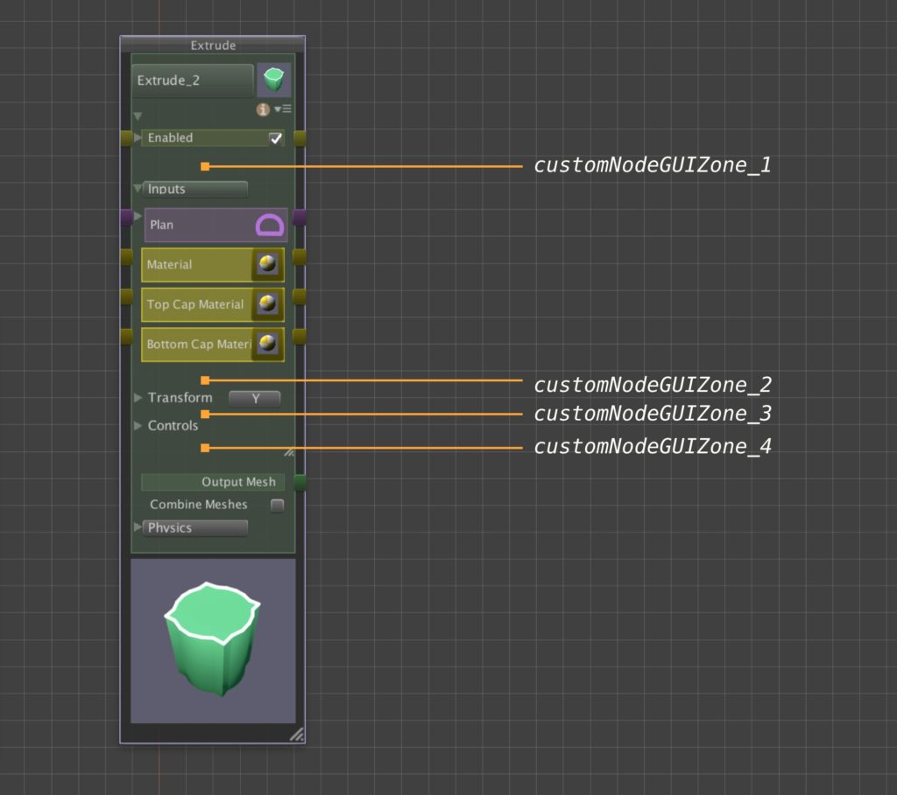

# Creating Custom Nodes

扩展 Archimatix 的一个很好的方式是创建自己的 node 和其他 nodes 在 graph 中一起使用。尽管你可以通过保存你创建的 graph 到 Library 或使用 AX Turtle scripting 创建一个自定义 parametric Shape 来创建一个自己的 node 时，但是在 C# 中 coding 一个 node 时你拥有改变 AX 的最强大的能力和灵活性。

幸运的是，在 C# 中创建一个 node 并不难。你所有需要做的是从一个 AX 的 Generator classes 派生一个类，你将会 subclass Generator2D 和 Generator3D。你只需要覆盖一些函数，然后你就创建了以自定义 node。

## Location, Location, Location

你的 script 和 icon 可以在 Asset 目录中的任何地方，你的新 node 将会被 AX 发现。使你的 class 被发现的唯一的需求是，除了子类化一个 Generator，你需要实现接口 ICustomNode。AX 使用这个接口来搜索自定义 node classes。

尽管你的 node icon 可以在 Asset 目录中的任何地方，但只有 icon 的名字遵循 zz_AXNode-MyNodeName.jpg 的约定时才会被发现。你的 node 将会出现在 node graph window 的右边 sidebar。

## Making your Node Iconic

如果你不创建自己的 node icon 图像，在右边的 node graph sidebar 会为你自动显示一个。作为一个通用图标，唯一知道它创建一个你的 node 的实例的方法时 tool tip。因此最好创建自己的描述性图标。


你的 node icon image 应该是方形的，并且保存为 jpg 文件。如果你根据上面的约定命名你的 node，它将会在右边的 sidebar 显示为 64x64 像素，因此你的原始图像应该是那个尺寸或更大。In order to work contextually with the other nodes in the sidebar color-wise, you can use the blank image icon to the right as a background. 一旦你的 image 被保存，在 Unity Project window 中选择它，设置 Texture Type 为 Editor GUI。


## Its All What You Node

一个以 C# 编写的自定义 node 实际上就是一个 AX.Generator 的子类。一个 Generator 有 inputs，parameters，generative logic 和 outputs。Input 可以是 Shapes，Meshes，Prefabs，或者任何 AX node 的 output。你可以决定你想要提供什么样的 output parameter。

一个 Generator 为一个 node 赋予一个行为。实际的 node class 自身是 AXParametricObject，它是 AXNode 的子类。在更深入 AX 结构之前，让我们看一下一个 Generator subclass 看起来是什么样。

首先，复制 Archimatix/Scripts/Core/Generators/CustomNodeTemplate.cs，改变 node 名字，并编辑 generate function，然后你就拥有了自己的 node。

## Custom Zones in the Node Palette

除了 SceneView Handles，你还可以创建自定义 GUI 来插入到 node palette。有 4 个 zones 在 node palette，它们被 GeneratorHandler functions 控制，而你可以覆盖它们。



要添加 GUI 元素到你的自定义 node palette 上，覆盖这 4 个 functions 中的一个。这个 GUI zone 的 current y-value 被传递给这个 function。你必须保持增加这个 cur_y 并在 function 的末尾返回 cur_y 的最终值。

这个 function 可能初始化变量来辅助 EditorGUI 元素的布局。

```C#
public override int customNodeGUIZone_1(int cur_y, AXNodeGraphEditorWindow editor, AXParametricObject po)
{
    int gap = ArchimatixUtils.gap;
    int lineHgt = ArchimatixUtils.lineHgt;
    float winMargin = ArchimatixUtils.indent;
    float innerWidth = po.rect.width - 2*winMargin;
 
    Rect pRect = new Rect(winMargin, cur_y, innerWidth, lineHgt);
 
    // Create GUI here
    return cur_y;
}
```
