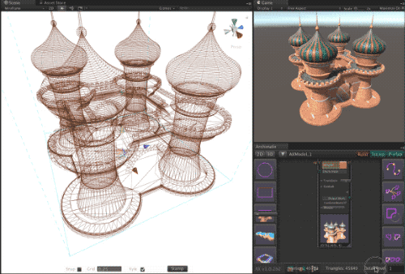
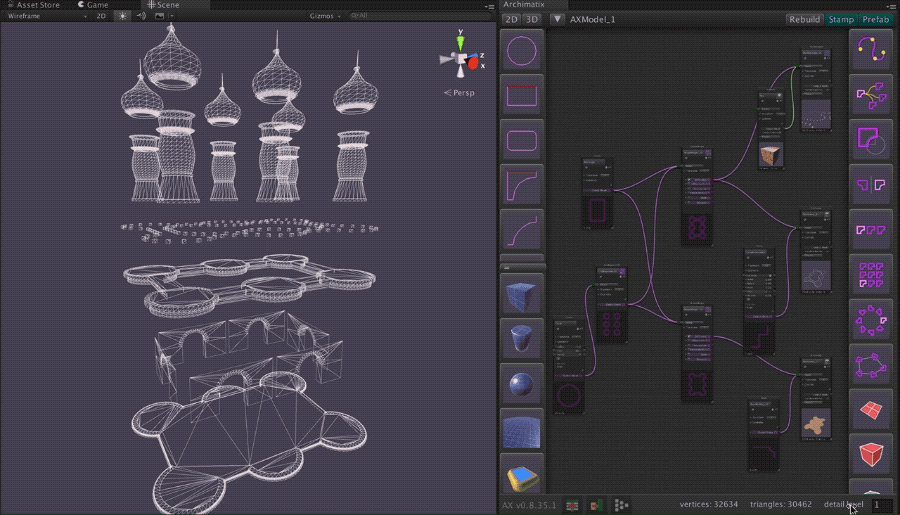
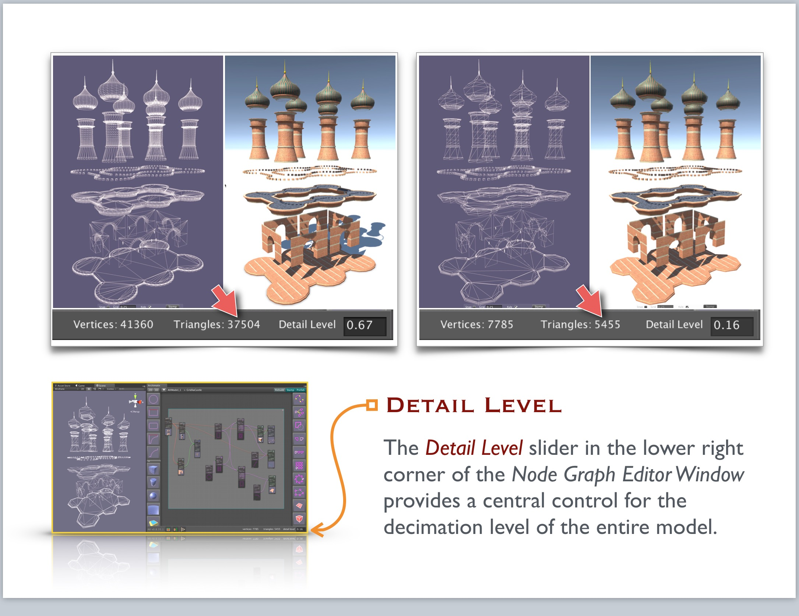

# Detail Level

因为 Archimatix 是一个 non-destructive modeler，它赋予你对 detail level 的强大控制，你可以交互式地得到优化的 lowpoly 或者优美的高精度模型，只需要通过简单拖拽 nodes 中的 local parameters，或者全局的 Detail Level 滑动条。

三角形密度趋向为 2D shape segmentation 的乘积。你可以设置 Plan 和 Section shapes 的 segmentation 来控制被 shapes 生成的 meshes 的 triangles 的数量。

或者，你可以在 Node Graph Editor 的右下角设置 Detail Level 参数，来 decimate（十中抽一） segs variables（无论它们在 graph 中的任何地方出现）。

你还可以使用 detail control 来创建模型的 LOD version。Archimatix 最终将会有一个 LODGroup creator。

## Prefabbing

从 Archimatix 模型创建一个 Unity Prefab 的唯一方式是确保 model 在 Hierarchy 中被选中，然后点击 Node Graph Editor widnow 的 Prefab button。这会冻结模型，但是它还以一种优化方式保存 GameObjects 中的所有 meshes 到 AssetDatabase。

注意你不能简单拖放一个 Stamped Model 到 Project window 来创建一个 Prefab，因为 meshes 还没有在 AsetDatabase 中，只存在于内存中。

## Exporting

Archimatix 还没有内置的 exporter，但是一旦 Archimatix model 被 stamped 或 prefabbed，你可以使用很多免费或付费的 assets 从 Unity 中导出 models 到 Obj 或 Fbx。
