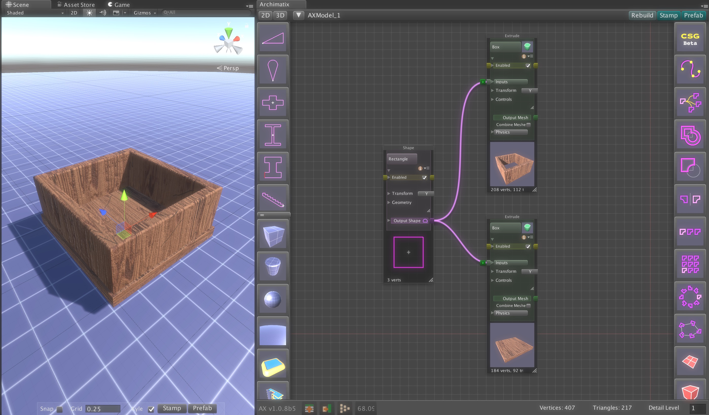
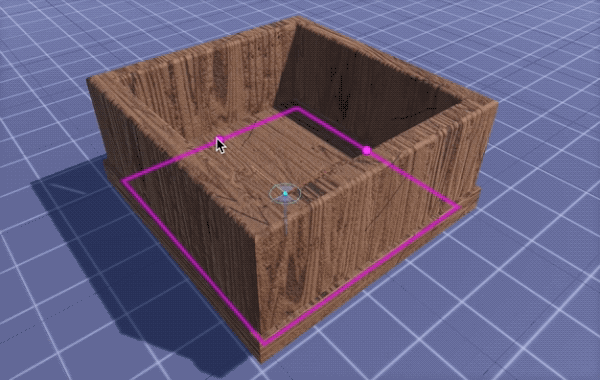
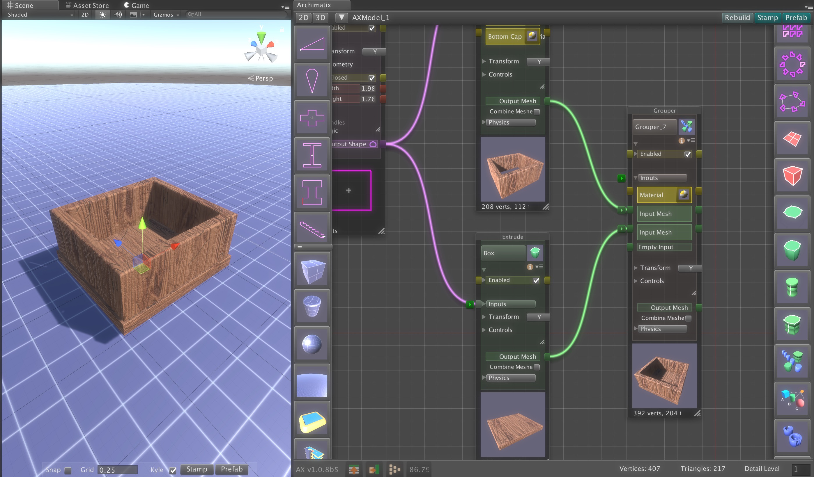
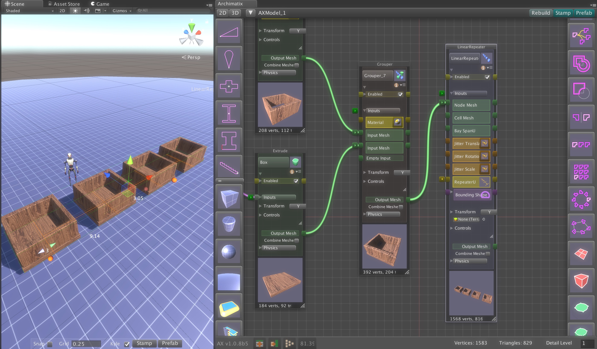
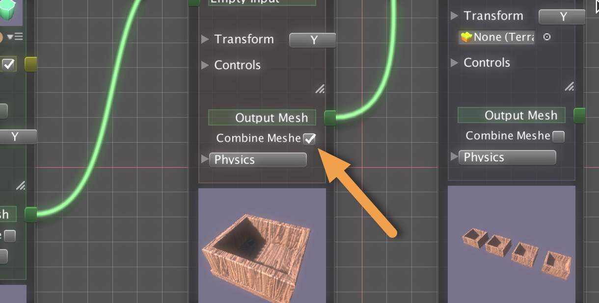

# Grouper: Combination versus Encapsulation

当你添加 nodes 到 model 时，node graphs 变得越来越大。Grouper node 帮助你组织 graph 并且提升组件可重用的模块性。

有两个方式使用 Grouper 来组织你的 nodes：

- Combination（组合）
- Encapsulation（封装）

## Simple Mesh Combination

或许最简单地 group nodes 的方式是将它们的 output feed 到一个 Grouper 的 mesh inputs。对于简单的 graphs，这是将一个多个 objects 作为一个东西的快速和容易的方法。

例如，如果我们生成一个有两个 Extrudes（共享 Library 相同的 Rectangle Shape）的 box，我们可以通过修改这个 Rectangle 的 width 和 height 很容易地操作两个 box 的 base 和 sides。

但是如果我们现在想要在一个 line 上 repeat 这个 box 又如何？我们有构成这个 box 的两个单独的 meshes。在 repeating 之前，让我们将这些 meshes 合并（combine）到 Grouper Inputs。

确保这些 nodes 没有一个当前被选中（点击 graph background 上的任何一点），然后从 Node Graph Editor 右手边的 sidebar 选择一个 Grouper node，并连接这两个 extrudes 的 output 到 Grouper。

现在 Grouper Output Mesh 可以被 feed 到任何其他 node 作为一个单一的 unit。

例如，点击 Grouper Output 然后在右手边的 sidebar 点击 LinearRepeater。

现在合并的 mesh 作为一个单元被 repeated。如果你 stamp out（截取）模型，bottom 和 sides 仍然是分离的 GameObjects（只不过被一起重复）。如果你想真正地合并这些 meshes（例如降低 draw calls 或者使它们作为一个 rigidbodies 单位），可以点击 Grouper Output 下面的 Combine Mesh 选项。

这种形式的 Grouping 的好处是它很快，并且你可以同时看见所有的 nodes。然而，当你的 graph 变得复杂时，同时看见所有 nodes 将会变得非常混乱。还有，这个方法不允许真正的封装（encapsulation）逻辑部分，后者可以改进其他 models 中子系统的可重用性。Grouper 的下一个应用就是改善这个问题。

## Mesh Encapsulation
