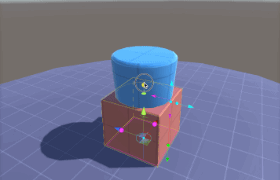
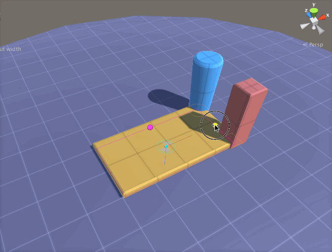

# Know Your Relations Better

艺术的参数化建模一切都是关于 relationships 关系。Not the personal kind, but the algorithmic kind.

通过在你的参数之间定义有意义的 relationships，你可以编码一个新的强大的 morphological genus（形态属） —— 创建了一个新的种类 DNA，可以用来生成成百上千个 models 变体。

简单地 stacking 关系：Cylinder 总是在 Box 上。

在 Archimatix 中有两种类型的参数化关系：

- inter-nodal connections
- 参数表达式 parameter expression

在这个 tutorial，我们将展示 inter-nodal connections。

当你在不同的 nodes 之间彼此连接参数，你就为参数化模型创建了行为。当你修改了一个参数，所有种类的改变可以像涟漪一样在模型中传递，依赖你通过 Relation connections 和 Relation 中的数学表达式。更进一步，这些 Relations 可以是 bi-directional 的，意味着你可以在任何地方改变一个参数，然后改变将会从那些参数像涟漪一样传播开。当你第一次指定一个 Relation 时的默认的数学表达式是 相等 “=”

## Equal Relations

一个 equals Relation 的常见用例是当你想要一个 object 总是在另一个上面，而不管下面的 object 是多高。

设置这个参数化行为的步骤：

1. 从 3D Library 选择一个 Cylinder 和一个 Box
2. 展开 Box 的 Controls 和 Cylinder 的 Transformations
3. 点击 Box node 的 Extrude 参数的 red connector box
4. 点击 Cylinder node 的 Trans_Y 参数旁边的 red connector 按钮
5. 要进行测试：或者在 SceneView 中点击 Box，并拖拽 green knob 来使 Box 更高，或者点击 Cylinder 然后拖拽 Y-Axis Position Handle

你会注意到 relation 是 bi-directional。修改任何一个参数将会修改相连接的参数。这违背了其他使用 uni-directional 关系的参数化模型。bi-directional 的好处是，当在 SceneView 中 playing 一个参数化模型，你可以点击任何地方并开始修改，而不是搜索 master 参数（控制另一个参数的参数）。

然而，这种自由不是没有代价的：bi-directionality 需要 inverse expressions 为输入。在这个简单的例子中，我们没有编辑 relation 中的表达式，而是依赖默认的 equals 表达式。下面是一个稍复杂一点的关系表达式例子。

## Expressing Relations

当想要拥有更有趣的 Relations，你可以使用 ExpressionEditorWindow。点击 Relation connector cable（连接线）中间的 green button 打开 ExpressionEditorWindow。ExpressionEditorWindow 中是两个 text fields，允许你编辑两个参数的 bi-directional relationship。

比如说我们想要模拟一个活塞运动。活塞随着轴以正弦方式上升或下降。表达式是 Piston.Trans_Y=Sin(Crankshaft.Rot_X)：

1. 从 3D Library 选择一个 Cylinder
2. 点击 node 顶部的 name button，将它重命名为 Piston
3. 复制粘贴第二个 Cylinder，命名为 CrankShaft
4. Transformations foldout 的旁边，点击 axis button 直到它显示 X
5. 打开 Transformations foldout 并选择 Align_X 选择 Center
6. 在 SceneView 中点击 Crankshaft 并减少一点 radius
7. 连接 Pistion.Trans_Y 到 Crankshaft.RotX
8. 尝试旋转 Crankshaft —— Piston 将会连续地上升下降
9. 点击 red connector cable（红色的连接线）中间的 green button
10. 在 ExpressionEditor 中，在被 Crankshaft.Rot_X 填充的字段中，修改 expression 为  Sin(Crankshaft.Rot_X) 然后点击 Save button
11. 再次选择 Crankshaft 进行测试活塞 Piston 将会震荡地上升和下降
12. 编辑表达式为 1.5+.5*Sin(2*Crankshaft.Rot_X)，使 Piston 更好地响应 rotation

## Best Practice: Relating Translations

如果你发现自己连接一个 node 的 Trans_X 和另一个 node 的 Trans_X 到同一个 source，使用一个 Grouper 将两个 nodes group 到一起，然后将 Grouper 的 Trans_X 关联到 source 可能更好。这与在 Unity Hierarchy window 中将两个 GameObjects parenting 到一个 Empty GameObject 是类似的。

尽管在 grouping 的地方使用 relation connections，Archimatix 可以处理大量 relations，这将会在 NodeGraphWindow 中添加更多的视觉复杂度。

例如，上面的动画描述了一个参数化行为，红色的 Box 和蓝色的 Cylinder 总是被放置在黄色 Box 的右边。有两种方式可以完成这个行为：

方法一：这个方法不是完美的，但是在构建一个 graph 时很常见。Cylinder 的 Trans_X 和黄色 Box 的矩形 plan 的 width paramter 关联起来，使用一个表达式：Cylinder.Trans_X = Rectangle.width / 2。当红色 Box 被添加到 graph，一个更简单的关系被添加在黄色 Box 和红色 Box 之间。当拖放 Rectangle width 的 Handle 时，蓝色 Cylinder 和红色 Box 相应地移动。

这个方法的缺陷是我们有两个 connections，我们必须两次输入相同的数学表达式（对于蓝色 Cylinder 和红色 Box）。如果我们想要改变 relationship，我们必须在两个地方改变它，并且 graph 会变得凌乱。

方法二：我们可以将 Cylinder 和 Box 放在一个 Grouper 中，然后将 Grouper 的 Trans_X 和 Rectangle 的 width 关联在一起。

我们的参数化行为将会是完全一样的，但是现在，如果我们想要编辑 relations 中的 expression，我们只需要编辑一个地方。还有 graph 将会有更少的参数关系，这使得 graph 更加清晰。
