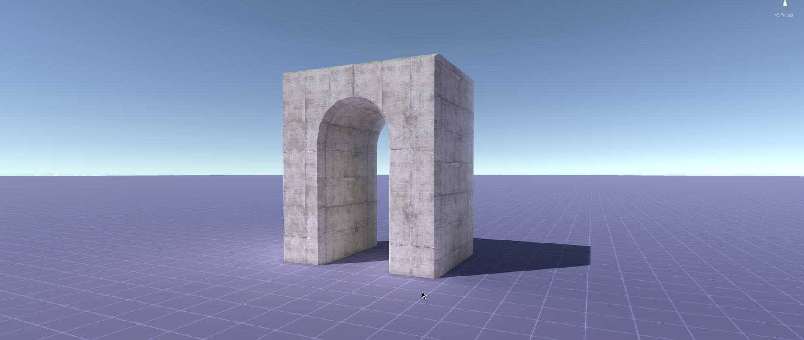
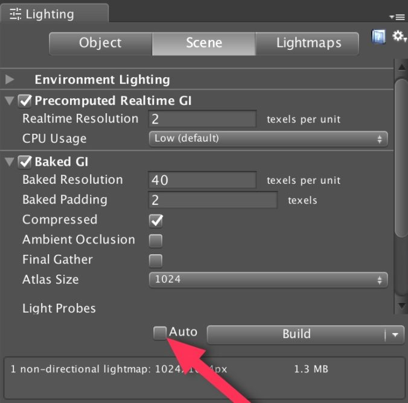
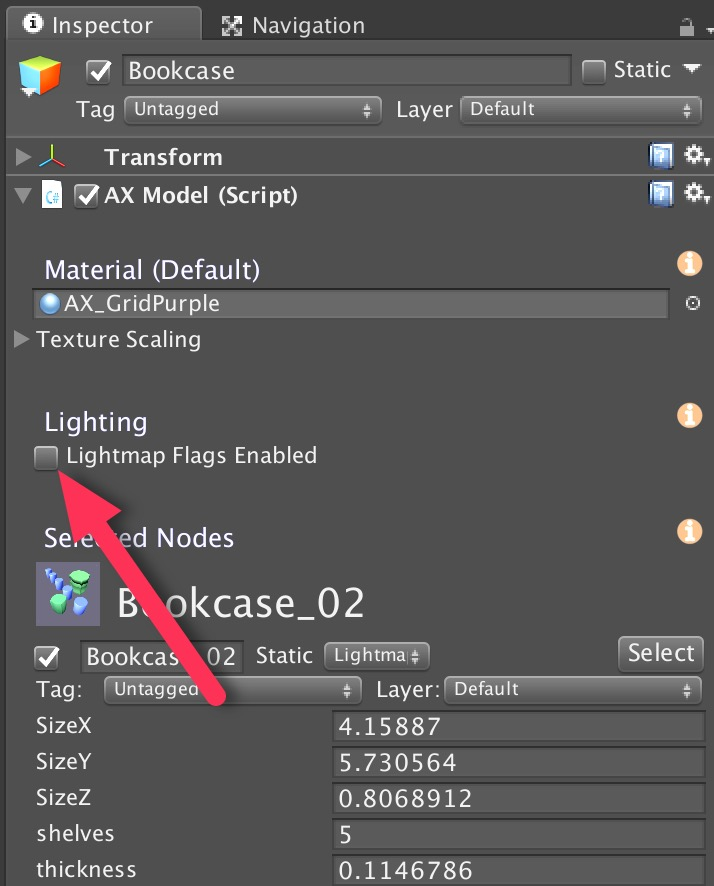
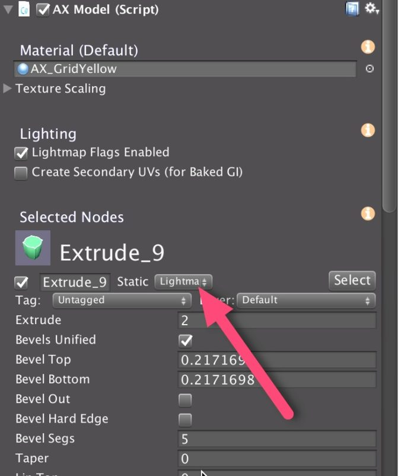
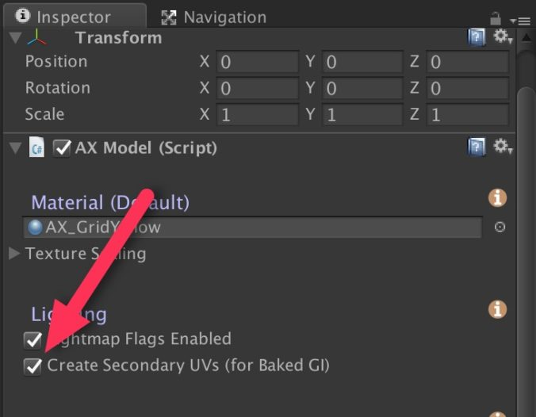

# Lightmapping With Archimatix

## Introduction

Archimatix 可以准备它创建的 models 用于 Unity 的 Global Illumination（GI），既包括 realtime 还包括 baked。因为 AX 随着参数改变频繁地生成模型，系统会做出一些关于你的 workflow 何时准备好的假设，来使 Unity render metadata 来支持 GI。

带有 Global Illumination 的圆拱

## General Workflow

根据模型的复杂性，Unity GI lighting 的预计算可能花费大量时间。默认地，Unity 会在它察觉到 scene 中的 static meshes 被 transformed，added，或 deleted 的任何时间，尝试开始这个计算。尽管这在很多场景下这很有用，但是当使用 AX 建模时，这个创建 lighting model 的默认模式可能会变得非常繁重，因为当你实时拖拽 AX 参数 handles 时，你通常正在每秒上百次地重新生成 meshes。甚至在你停止拖拽而 AX 生成实际 GameObjects 之后，你还非常可能保持修改和调整 parameters。尽管这个流畅的 mesh 生成是 AX 魔法的一部分，这样快速递改变使 automatic lightmap build 不必要的繁重。有两种方法避免这种情况。

避免在修改一个 model 的参数时不必要的计算的第一种方法是简单地关闭 Auto build mode。这是通过打开 Unity Lighting Window 并且 unchecking ”Auto“ checkbox 完成的，就像下面的图片。当关闭 Auto，你可以任意修改 AX meshes 而不引起 lighting 计算。当你准备好查看被 GI 渲染的 model 之后，点击 ”Build“ button 手动进行计算。

然而，如果你倾向于打开 Auto，则你可以为整个 AX 模型临时关闭 Lightmap Static flags。这意味着，当 AX 生成拥有 meshes 的 gameobjects 时，它不会添加 Lightmap Static falgs 到这些 gameobjects 上。而 light mapper 将不会感觉到 mesh 的改变。使用这种方法，你可以尽情地 model，然后当你准备好查看 GI 渲染的结果时，为整个 AX 打开 Lightmap Static Flags（在 AX Inspector 中，而不是 static flags 中）。

注意：模型的 Lightmap Flags Enabled 参数默认是关闭的。这意味着，当你第一次创建一个 AX 模型，你必须在 build lighting 之前打开它。

一旦你完成了 modeling 和 tweaking，并且你准备喝杯咖啡休息一下，你可以打开模型 Inspector 中的 ”Lightmap Flags Enabled“ checkbox。如果 Auto 打开了，light mapping 将会进入高档状态。否则如果 Auto 是关闭的，在勾选 Lightmap Flags Enabled 之后，进入 Lighting Window 并点击 Build button。

在任何一种模式中，当 lighting model 被 built，只会考虑被标记为 Lightmap Static 的 nodes 生成的 objects，如下所述。

## Lightmap Static Flags

如果一个 ParametricObject，下面图中的那个，设置为 LightmapStatic，则当一个 GameObject 被 AX 生成之后，它的 static falgs 将会被设置为 Lightmap Static（只要在构建模型时 Lightmap Flags Enabled 是勾选的），并且 Unity GI 系统将会考虑它，在它重新构建时会触发 lighting 计算。这个 static flags 于 Unity 中任何 GameObject 的 static flag 是类似的，区别是这个 flag 在 AX node 中在内部设置，并且当它们被 AX 构建时，转移到（transferred）GameObjects 上。

When you set the static flag for a node, all its upstream nodes will be set to the same flags.

当你为一个 node 设置 static flag，它所有上游 nodes 都会被设置为相同的 flags。

## Secondary UVs for Baking

当你在 Unity Lighting Window 中选择了 Baked GI，则你会想要为 AX 构建的 meshes 生成一个 Secondary UV。因为生成这些额外的 UVs（它们被 Unity Lighting model 使用来创建 rendered lightmaps），需要花费额外的计算，你必须每次 bake lighting 时重新创建 secondary UVs。

Create Secondary UV 的 checkbox 只在 Lightmap Flags Enabled checkbox 被勾选之后出现。当你勾选它时，将会为任何设置 flags 为 Lightmap Static 的 nodes 生成的 meshes 生成 Secondary UV。

即使你勾选了 Create Secondary UV，在 AX model 完成它的一个构建之后，这个 box 将会变成 unchecked 的。

