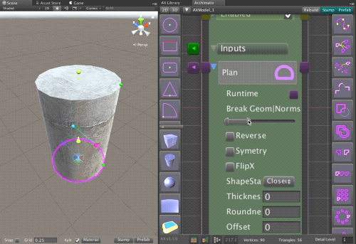
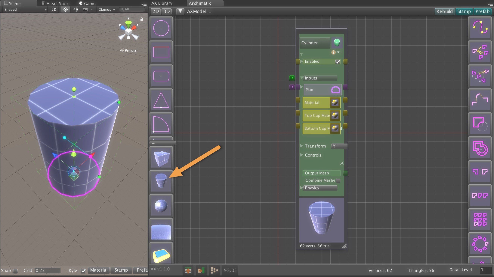
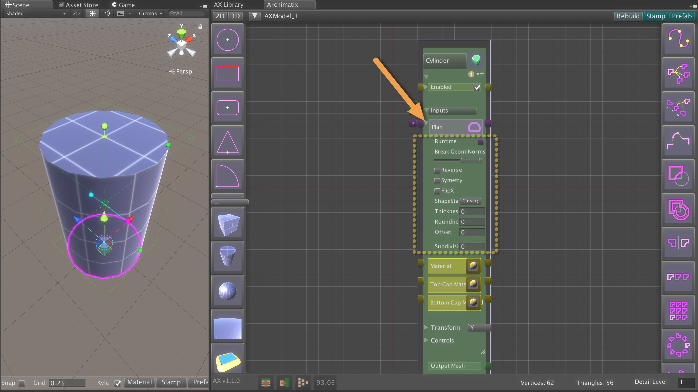
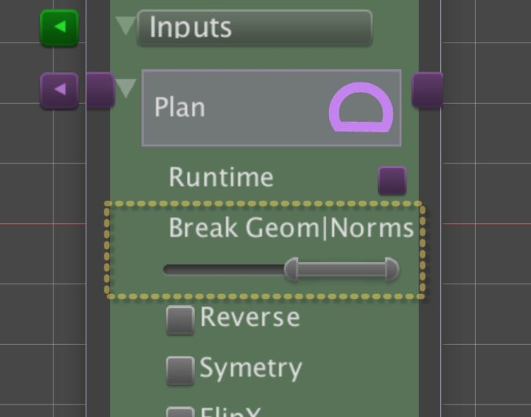
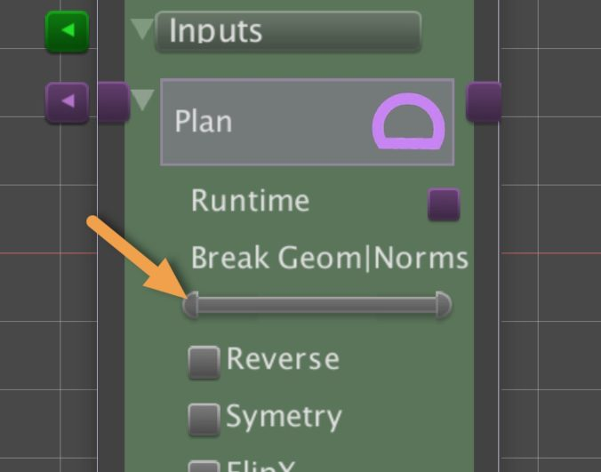
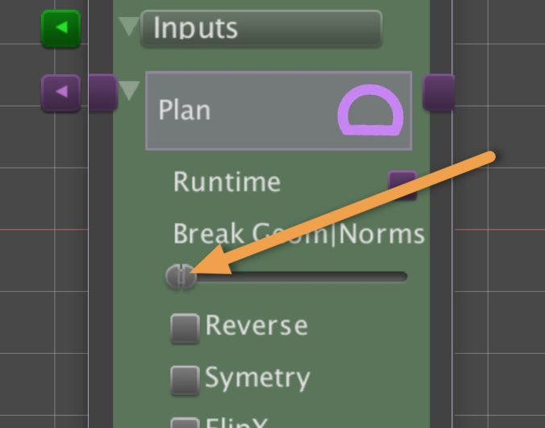

# Making Hard Edges

Archmatix 可以控制生成的 mesh 的表面是 smoothing 的还是 hard-edge 的。

使用 U 和 V 分别控制各种方向上的 hardness。

默认拥有 smooth edges 的最简单的 curved object 是 Cylinder。

## Step 1

打开 Node Graph Editor，在左手边的 sidebar 点击 Cylinder 来实例化一个。

你会注意到 Cylinder 的 sides 是 smooth 的，而 top 和 bottom edges 是 hard 的。这是因为，因为 source plan 是一个 16 segemnts 的 circle，side polygons 的默认 angle 是 22.5 度，小于进行 smoothing 的默认 break angle 60 度。而 side polygons 和 top cap 的角度是 90 度，因此是 hard edge 的。

让我们来修改 break angle 的值。

## Step 2

打开 Plan input parameter 来查看这个 node 的 controls。这些 controls 不影响 source shape，但是在使用它之前进行一些修改。

例如，你可以 reverse shape，flip shape，给它一个 offset，给它一个厚度（thicken it）。我们将要调整它的 break angles。

## Step 3

Break Geom|Norms control 有一个 MinMaxSlider，两个 knobs 控制 BreakGeometry 和 BreakNormal 角度

### Break Geometry Angle

左边的 knob 控制 BreakGeometryAngle，在这个 angle，mesh 将会 break vertices，使得它们不在 welded（焊接），将 geometry 分离。这不只影响 texture placement 的 UVs，它还使 mesh 上的 vertices 具有单独的 normals。

### Break Normals Angle

右边的 knob 控制 BreakNormalsAngle，在这个 angle，normals 将会 break edge 为一个 hard edge。

## Step 4

Slide the left knob to the far left, or 0. This will result break all the vertices in the mesh so that all faces have their own vertices. For this particular mesh, we should not notice any difference in the UV coordinates for texturing. However, the BreakNormalAngle can never be more than the BreakGeometryAngle, so this is a necessary step.

滑动左边 knob 到最左边，即 0。这将会导致 break mesh 中的所有 vertices，使得所有 faces 有它们自己的 vertices。对于特定 mesh，我们在 texturing 的 UV 坐标中应该注意不到任何区别。然而 BreakNormalAngle 从不能够比 BreakGeometryAngle 更大，因此这是一个必须的步骤。

## Step 5

现在滑动右边 knob 到最坐标，或 0。现在每个 polygon 将会有它们自己的 normals 垂直于它，在处处留下 hard edges。

