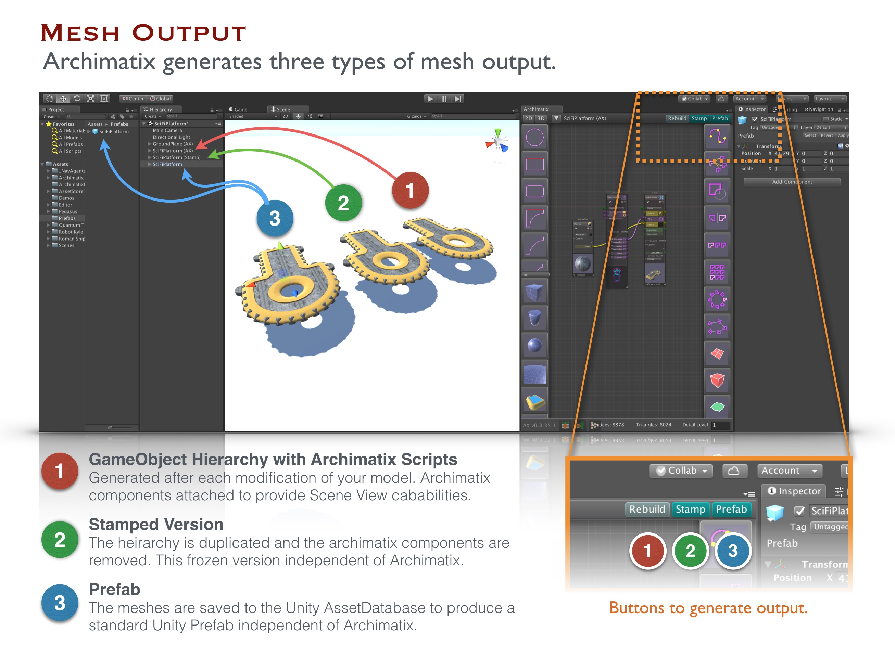

# Models Output from Archimatix

如果你想要将 Archimatix 的结果导入到外部应用程序例如 Substance Painter 或 Quixel 中，你可以导出你的 models 为 Obj 或 Fbx。一旦你 Stamp out 你的 model，你可以很容易地使用 Asset Store 中免费或收费的 assets 将 archimatix 的 model 导出模型为 Obj 或 Fbx。

## Stamping

当你 Stamp 你的 Archimatix model，你创建了一个标准 Unity GameObject Hierarchy 的副本，并剥离任何 AX 元数据。这留下一个基本上 frozen 的 GameObject Hierarchy，不在参数化。

要 Stamp 一个 model，确保它在 Hierarchy window 中被选中，然后点击 Scene View 底部，或者 Archimatix Node Graph Editor 窗口右上角的 Stamp button。

在这一点，这个 Stamped model 不再需要 Archimatix 在 scene 中。它还准备好被进一步被 Asset Store 的 assets 修改，例如 ProBuilder 用于修改 polygonal modeling，或者 Surforge 用于 PBR texture painting。

