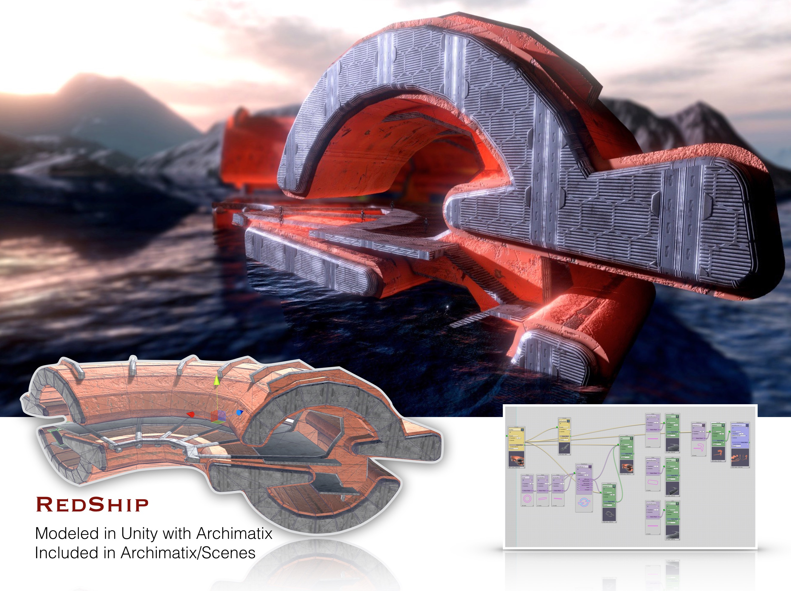

# Overview

Archimatix 是一个强大的 node-based 参数化建模 Unity 扩展，可以帮助你快速创建可修改的物品，和丰富可变的环境。

一个强大的特性是它是非破坏性的 non-destructive，实时的，和运行时可编辑的，使得建造环境称为一种乐趣。

你是否曾经过早地在设计中做决定，而之后又后悔了？破坏性建模的一个劣势是你走得越远，进行改变的代价越大。而设计本身是一个迭代的过程，需要不断地来回切换。

Archimatix 中，每个阶段的逻辑在任何时候都是可以修改的，非常容易地产生各种变体。

Archimatix 带来的 LighthouseBase 模型主要就是有两个 plan shape（Circle 和 I Shape）生成的。简单地操作这两个 shapes 的 scene handles，就可以修改所有依赖于它们的形状。

如果你从来没有试过参数化建模，不要担心，它并不难学习。尽管 brush-based 建模（ZBrush），或 topological 建模（Blender）等直接操作 vertices 和 faces 的工具非常难，但是使用参数化建模，你可以只操作相对少的 handles 或 gizmos 来修改整个 mesh。

Archimatix is “modeling software at the intersection of art and algorithm.”

不只是在创造过程中任何时间都可以修改是可能的，而且偶尔创造经常出现在使用 visual node graph editor 装备 Archimatix 逻辑的过程中。例如你想要建造的体育场可能会变成一个完全不同的宇宙飞船，通过使用一些额外的 nodes 和一些随机的参数变量滑动，就像下面这个 RedShip 的产生一样：

Archimatix 使用它的 architectural 智能地增强你的创新想法；它的逻辑在你的指尖下，通过 node graph editor 的可视化脚本。Archimatix 提供了很多示例供你学习。这些示例的真正价值在于你可以看到它的 node graphs，学习它们是如何组装的。你可以使用 scene handlers 简单地修改它们，或者直接将它们用在你的游戏中。

你还可以引入特定于你自己的 art 方向的的参数化 objects。Archimatix 提供了一个 node graph editor，它将建模逻辑的所有能力放在你的指尖下面，不需要编码！事实上，使用 Archimatix 你可以使用相对很少的 简单的 generative building blocks 来创建 fantastic spaces 和 extensive realm，但是当在 node editor 中连接在一起时可以变成相当 expressive（细节，细节，细节）。

下面的马戏场只使用了 10 个 node 构建。

使 Archimatix 独特于 AssetStore 的其他 fine modelers 的事情是，它将像建筑学一样思考建模，即 plan 和 section，对于艺术家而言，就是形成丰富 3D 空间的基本 2D shapes。

Archimatix 提供了其他外部建模程序没有的强大的 2D 形状编辑器。这些工具包含 shape merging（2D boolean operations），offsetting，thickening，和 rounding。当这些形状交互来实时地形成 mesh 时，结果就像魔法一样。

