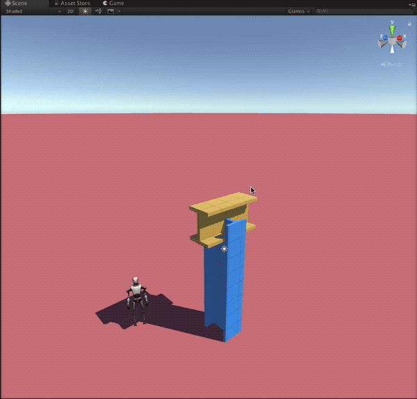
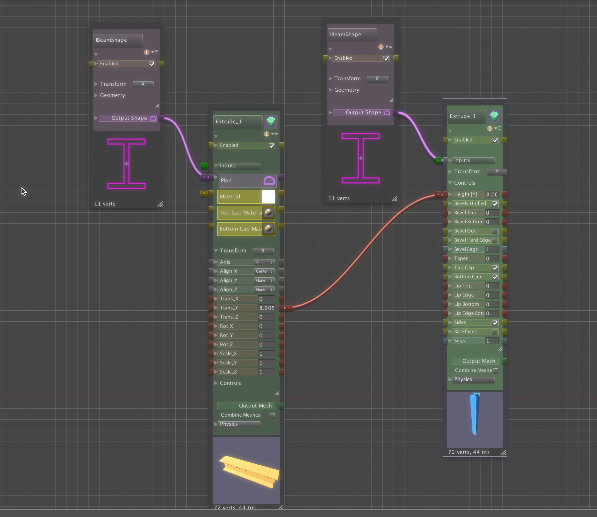
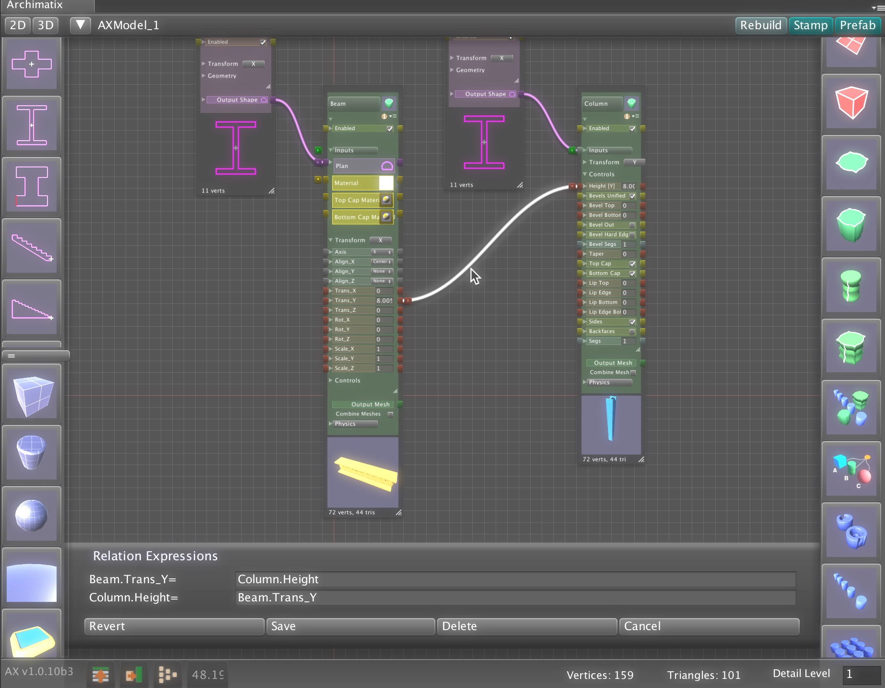
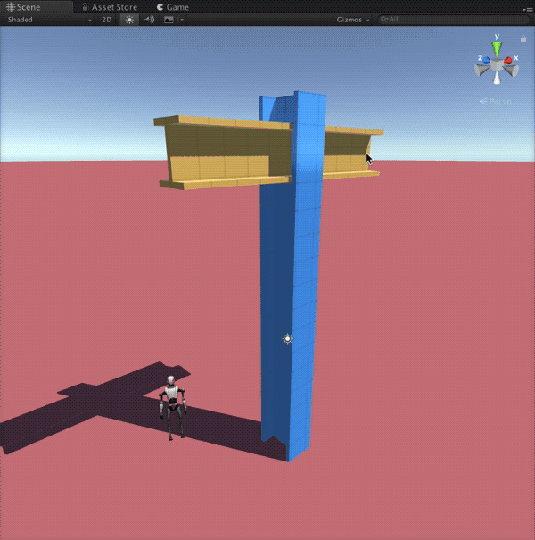

# Parameter Relations

Archimatix 一个很重要的方面是构建参数之间关系的能力。有两种指定参数之间关系的方法：

- inter-nodal connection，node 之间连接
- 参数表达式

当一个参数和另一个相关，它们可以一起工作，例如当 relation 中一个参数被修改，另一个参数就会基于 relation expression 相应地修改。

例如，作为一个设计者，你可能想要指定一个 building column 的高度总是等于屋顶横梁的高度。一旦这个关系被设置，你可以上下移动横梁，则 column 的高度将会调整自己和 beam 具有相同的高度。

## Inter-nodal Parameter Relations

这是一个 inter-nodal 参数关系，它连接 beam 的 TransY 参数到 column Extrude 的 height 参数。

通过简单地连接这两个参数，我们使它们保持相等。但是如果我们想要以比例的方式而不是相等又怎样呢？为此，我们需要编辑关系的默认表达式。

## Relation Expressions

关系的本质可以被描述为一个数学公式。在上面的简单等式中，默认表达式不是那种令人望而生畏的数学公式。我们可以通过点击两个参数之间红线的连线看一下它。

当连接被选择后，表达式编辑框会出现在 node graph window 的底部。我们可以看见，参数们只是简单地相等。我们可以将它们修改得复杂一点。

## Bi-direction Relations

Archimatix 允许 bi-directional flow 的参数关系。实现这个功能是每个 inter-nodal 关系提供两个 expressions。上面的表达式定义当 Column.Height 被修改时 Beam.Trans_Y 如何变化。下面的表达式定义当 Beam.Trans_Y 被修改时，Column.Height 如何变化。

尽管这些表达式看起来一样，技术上讲它们是互为倒数。双向表达式的关键是花时间得出这些双表达式，它们经常是互为倒数的，尽管不是必须的。双向的好处是你不需要知道那个 object 驱动另一个。你可以简单地点击任何一个 object，并开始修改，而 model 的 logic 将会负责所有的事情。绝大多数参数化系统没有这个功能，而是让 user 来找到哪个 object 是 driver，哪个 object 是 slave。

如果你不想双向表达式，你可以总是使其中一个表达式为空。

如果我们想要一个比例关系，我们可能编辑这些表达式来定义 beam 应该总是被焊接在 column 高度的 4/5 处。

表达式被编辑来反映比例，并互为倒数。

但是如果我们想比例成为一个参数又如何？当前，一个 inter-nodal 表达式只支持参数在 connector 的其中的一端。为了在一个等式中包含多个参数，你可以使用参数表达式。

## Parameter Expressions

一个或多个参数表达式可以被附加到任何参数。当 paramter 被修改时，这些表达式就会执行。

