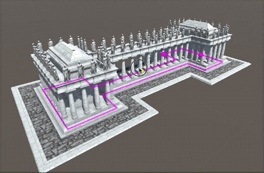

# Repeaters Repeating

Repeaters 是 Archimatix 中一个重要的 node 类别，因为它们允许你创建 Shapes 或 objects 的实例，自动以有组织的模式例如 linear，grid，circular，stepped 等将它们排放。有组织地排放可以使用 JitterTool 帮助产生一些随机化。

重复是人类建筑的特征。这是有道理的，因为当 objects 可以被重复的制造时，构建建筑才更高效，而且 columns 和开发的空间具有韵律（规律）。想象一下现在尝试构建一个建筑而不能重复，或自动实例化 columns 和 雕像！

当进行 level design 时，repetition 也有一些陷阱，因为重复的空间可能缺乏由独特元素产生的组织感。就是说，重复可以被想象为 architectural arrangement 的开始，而更多的元素将打断重复的连续性以提供独特的体验，一个丰富的 level design 实践，其同时创造有序和混乱。

Archimatix 同时提供了 2D 和 3D Repeaters。

The 2D Repeaters

