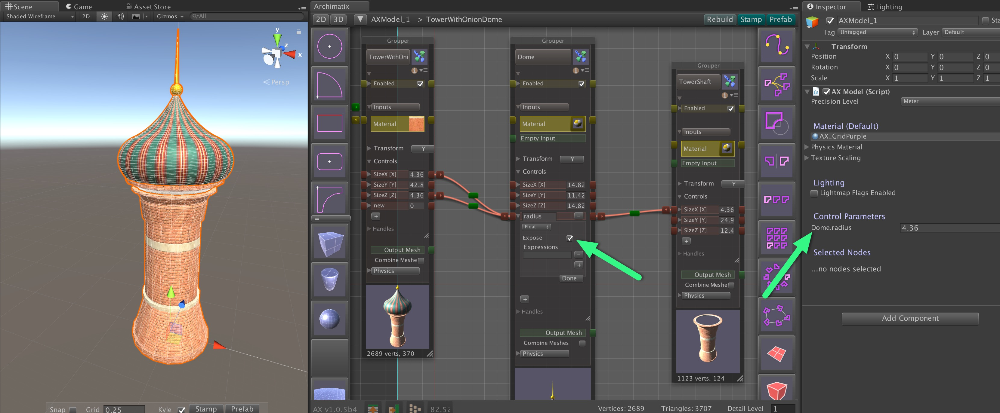

# Runtime Archimatix


使用 Runtime Archimatix，你可以创建 in-game 的交互式 modelers（建模器）。一个很好的例子是 Archimatix 内置的 Spaceship Shop demo scene。在这个 demo 中，你可以使用 in-game UI 来完成一些简单地 modeling 功能，例如使用运行时 handles 修改外壳 hull 的形状，选择 engine type 和 size，以及 weapons 的 size 和 position。这样的一个 ship 可以是一个 game 的一部分，或者它自己的独立的应用程序。

其他例子可能包括 in-game house construction，迷宫 maze 设计，任何你可以想象的东西！通过创建这样的运行时应用程序，你不仅使环境和物品 prop 的构建简单，有趣和主题化，还创造了超越 获得模块化物品的 in-app 购买 purchases 的机会。

在它的第一次迭代中，runtime Archimatix（AX） 允许你在 runtime scripts 控制 AX 参数。这意味着你不能连接你的 runtime UI 到一个 AX 模型，并以适合你游戏设计的方式控制它。例如，如果你的 player 可以花费 game dollars 来构建一个 house，然后他们可以交互地控制 house size 同时观看 house 基于 building 占据 floor 面积的 cost 变化。

要使用这个功能，AX 在 node 的每个 parameter 有一个 Expose checkbox。一旦你选择这个 checkbox，这个参数将会在 AXModel 的 Inspector 中被显示。通过 model level 的暴露的 variable，你的脚本可以容易地访问这个 variable 来 get 和 set 它的 value。



为了在运行时修改这些参数，你需要一个队 AXModel 引用（scene 中一个 gameobject 的组件）。在你的 MonoBehavior，添加一个 AXModel 类型的 public member：

```C#
using AX;

public class GrayShipDesigner : MonoBehaviour {

    public AXModel model;

}
```

之后，你可以拖放一个 AXModel GameObject 到你的运行时脚本的 ObjectField。使用这个参数化模型的引用，你可以 get 和 set 这个暴露的参数。当你设置这些 parameters，它们将会在 graph 基于你在参数之间完成的 Relations 传播它们的 value change。

要是你的 code 更加可读，设置对这些参数的引用会非常好，因为它们更容易操作：

```C#
using AX;

public class GrayShipDesigner : MonoBehaviour {

    public AXModel model;

    public AXParameter P_Radius;
    public AXParameter P_Channel;

}
```

在这个 Start function，你可以使用 getParameter function 完成这些参数引用。这个 function 使用你在 graph 赋予参数的名字来查找这个参数：

```C#
// Use this for initialization
void Start () {

    // Establish refernces to AXModel parameters.

    if (model != null)
    {
        P_Channel = model.getParameter("Engine.Channel");
        P_Radius  = model.getParameter("Engine.radius");
    }
}
```

To modify the parameters you have a reference to, use AXParameter.intiateRipple_setFloatValueFromGUIChange(floats value) and then let the model know you are ready to have the changes regenerate the model while dragging with model.isAltered() or after UI edits are complete with model.autobuild().

要修改一个有引用的参数，使用 AXParameter.intiateRipple_setFloatValueFromGUIChange(floats value) ，然后在拖放滑动条时使用 model.isAltered() 或在 UI edits 完成之后使用 model.autobuild()，让这个 model 知道你已经准备好使用这些修改重新生成 model。

```C#

// 一个 UI callback 函数的例子。这可以是一个控制 radius 的 Slider 的 delegate

 public void radiusSliderUpdate()
 {
    // 设置 parameter 的 value 并让这个 change 在 Relations network 传播开

    P_Radius.initiatePARAMETER_Ripple_setFloatValueFromGUIChange(radiusSlider.value);

    // 让这个 model 知道你完成了你的 changes，但是不必立即创建新的 game objects.
    // isAltered() 经常在一个 repetitive change 期间被调用，例如一个 slider
    // 标记 model 被修改，mark dirty

    model.isAltered();

    // 其他和 Archimatix 无关的 game state 变化
     
    radius = radiusSlider.value;
    recalculate();
 }

   
 public void engineTypeDropdownUpdate()
 {

    // 设置 parameter 的 value，让这个 change 在 Relations Network 中传播开

    P_Channel.initiatePARAMETER_Ripple_setFloatValueFromGUIChange(engineTypeDropdown.value);

    // 告诉这个额 model 重建它的 GameObjects.
    // autobulild() 经常在一个 Dropdown 或 Checkbox UI 被修改之后调用
    
    model.autobuild();

    // 其他和 Archimatix 无关的 game state 变化

    recalculate();
}
```

这些就是你使用 runtime Archimatix 所有需要知道的东西！
