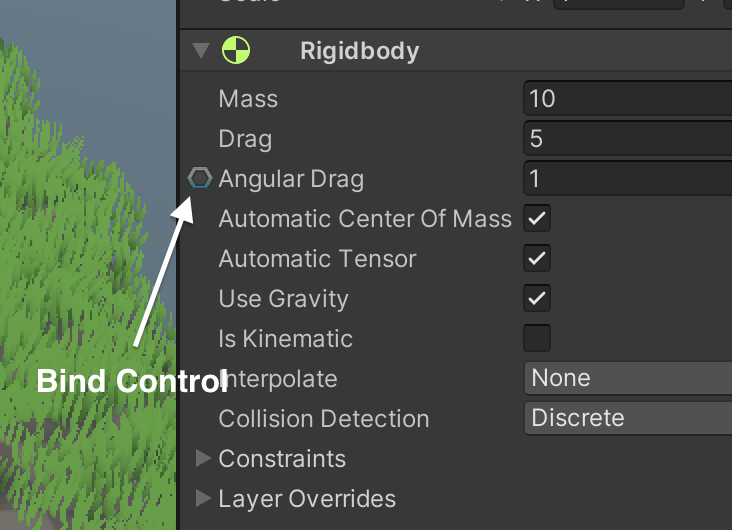

Binding System 2 的设计初衷就是让你能够尽可能快速、简单地建立对象间的关联。在大多数脚本、对象、材质和组件中，大部分字段都开箱即用地支持绑定。只要某个字段是可序列化的，并且其绘制器包含 BeginProperty 调用，那么它很可能就可以被绑定。默认情况下，所有使用标准绘制器的脚本字段都是可绑定的，这意味着您使用 Unity 标准绘制器编写的脚本以及第三方脚本都能完全兼容。

要绑定一个字段，悬浮光标到字段上，右键点击它，展开一个属性菜单，在菜单中选择 Enable Binding。

一旦字段左边出现 bind 控件，点击它来绑定这个字段。

一旦字段被绑定，data pipeline 就会出现，它包含一些控件可以用来设置。

绘制器 drawer 使它可以很容易地在 Inspector 中配置绑定。此外，BindingSystem 还兼容 Odin Inspector 插件。

要关闭字段的绑定，反向执行上面的过程：首先 unbind 字段，然后右键点击 field，选择 Disable Binding。

字段绑定采用非破坏性方式实现，这意味着字段原有的序列化逻辑不会受到任何影响，所有与绑定相关的序列化数据都会存储在独立的位置。简而言之，它不会影响字段内部的任何东西，被绑定的组件不会有任何感知自己被绑定。

但是当开启 Update In Edit Mode 时，不是如此，此时 value 会被更新并覆盖它原始值。

# Data Pipeline

数据管道通过一系列阶段（其中部分阶段为可选）来处理数据，并将其传输至目标位置。管道的数据流向取决于所选的 BindMode 值：当处于"读取"模式时，数据从绑定源属性流向被绑定字段（即从右向左流动）；而当执行"写入"操作时，数据则从被绑定字段流向绑定源属性。默认情况下，绑定模式被设置为"读取"（Read）。

# Smart Dropdown

BindingSystem 提供了一个定制的可搜索下拉菜单，简化了每个绑定属性的访问和设置过程。

当点击 path 控件或其他任何绑定选项按钮时，会出现一个名为“智能下拉菜单”的自定义下拉菜单，其中包含相关信息或可供选择的选项。该菜单能够处理不同类型的数据控件，例如复选框、输入框、按钮、分组控件等。

当选择一个 bind path，这个 custom dropdown 让你选择 direct entries：

或者 compound entries（如果 direct entry 和其 children 都是有效选择）：

或者在 preset 中搜索一个 value：

# Bindings Update Points

Code based bound fields (with Bind<T>) are refreshed in user-code and don't need automatic refreshes.

系统会自动刷新已绑定的字段，确保它们始终显示最新的可用数据。虽然更新逻辑非常高效，但仍会产生少量开销。为了避免不必要的性能浪费，系统允许您自行决定在何时刷新已绑定的字段。目前提供了几个预定义的刷新时机供您选择：

- Editor：在 Editor Frame Update 中刷新绑定的字段。如果你需要不进入 Play Mode 就看见 changes，开启这个 point
- Update：在运行时的 Update 阶段刷新绑定的字段。这是默认的 update point
- Late Update：在运行时的 Late Update 阶段刷新绑定的字段
- Render：在渲染本帧之前刷新绑这个绑定字段。当字段连接到 animations 和 IK 计算时，这很有用
- Fixed Update：在 Physics update 阶段更新绑定字段。当字段连接到物理模拟时，这很有用
- On Change：绑定字段会在 Update、LateUpdate、FixedUpdate 任何一个阶段更新，只要检测到 source value 发送改变

从2.2.2版本开始，可以通过 Unity Event 刷新已绑定的字段（在 Unity Event 的回调中设置刷新函数）。只需从可用选项中选择要更新的绑定字段，当事件触发时该字段就会刷新。这在你需要更精确地控制绑定刷新时机时非常有用。

当在事件中选择了已绑定字段时，该字段旁会出现一个按钮。点击此按钮将弹出已绑定字段的设置窗口，可以在其中进行调整。按住Control键（MacOS系统按住CMD键）的同时点击该按钮，会在检视面板中高亮显示对应的已绑定字段。

